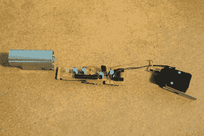
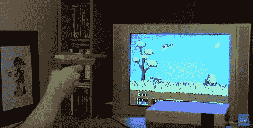

# 复活猎鸭

> 原文：<https://hackaday.com/2015/11/16/resurrecting-duckhunt/>

对大多数人来说，让旧物复活是一种巨大的快乐。对重获青春的永无止境的追求将我们引向早已遗忘的道路。一路上，我们往往会撞上被遗忘的记忆，这些记忆与其他被遗忘的记忆相互碰撞，让我们重温多年甚至几十年都没有想过的快乐时光。对于一些人来说，351 小街区的轰鸣声让他们回想起高中时代，以及开着调频收音机在大街上快速行驶的夜晚。对于我们这些出生于 80 年代和 90 年代的人来说，电子游戏可以带回这样的记忆。我们中有谁能忘记第一次与《最终幻想》或《上-上-下-下-左-右-左-右-b-a-select-start》优雅的主题音乐 Link 的邂逅？

处理器技术的进步使我们能够通过模拟器重温我们最喜欢的游戏——模拟旧电脑处理器的程序。游戏从 rom 芯片(存储它们的地方)被“转储”到文件中。然后，这些游戏文件可以加载到模拟器程序中，这使您可以像在原始系统上玩游戏一样玩游戏。

Guts of NES Zapper

技术确实是一个美丽的东西。它让我们前进，让我们今天做昨天不可能的事。然而，在少数情况下，这种范式并不成立。其中之一与任天堂娱乐系统及其“Zapper”枪支控制器有关。NES 是当时最受欢迎的游戏主机，这是理所当然的。从任天堂工程师、程序员和音频专家的头脑中诞生了一些有史以来最好的视频游戏。不幸的是，由于 Zapper gun 和现代数字显示器的不兼容，一些伟大的游戏无法在你最喜欢的模拟器上玩。我们谁也忘不了 Duckhunt 带来的乐趣。这个游戏是所有 NES 系统的标准配置，所以我们都玩过。但它的怀旧情绪目前被尚未解决的技术怪癖所掩盖。

从一个黑客到另一个——这是不能再容忍的。首先，我们要学习 Zapper 是如何工作的，以及为什么它不适用于数字显示器。那我们就去解决它。

## 问题是

Zapper 枪基本上是一个光电二极管和一个开关。当扳机(开关)被拉动时，NES 对屏幕做一些事情来确定枪指向哪里。这个东西是什么，我们稍后会讨论。但首先，我们必须明白，它只适用于 CRT 模拟电视。将您的模拟器安装程序插入其中一个，您将不会有任何问题。问题是没有人再拥有 CRT 电视了。每个人都有数字平板电视和显示器。把你的设备插在其中一个上面，它就不工作了。我们需要理解这是为什么。

## 终结一个神话

关于 NES 如何知道 Zapper 在屏幕上指向哪里，似乎有很多困惑，即使在应该知道得更好的电子类型中也是如此。有些人似乎认为，并继续提出神话，NES 看着阴极射线管上的扫描线。CRT 以一定的时间间隔从屏幕顶部向底部绘制扫描线。通过观察扫描开始和 Zapper 看到扫描之间的时间，NES 可以知道 Zapper 指向哪里。因为数字显示器会同时显示所有的扫描线，所以它没有办法计算出 Zapper 指向哪里。这可能适用于其他类型的基于光电二极管的枪，但 NES 的工作方式却是**而不是**。差远了。

## NES Zapper 如何工作

实际上，这很聪明。当扣动扳机时，NES 会向电视写入一个空白的纯黑帧(稍后会有更多介绍)。NES 每秒输出 60 帧，因此一帧将持续 0.0166 秒或大约 16 毫秒。下一帧将在目标鸭子周围放置一个白色矩形框，背景保持黑色。同时，它会轮询 Zapper 中光电二极管的状态。当指向屏幕的黑色部分时，光电二极管的输出与指向白盒时有可测量的差异。而这一切只发生在两帧，或约 32 毫秒。你几乎注意不到它。下面的画面回到游戏，记录你的击球是命中还是未命中。太棒了。

Go to 7:00 of the linked video to see more details

"但是等等，当有两个目标时它是如何工作的？"好问题。NES 的工程师通过做完全相同的事情来处理这个问题，只做了两次。因此，你会得到一个纯黑的框架，然后下一个框架会在一个目标上画一个白盒，并轮询光电二极管，就像只有一个目标一样。如果有另一个目标，第三帧会将白盒放在第二个目标上。这三帧发生在大约半秒钟内，所以你没有时间两个都拍。你只能射一个，这个技术可以让 NES 知道你射的是哪一个。

“如果 NES 只是在观察光电二极管的状态，我能不能把枪对准亮光，每次都能命中？”这又是一个好问题。NES 的工程师们通过首先写一个黑屏并观察光电二极管的状态来消除这种欺骗，确保这不会被允许。如果它看到除了黑屏以外的任何东西，它会将该镜头记录为未命中。据传，一些非常早期的游戏版本可能没有修复这个错误，但迄今为止还没有出现这样的错误。

## 从另一个角度看这个问题

既然我们知道了 Zapper 实际上是如何工作的，我们就可以着手解决数字显示器的问题了。如果它看到的只是黑白对比，那么它在数字显示器上应该也能正常工作。但显然不是。有人说光电二极管对来自 CRT 的红外线很敏感，而数字显示器不会发出任何红外线。但是看看这个 [12 秒的视频](https://www.youtube.com/watch?v=8D624JADDOw)。zapper 似乎工作得很好！

我们知道扫描线的说法是垃圾，Zapper 可以辨别数字屏幕上的黑白对比。我们只能得出结论，我们的问题与时间有关。看起来模拟阴极射线管比数字阴极射线管向屏幕上写入图像要快得多。NES 被硬编码为在 16ms 过去后寻找白盒。如果我们的数字屏幕不能足够快地处理 NES 的输出，当正常的游戏屏幕显示时，它会寻找一个白盒。

NES 的输出分辨率为 256 x 240。数字显示器必须处理每一帧图像，将其放大到设定的分辨率。这一过程会引入高达 70 毫秒的延迟，远远超过我们的 16 毫秒帧速率。

## 怎么修

嗯，这可不容易。如果数字显示器本身太慢，唯一的解决办法就是降低 NES。

**选项 1–欠锁**

我们都听说过超频。但是欠锁呢？我们能否在不将 NES 处理器加速到光速的情况下减慢它的速度？当然，必须在不上锁的情况下完成。它需要以正常速度运行，但是当触发器被按下时，我们将需要切换到较低的时钟速度，并有效地延长延迟时间。记住，NES 写黑屏，延迟 16 毫秒，写白盒。通过降低处理器速度，我们可以延长延迟时间，让数字监控器有时间跟上。

**选项 2–编辑 ROM**

编辑 ROM 的唯一真正方法是用十六进制编辑器。如果我们可以单步执行仿真器，并找到代表扣动扳机后延迟的数据，会怎么样？如果我们能找到它，我们可以让它变长，希望它不会打破任何东西。

**选项 3–轮到你了**

现在，你已经确切地知道了 NES Zapper 是如何工作的，以及它为什么不能与现代数字显示器一起工作，你正在解决这个问题，并摆脱怀旧情绪，这种怀旧情绪是技术命运的残酷扭曲从我们这一代人身上锁住的。你会怎么做才能让 Zapper 与数字显示器一起工作，并立即成为互联网英雄？

这不是一个复杂的设置。当然，我们可以集思广益，让 Zapper 停止向我们的数字世界开火。请在下面的评论中告诉我们你对这个问题的解决方案。