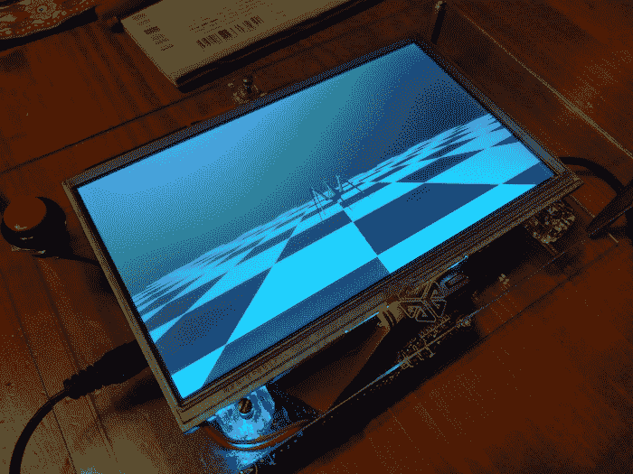

# 复古重建在旅途中重现 SGI 工作站演示

> 原文：<https://hackaday.com/2018/05/23/retro-rebuild-recreates-sgi-workstation-demos-on-the-go/>

当[劳伦斯]上周末向我们展示 Maker Faire 湾区后的 Alice 4 时，并不清楚这个系统有多特别。这款保护套是干净的白色，只有一个 7 英寸屏幕下方的红色大按钮，背面有一个电源开关。轻触开关时，系统启动显示一个熟悉的动画，并让你进入一个菜单。从这里开始探索会引出各种独立的图形演示，有些是交互式的。这是一个盒子里的树莓派在播放视频，对吗？差远了。

通常复古计算集中在个人计算机系统上。当他们是新的 8 位图形或复杂的 2D 精灵是最先进的，但现在他们的吸引力倾向于学习机会和怀旧的刺激。Alice4 可能仍然如此，该系统[Brad、Lawrence、Mike 和 Chris]从 20 世纪 80 年代中期开始运行 [Silicon Graphics (SGI)](https://en.wikipedia.org/wiki/Silicon_Graphics) 演示，但这不是故事的全部。[Lawrence]和[Brad]都曾在 SGI 全盛时期工作过，对那些大型工作站附带的图形演示有着美好的回忆。因此，他们从 FPGA 构建了 Alice4 来实时运行这些完全相同的演示。

多亏了摩尔定律，今天的嵌入式系统让昨天的动力触手可及。[Lawrence]和[Brad]在一个破旧的 FTP 服务器中找到了旧的演示代码，并定制了 Alice4 的软件和硬件来本地运行它们。[Brad] [编写了一个 libgl](https://lkesteloot.github.io/alice/alice4/libgl.html) ，它实现了 IrisGL API 的子集，以支持他们选择的演示集。libgl 将一组三角形发送到 SDRAM，在板载 FPGA 的[上运行的【Lawrence’s】HDL 获取它们以插值颜色和深度，并将结果绘制在屏幕上。它们一起允许 Alice4 核心的 99 美元 Altera Cyclone V 开发板在您的手掌中运行这些最先进的演示。](https://lkesteloot.github.io/alice/alice4/fpga-rasterizer.html)

Alice4 是[开源的](https://github.com/lkesteloot/alice/tree/master/alice4)并且有大量的文档。细读图形 API 逆向工程的考古学或 FPGA 中 FIFO 设计的讨论。如果这些还不能满足你的胃口，休息之后看看 Alice4 的视频吧。

 [https://www.youtube.com/embed/H9817NOqXno?version=3&rel=1&showsearch=0&showinfo=1&iv_load_policy=1&fs=1&hl=en-US&autohide=2&wmode=transparent](https://www.youtube.com/embed/H9817NOqXno?version=3&rel=1&showsearch=0&showinfo=1&iv_load_policy=1&fs=1&hl=en-US&autohide=2&wmode=transparent)

