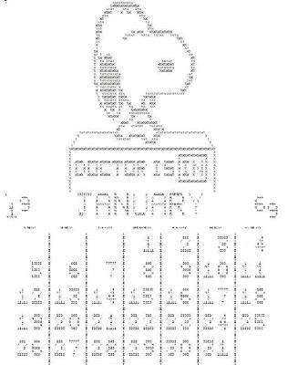
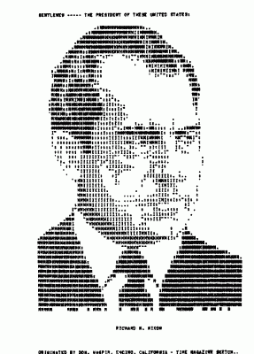
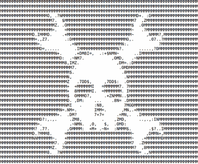
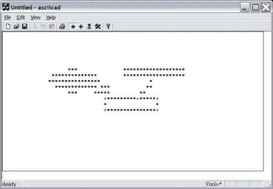
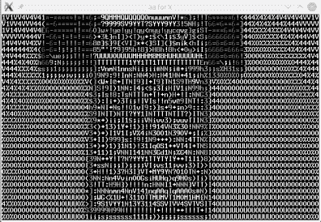
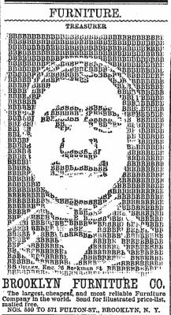

# 复古:19 世纪的 ASCII 艺术

> 原文：<https://hackaday.com/2016/06/28/retrotechtacular-ascii-art-in-the-19th-century/>

计算机图形学有了长足的进步。今天的一些视频游戏超过了几年前令人惊叹的电影动画。然而，并不是一直都是这样的。计算机生成图形的最早形式之一是使用文本字符在打印机上绘图。

 早期的电脑室可能会在绿色和白色的折纸上有一个史努比的角色。带有一些艺术作品的日历也很受欢迎(见左图，如果你喜欢的话，可以找到创造它的 FORTRAN 语言)。使用电传打字机(用业余无线电爱好者的说法是 RTTY)的业余无线电爱好者经常收集大量的穿孔带，这些穿孔带中有艺术作品。鉴于 20 世纪 50 年代和 60 年代大多数火腿都是男性，而且时代不同，他们中的许多人或多或少都被评为“R”级。

 不过也不全是。例如，理查德·尼克松无疑被评为“G”级(见右图)。简单的图片会使用单个字符，但复杂的图片会使用退格字符叠印多个字符。

## 业余无线电艺术

你经常听到这被描述为 ASCII 艺术，今天，虽然火腿通常使用 5 位博多代码，所以这是一个误称的图像，至少。当然，今天，人们并不热衷于储存一卷又一卷的纸带(或者甚至拥有一个纸带阅读机)，所以有几个项目以更现代的形式捕捉这种艺术。

虽然仍然有一些艺术活动，但图片发送已经基本上被慢扫描电视(SSTV)所取代，它可以发送真实的静止图像或传真等其他方式。一些较新的数字模式甚至有发送图片的能力。例如，你可以谈论你的收音机，然后给对方看一张收音机的照片。

## 现代艺术

现代 ASCII 艺术并不缺乏。如果你仔细想想，基于文本的表情符号(比如:-)就是一行 ASCII 艺术。我们大多数人都知道简单的，但如果你环顾四周，你会发现一架飞机:“٭٭ (▫▫) ٭٭”

或者你更喜欢机器人:

c[○┬●]כ

如果你喜欢一个著名的机器人，试试这个:

¦̵̱ ̵̱ ̵̱ ̵̱ ̵̱(̢ ̡͇̅└͇̅┘͇̅ (▤8כ−◦

 有[个网站可以轻松地将图像转换成 ASCII 码](http://www.glassgiant.com/ascii/)。例如，Hackaday 徽标很好地变成了 ASCII 图像(见左图)。

当然，你可以在网上找到许多[收藏](http://www.asciiworld.com/)(包括[一些带有教程](http://www.chris.com/ascii/))。如果你想从零开始画点什么，我在 2002 年写了一些你可能会喜欢的东西，叫做 [ASCIICad](http://www.al-williams.com/free/asciicad.htm) (见左下)。

话又说回来，既然创建它们如此容易，静态图片就不像过去那样令人兴奋了。如果你有这种感觉，也许你会对 ASCII 动画印象更深刻。如果你已经看过很多遍了，可以看看下面的视频，来一个更有创意的拍摄。

令人印象深刻，虽然如果你使用 VLC 的 ASCII 输出编解码器得到类似的效果。还记得关于金宇诺钟的黑客视频吗？见下面(右)来看看 VLC 是如何把它转换成一些 ASCII 艺术

    

## 这要追溯到多久以前？

当然，电传打字机、纸带和绿色折纸都是旧东西，对吗？你可能会认为这种类型的艺术无法超越电脑印刷。你可能会这么想，但你错了。看看下面 1881 年纽约时报的广告。

虽然广告使用了一个字符(“B”)来代表适当的图形。然而，有些字符不是完整的，所以它与计算机艺术不太一样。然而，它确实表明，在机械打印机出现之前，人们就有了将字符用作图形元素的想法。

这个有实际用途吗？谁知道你什么时候会有一个纯文本的液晶显示器或打印机，并想增加一点趣味呢？或者，你可能只是想要一个项目的复古外观。即使这些事情从来没有发生过，ASCII 艺术看起来和创造起来也是很有趣的。

我们过去已经报道过更加丰富多彩的 ANSI 艺术。如果你想要硬件更强的东西，你可能会发现[这款打字机很棒](https://hackaday.com/2015/04/21/ascii-art-with-pure-data-and-a-typewriter/)。

 [https://www.youtube.com/embed/3wYz3zVnkIA?version=3&rel=1&showsearch=0&showinfo=1&iv_load_policy=1&fs=1&hl=en-US&autohide=2&wmode=transparent](https://www.youtube.com/embed/3wYz3zVnkIA?version=3&rel=1&showsearch=0&showinfo=1&iv_load_policy=1&fs=1&hl=en-US&autohide=2&wmode=transparent)

* * *

**Retrotechtacular is a column featuring hacks, technology, and kitsch from ages of yore. Help keep it fresh by [sending in your ideas for future installments](mailto:tips@hackaday.com?Subject=[Retrotechtacular]).**