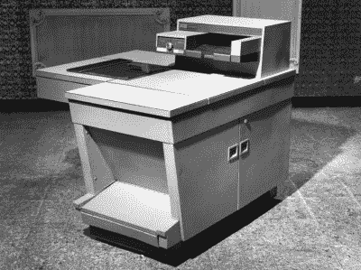
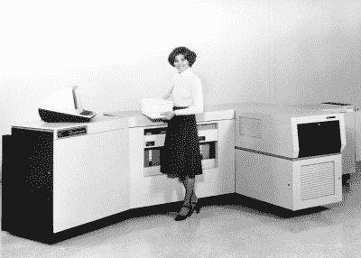

# 复制技术:复制一份文件的极其困难的任务

> 原文：<https://hackaday.com/2016/07/20/retrotechtacular-birds-and-the-bees-document-style/>

这似乎很难想象，但在 20 世纪早期，没有太多创建文档副本的好选择。最常见的方法是用复写纸从打字机或行式打印机上一次复印多份。一家名为 Haloid 的公司改变了这一切。没听说过吗？他们后来成为了施乐公司。

底层技术可以追溯到 1938 年(由一位同时也是律师的物理学家发明)。1944 年，他们生产了一台实用的复印机，此后不久就将版权卖给了 Haloid。Haloid 公司最初制造使用湿化学的照相复印机。

1959 年，施乐 914(之所以这么叫是因为它可以复印 9 英寸 x 14 英寸的文件)出现了(就是它，如下)。这台 650 磅重的复印机每分钟可以复印 7 份，并且配有灭火器，因为它有着火的倾向。如果你不想花 27，500 美元的价格，你可以只花 25 美元/月(记住，在 1959 年，25 美元可以买大约 25 磅的丁字牛排)。您可以在下面的视频中看到 914 的广告。

在广告中，你会看到他们夸大印刷品干燥的事实。这是因为很多以前的机器使用湿化学的实际摄影过程。显然，那也需要特殊的纸张。

## 甚至更早

如果复印机是最近才出现的，那以前人们是怎么复印的呢？结果发现有很多方法可以复制不同程度的劣质或极度麻烦的东西。从某种意义上来说，最好的副本是由抄写员写下第二份副本的。有各种各样的机器可以捕捉你写的东西，并通过机械或其他方式进行复制。测谎仪(不是测谎仪)允许托马斯·杰斐逊写信并复印。这台机器移动了一支笔，以配合作者的笔的动作，从而做出了一份近乎完美的副本。稍加调整，这就成了缩放仪，不仅能做同样的工作，还能缩小或放大副本。复写纸被广泛用于制作手写和打字文档的多份副本。

Spirit duplicator [by Birmingham Museums Trust](https://commons.wikimedia.org/wiki/File:Thinktank_Birmingham_-_object_1981S03518(1).jpg) CC-BY-SA 4.0

如果你愿意做一个“母版”来制作复制品，你甚至有更多的选择。学校过去常常使用胶版印刷(平底锅中的明胶)从母版上吸收墨水，然后用湿法将其转移到纸张上，使纸张膨胀和起皱。真正的打印机可能会用金属或木头做印版。复印机(见右图)是另一种流行的办公机器。打字机会切割蜡纸。蜡中含有墨水和溶剂(酒精),可以将墨水转移到纸上。

这一切只是冰山一角。如果你真的想探究人们是如何制作文档的，[维基百科有一个列表](https://en.wikipedia.org/wiki/List_of_duplicating_processes)。

## 因果

Xerox 9700 via [DigiBarn](http://www.digibarn.com/collections/printers/xerox-9700/)

想想这个:早期的计算机打印机基本上是某种类型的打字机。当然，一些打印机使用链条、带子、菊花轮和打字球。一些打印机只用几个点来形成字母，而不是打印元素，但他们仍然使用一些东西来击打色带和纸张。

复印机采取了不同的方法。它给一个滚筒充电，滚筒收集墨粉并将其压在纸上。当时，显然感光鼓是感光的，可以“扫描”原稿。但是真正的力量在于让一台计算机使用激光或 LED 灯来发光。

并不是说最初的复印机不是一个突破。但是一个更大的突破正等着它。施乐也取得了突破。[Gary Starkweather]在 1969 年有了这个想法，并在 1971 年将施乐 7000 改装成了激光打印机。1976 年，商业打印机不得不等待 IBM 3800。240 DPI 打印机像普通行式打印机一样使用连续纸张，每分钟可以打印 215 页。1977 年的施乐 9700 有点像现代的激光打印机，尽管佳能在 1979 年将这项技术带到了桌面上。施乐之星在 1981 年就有了这样的打印机，而采用佳能技术的惠普激光打印机出现在 1984 年。

顺便提一下，Xerox 9700 源代码对用户是不可用的。这让麻省理工学院人工智能实验室很不高兴，因为他们之前修改了打印机源代码，以便在乔布斯打印时提醒用户。有一个用户特别不高兴，开始思考为什么软件应该是开放的。那个用户？[理查德·斯托尔曼]。你可以争辩说施乐 9700 启动了自由软件运动。

 [https://www.youtube.com/embed/9xZYcWsh8t0?version=3&rel=1&showsearch=0&showinfo=1&iv_load_policy=1&fs=1&hl=en-US&autohide=2&wmode=transparent](https://www.youtube.com/embed/9xZYcWsh8t0?version=3&rel=1&showsearch=0&showinfo=1&iv_load_policy=1&fs=1&hl=en-US&autohide=2&wmode=transparent)

* * *

**Retrotechtacular is a column featuring hacks, technology, and kitsch from ages of yore. Help keep it fresh by [sending in your ideas for future installments](mailto:tips@hackaday.com?Subject=[Retrotechtacular]).**