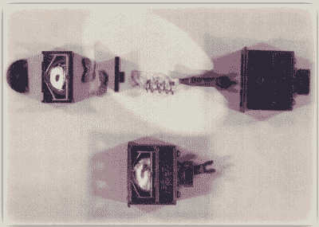

# 复古:冷战时期的硬件键盘记录器

> 原文：<https://hackaday.com/2015/11/06/retrotechtacular-cold-war-era-hardware-keyloggers/>

随着冷战紧张局势在整个 20 世纪 70 年代加剧，苏联在从美国外交官那里挖掘信息时使出浑身解数。这份[国家安全局 2012 年的备忘录](https://www.nsa.gov/about/_files/cryptologic_heritage/center_crypt_history/publications/learning_from_the_enemy_the_gunman_project.pdf)解释了在莫斯科和列宁格勒办公室使用的几台 [IBM 电动打字机](https://en.wikipedia.org/wiki/IBM_Selectric_typewriter)如何被成功地安装了机电设备，这可能是世界上第一台键盘记录器。

Selectric 用一个旋转并倾斜的球来选择想要的字符。两个机械臂控制球的旋转和倾斜，键盘记录器读出这些臂的位置。因此，Selectric 的类型元素球上的每个字符都有自己的签名。键盘记录装置的感应部分被埋在打字机底盘的一部分中，这是一根横跨机器宽度的金属杆，隐藏得非常好，只有完全拆卸或用 x 射线才能发现。

A bugged Selectric power switch. Image source: [NSA](https://www.nsa.gov/about/_files/cryptologic_heritage/center_crypt_history/publications/learning_from_the_enemy_the_gunman_project.pdf)

一旦传感器检测到一个字符，它就被存储为数字信号并压缩成四位字。当窃听器的缓冲区达到八个字的极限时，金属棒中的发射器通过射频将字符发送给苏联的接收器。尽管肉眼看不到，但苏联人希望得到更多的保护，以免被频率分析仪检测到，所以这些窃听器通过在与当地电视台相同的波段传输来隐藏信号。

在这些打字机中也不只有一种键盘记录器。国家安全局的分析师统计了五种不同的品种。早期型号靠电池运行，后来的型号从打字机本身获取交流电。这是他们垮台的原因。美国国家安全局 COMSEC 标准和先进技术部门的一名技术人员在一台打字机的电源开关中发现了一个额外的线圈，于是开始怀疑，剩下的就是历史了。如果苏联坚持使用电池，这些虫子可能不会被发现。

主图 via [维基百科](https://upload.wikimedia.org/wikipedia/commons/9/91/Selectric_II.jpg)。

谢谢你的提示，[Itay]。

Retrotechtacular 是一个每周专栏，以旧时的黑客、技术和媚俗为特色。通过[发送您对未来分期付款的想法](mailto:tips@hackaday.com?Subject=[Retrotechtacular])，帮助保持新鲜感。