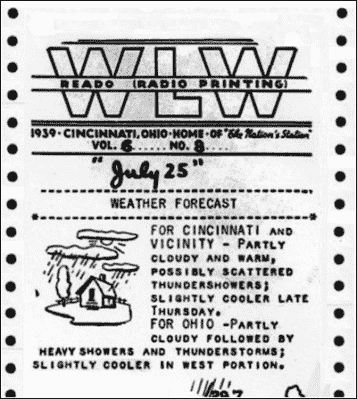

# 回溯:20 世纪 30 年代的电子出版

> 原文：<https://hackaday.com/2015/12/22/retrotechtacular-electronic-publishing-in-the-1930s/>

我们生活在公民新闻和 24 小时新闻循环的时代。几乎任何有新闻价值的报道都可以从多个角度进行，既有经过审查的，也有业余的。就在几十年前，人们还依赖日报、广播和口口相传来获取新闻。在电视时代即将到来之际，美国的几家广播电台参与了一项通过无线电波广播新闻的实验。但这不是普通的传输。在另一端，一种新型的接收器在一长卷纸上打印出新闻故事、线条画和图片。

无线电传真报纸技术在 1939 年的世界博览会上，在两个不同的展台向公众介绍。一个属于名叫威廉·芬奇的发明家，一个属于美国无线电公司。芬奇最近因他的有声报纸而出名，这种报纸将音频嵌入标准报纸的边缘，以波浪线的形式出现，由一种特殊的设备读取。

### 纸张的差异

Transmission from WLW Cincinnati printed on a Crosley Reado. Image from [Antique Radio Classified](http://www.antiqueradio.com/Sep07_Banks_Fax.html)

芬奇和 RCA 的接收器都使用连续的纸卷，但只有 RCA 的单位可以将它切成薄片。RCA 的纸有 8.5 英寸宽，由标准成分组成，而 Finch 的纸只有它的一半大小，并且经过化学处理。过了一会儿，克罗斯利带着他们的 Reado 接收器加入了游戏，他们在梅西百货公司以低于芬奇和 RCA 的价格出售了这款接收器。

接收器的差异意味着内容提供商不得不考虑多种类型的设备，就像今天的应用程序开发人员一样。RCA 标准宽度纸张上的新闻和照片在 Finch 的半幅纸上看起来会非常不同。

### 那刺耳的声音是什么？

如果你曾经在传真机打来电话时接过电话，你就会对传真传输的无线电版本有所了解。正因为如此，FCC 规定 AM 波段上的传真新闻广播只能在凌晨 1:00 和 6:00 进行。几个电台在相当新的调频波段上全天播送新闻。后来，广播公司试验了多路复用技术，在相同的调频频率上传输音频和传真。

### 太多新技术

无线电传真的支持者认为它为新闻提供了永久的记录，而且通过无线电听到的报道很容易被误解或曲解。几家广播电台归报纸所有，正是这些电台最努力地用这种创新来满足市民对新闻的渴求。许多从业者认为新技术是对日报和电台报道的补充，而不是威胁要取代它们。

像任何其他新技术一样，广播报纸被消费者采用的先有鸡还是先有蛋的问题所困扰。没有早期采用者，任何技术都不会成功，没有受众，就没有广告商。接收者平均 15 分钟打印一页，这对于许多人来说是非常慢的。大多数家庭的预算因大萧条和战争而捉襟见肘，因此家庭不得不在广播报纸和电视之间做出选择。你会选择哪个？

在下面的视频中，美国国家历史博物馆的 Hal Wallace 简要介绍了广播报纸的历史，并展示了 1938 年的 RCA 设备。

### 作者注:发送更多提示！

后面的机器冒烟了！我们想要的圣诞礼物就是让你送来一大堆新奇的小贴士。和烙铁头。还有啤酒。

 [https://www.youtube.com/embed/gTnRGkkFJj0?version=3&rel=1&showsearch=0&showinfo=1&iv_load_policy=1&fs=1&hl=en-US&autohide=2&wmode=transparent](https://www.youtube.com/embed/gTnRGkkFJj0?version=3&rel=1&showsearch=0&showinfo=1&iv_load_policy=1&fs=1&hl=en-US&autohide=2&wmode=transparent)

