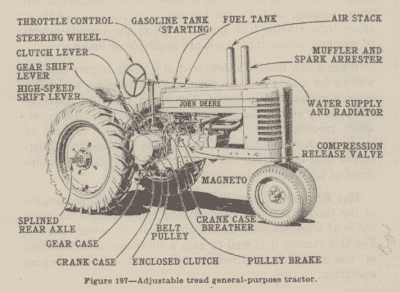

# 复古的:1932 年的农具

> 原文：<https://hackaday.com/2017/04/28/retrotechtacular-farming-implements-in-1932/>

很少有人会否认农业是一项艰苦的工作。它一直都是，而且可能永远都是，不管设备变得多么花哨。1932 年，农业尤其艰苦。整个美国出现了大范围的干旱，这导致了沙尘暴的出现。好像这两件事还不够糟糕，由于斯穆特-霍利关税法案，美国农民的平均收入在大萧条期间跌至最低点。

即便如此，在 1932 年，农作物种植仍然是一个可行的、有点受欢迎的职业道路。毕竟，知道如何种植食物总是会让你很快被选入当地的后世界末日委员会。  就这样，约翰迪尔设备公司发布了他们的经典著作第 19 版，农业机械的操作、保养和维修。这本书涵盖了农民从耕地到收获所需的各种设备。该文本对马和拖拉机驱动的农具给予了同等的考虑，并且有整整一章致力于拖拉机发动机的维护。

根据它的序言，这本书在学校和工读项目中被用作农业教科书。它提供了在全国各地进行土壤耕作、种植作物、耕作、收获和施肥所需的所有(John Deere)设备的完整维护课程。《农业机械的操作、保养和维修》非常受欢迎，John Deere 将这本书出版了 30 多年。第 28 版和最终版于 1957 年问世。我们想知道为什么过了那么长时间他们会停止扑灭它。也许这不够有利可图，或者该公司决定逐步淘汰遮荫树拖拉机技工。

那么，你为什么要钻研一本关于农业设备的过时教科书呢？嗯，它写得很直白，很容易学习，不管你是否在尝试。如果你对农业的基本知识有一点好奇，你应该去看看。如果没有其他原因，你应该去寻找美丽的手绘插图，并留下来看后面有趣的表格和图表。你知道一加仑牛奶重 8.6 磅吗？

Retrotechtacular 是一个每周专栏，以旧时的黑客、技术和媚俗为特色。通过[发送您对未来分期付款的想法](mailto:tips@hackaday.com?Subject=[Retrotechtacular])，帮助保持新鲜感。