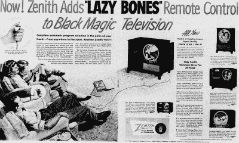
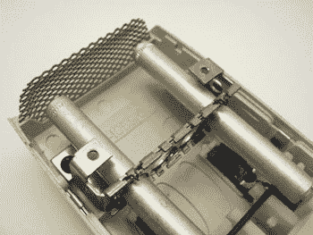

# 遥控器有多旧了？

> 原文：<https://hackaday.com/2017/03/16/retrotechtacular-how-old-is-the-remote/>

几周前，我们报道了一个(可能是)关于用火焰的红外线控制电视的虚假帖子。这让我们开始思考遥控器的真正起源。我们知道一个关于 38 kHz 频率的故事，通常用于调制 IR。我们听说它来自早期声波遥控中使用的声纳晶体。那是真的吗？还是只是一个都市神话？我们开始寻找答案。

## 惊喜！遥控器太旧了！

如果你是年轻读者，你可能会认为电视一直都有遥控器。但对我们许多人来说，遥控器似乎是一项新发明。如果你生长在上世纪中叶，你很可能是你父亲心目中的遥控器:“起来，转频道！”不过，事实证明遥控器已经存在很长时间了。他们只是在很长一段时间里不常见。

如果你真的想追溯到 1894 年，[奥利弗·洛奇]用无线电移动了一束光。1896 年，[马可尼]和其他一些人通过遥控制造了一个铃铛。[特斯拉]在 1898 年著名地展示了一艘无线电控制的船。但是这些都不是我们想象中的电视遥控器。

当然，电视一时还不会出现，但是到了 20 世纪 30 年代，许多收音机制造商已经为收音机安装了有线遥控器。人们不喜欢电线，所以菲尔科在 1939 年推出了[神秘控制器](http://philcorepairbench.com/mystery/index.htm)。这使用了数字脉冲编码和无线电发射机。这是一种奇特的说法，它有一个像老式电话一样的表盘。据我们所知，这是第一个用于消费设备的无线遥控器。

 [https://www.youtube.com/embed/5SDWNGrm9Gk?version=3&rel=1&showsearch=0&showinfo=1&iv_load_policy=1&fs=1&hl=en-US&autohide=2&wmode=transparent](https://www.youtube.com/embed/5SDWNGrm9Gk?version=3&rel=1&showsearch=0&showinfo=1&iv_load_policy=1&fs=1&hl=en-US&autohide=2&wmode=transparent)

神秘控比有线懒骨头遥控器晚了好几年，也没拿一件家具来装(但确实拿了一块[大电池](https://www.youtube.com/watch?v=7933V_ls7JA))。我们知道你想把一个拆开，幸运的是，[电池人]在这个视频中为我们做到了。

 [https://www.youtube.com/embed/aByPMNyQQLc?version=3&rel=1&showsearch=0&showinfo=1&iv_load_policy=1&fs=1&hl=en-US&autohide=2&wmode=transparent](https://www.youtube.com/embed/aByPMNyQQLc?version=3&rel=1&showsearch=0&showinfo=1&iv_load_policy=1&fs=1&hl=en-US&autohide=2&wmode=transparent)

## 懒惰的

菲尔科对遥控器并不陌生。他们的懒骨头电视在神秘控制器出现之前就已经存在了，并且使用地毯下的扁平电缆将收音机连接到另一个木制橱柜中的遥控器。他们也不是唯一生产有线遥控器的公司。Zenith 在 1950 年推出了懒骨头有线电视遥控器。

根据[到天顶](http://www.zenith.com/remote-background/):

> 懒人使用一根从电视机连接到观众的电缆。电视机中的一个马达通过遥控器操纵调谐器。通过按遥控器上的按钮，观众顺时针或逆时针旋转调谐器，这取决于他们是否想将频道换到更高或更低的数字。遥控器上有开关电视的按钮。
> 
> 尽管顾客喜欢遥控他们的电视，但他们抱怨人们会被蜿蜒穿过客厅地板的难看的电缆绊倒。

## 闪光！

齐尼思工程师[尤金·波利]在 1955 年解决了电线问题。他的闪光系统在电视的角落使用了四个光传感器。通过用一些光撞击传感器，你可以上下切换频道，关闭电视，或者静音，并且可能取消静音。

唯一的问题是光传感器会对任何光线做出反应。因此，如果太阳在一天中的正确时间照进你的窗户，它可能会关掉你的电视。然而，人们喜欢它，Zenith 不得不向客户道歉，因为没有足够的产品来满足需求。

## 音频遥控器

1956 年，Zenith 推出了它的太空遥控指挥系统。这使用音频而不是光。但是它可能没有你想象的那样工作。当你按下一个键时，[一个锤子敲击一个铝棒](http://www.pushclicktouch.com/blog/?p=107)产生一个接收器接收到的特定频率。这意味着遥控器不需要任何电池，这很聪明。Zenith 的市场部担心，如果遥控器电池没电了，人们会认为他们的电视坏了。
T3

你可以看到里面的杆子。每个杆的长度略有不同，总长度约为 2.5 英寸，如果你猜这意味着遥控器有两个按钮，那你就对了。你可以调低频道或者把音量从高到低再调回来。记住，那时候你只有 12 个频道可以浏览，可能只有两三个频道有除了雪以外的内容。

箱子里还有空间再放两根杆子，你可以看到箱子里还有两个按钮的切口。也有带四个按钮和四个杆的型号。

你必须记住电子设备在 1956 年的样子。遥控接收器给电视机加了六个显像管，把价格提高了 30%左右。尽管如此，它还是成功了。人们想要远程控制。

看着[drh4683]对准其中一个遥控器的接收器，听到铝条被敲击时发出的咔哒声，真的很有趣。甚至还有用于对准远程接收器的特殊测试装置。

 [https://www.youtube.com/embed/WE9eCGjMPE0?version=3&rel=1&showsearch=0&showinfo=1&iv_load_policy=1&fs=1&hl=en-US&autohide=2&wmode=transparent](https://www.youtube.com/embed/WE9eCGjMPE0?version=3&rel=1&showsearch=0&showinfo=1&iv_load_policy=1&fs=1&hl=en-US&autohide=2&wmode=transparent)

## 电子学

20 世纪 60 年代，固态技术发展到可以用晶体管电路和压电传感器代替铝棒的地步。这允许更多的按钮，但它需要电池。

有故事说人们也能听到遥控器和狗的声音。不难想象，随机噪声也能产生足够的能量来触发某些遥控器。然而，Zenith 声称，在过去的 25 年里，该行业生产了超过 900 万个超声波遥控器。

## 红外线的

像我们今天这样的红外线转换始于 20 世纪 80 年代，当时一家名为 Viewstar 的加拿大公司制造了有线电视盒。我们已经多次讨论过[它们是如何工作的](https://hackaday.com/2011/02/16/38-khz-ir-communications-tutorial/)，所以我们在这里不再赘述。我们永远无法证实 38 千赫是由于超声波遥控器的频率。看起来这个范围内的频率是在电子遥控器时代引入的。铝棒遥控器似乎工作在频率的五分之一左右。然而，即使使用红外遥控器，载波频率也会有一些变化。

例如，NEC 协议规定载波频率为 38 kHz。飞利浦 RC-5 和 RC-6 遥控器应该使用 36 千赫。然而，因为许多公司使用了容易找到的 455 kHz 谐振器，所以 37.92 kHz 的频率是常见的。还有其他频率的例子，包括 50-60 kHz 范围内的一些频率。

一个有趣的提示:红外线的频率也很重要。许多遥控器使用 930-950 纳米的波长，因为大气会吸收该光谱中的太阳红外辐射。这减少了阳光遮蔽红外接收器的机会。

## 普遍的

通用遥控器于 1985 年首次出现在 Magnavox(飞利浦品牌)上。苹果公司的史蒂夫·沃兹尼亚克(Steve Wozniak)创办了一家名为 CL9 的公司，销售 CORE——一种可编程学习遥控器，但未能流行起来。有人说是因为编程太难了。

即使在今天，也很难找到一个遥控器可以控制所有东西，除非你买非常高端的东西。有几个射频遥控器使事情变得复杂，并把我们带回了神秘控制器的完整循环。新的设备和代码不断出现。

然而，越来越多的趋势是允许设备通过手机或平板电脑等联网设备接受控制。所以也许有一天红外遥控器会像今天的超声波遥控器一样特别。

下一次，当你把 Harmony 遥控器捧在手中，寻找下一个你想看的真人秀节目时，花一分钟想想这段历史。那个遥控器背后有一条长长的线，可以追溯到[特斯拉]、[马可尼]和[洛奇]。