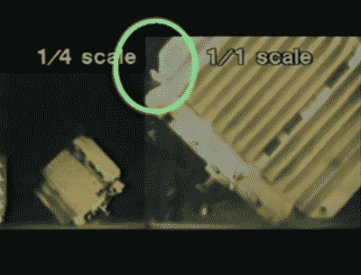
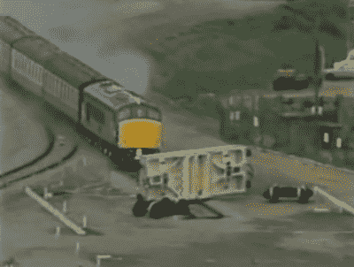

# Retrotechtacular:红极一时的行动

> 原文：<https://hackaday.com/2018/04/11/retrotechtacular-operation-smash-hit/>

从上传到网上的视频数量来看，YouTube 一代人的一个众所周知的恶习就是观看撞车视频。无论是英国司机在平交道口碰运气，俄罗斯人在积雪上失去了速度，还是美国人在矮桥下驾驶高大的卡车，这些电影都对观众产生了引人注目的吸引力，他们试图从他人的不幸中获得娱乐。这些镜头往往是外围的或模糊的，不可避免地被 dashcam 或安全摄像机捕捉到，而不是在专业操作的广播质量系统中占据中心位置。你无法预测这样的事情什么时候会发生。

在 1984 年的某个时刻，预测一场大崩盘正是你所能做的。这是一个全国性的事件，遍布电视屏幕，有数百万人观看。英国核电站的运营商希望公开展示他们的乏核燃料棒运输瓶有多坚固，所以在所有的实验室测试后，他们把它放在铁路测试轨道上，并撞上了一辆时速 100 英里的特快列车。

Water escaping during drop test.

这既是一个公关噱头，也是一项科学努力，他们不失时机地在所有媒体上推广它。断裂下方的电影是这一努力的一部分，它带我们经历了由巨大的钢坯锻造而成的烧瓶的制造过程，然后向我们展示了它所经受的测试。其中最难的是，在一个装满水的瓶子的一角进行跌落试验，结果瓶子里的水有少量溢出。因此，决定进行最终测试，以确保公众对核运输的充分信任。

旧的达尔比试验轨道是英国中部地区不对乘客开放的线路的一部分，被英国铁路公司保留作为新机车的试验场。在核废料铁路运输的最终测试中，一个烧瓶被横放在一段轨道上，一列由 20 世纪 60 年代撤回的机车和 20 世纪 50 年代的短耙车厢组成的火车在无人驾驶的情况下加速到 100 英里每小时。

An instant before impact, we see the underside of the derailed car. The flask is between it and the locomotive.

25 年后的 2009 年，[为*铁路*杂志【】写了一篇近乎滑稽的描述](https://www.railmagazine.com/trains/heritage/it-s-a-lovely-day-bring-a-flask)[46009](https://www.flickr.com/photos/barry13092/3745569111)号机车的毁灭，正如他所报道的，烧瓶幸免于难，只有表面损伤和微小的压力损失。这一事件被核工业誉为一次成功，随后逐渐淡出公众视线，因为核电站运营商更愿意远离新闻。

值得怀疑的是，老达尔比坠机事件对摄像机和公众有多大影响，对科学家和工程师有多大影响。但是这种破坏性试验确实是获得重要试验数据的一种手段，这些数据不能通过其他方式获得，而且在航空工业中已经进行了不止一次。同年晚些时候[一架波音 720 在美国](https://en.wikipedia.org/wiki/Controlled_Impact_Demonstration)坠毁，而更近的 2012 年[一架波音 727 在墨西哥](https://en.wikipedia.org/wiki/2012_Boeing_727_crash_experiment)坠毁。

让一列快车撞上一个核烧瓶是不太可能再次发生的事情，这是一次性事件。但有一件事是肯定的，我们无法对火车失事视而不见并不是什么新鲜事。YouTube 和无处不在的摄像头当然让崩溃变得容易，只要敲几下键盘。但是，从 1984 年的木桶碰撞试验，到 1896 年德克萨斯州 Crush 的壮观景象，这些碰撞中展示的巨大力量似乎对我们产生了一种诱惑的效果。

 [https://www.youtube.com/embed/2jzugX2NMnk?version=3&rel=1&showsearch=0&showinfo=1&iv_load_policy=1&fs=1&hl=en-US&autohide=2&wmode=transparent](https://www.youtube.com/embed/2jzugX2NMnk?version=3&rel=1&showsearch=0&showinfo=1&iv_load_policy=1&fs=1&hl=en-US&autohide=2&wmode=transparent)

标题图片:布赖恩罗伯特·马歇尔[ [CC BY-SA 2.0](https://commons.wikimedia.org/wiki/File:Old_Dalby_nuclear_flask_test-by-Brian-Robert-Marshall.jpg) 。