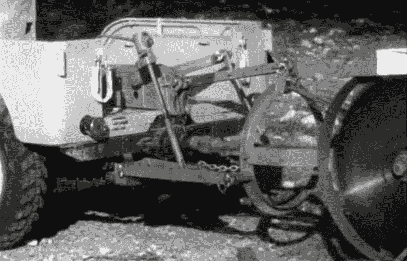

# Retrotechtacular:有史以来最好的吉普广告

> 原文：<https://hackaday.com/2018/02/21/retrotechtacular-the-best-jeep-commercial-ever/>

我们多久会发现自己感谢广告？当谈到 Hackaday 的 Retrotechtacular 专栏时，它实际上是非常常见的，因为它捕捉了文化和技术的一个瞬间。今天的展览是一个很好的例子，在这里我们可以看到现代生活中很少见到的汽车的实用性。

吉普的起源故事当然是它在第二次世界大战中的突出地位，当时生产了 50 多万辆。在战争期间经常驾驶这种车的美国大兵非常欣赏这种车的可靠性和多功能性，他们想在回家后拥有一辆自己的车，于是一个满足这种需求的市场出现了。现代版相当于 20 世纪 90 年代开始的悍马时尚。悍马的早期祖先悍马在 20 世纪 80 年代取代了美国军队的吉普车，一款名为悍马的车型在 92 年进入了消费者市场。但这更像是一个舒适符合图标的命题，20 世纪 50 年代的吉普(见下面的广告)在实用性的承诺下交付了——甚至超额交付了。

[在这个广告](https://www.youtube.com/watch?v=u7Sle8X4EZM)中，这个箱子是为吉普车制作的，作为农具，充当犁、割草机，甚至是挖坑机。作为一种消防工具，播音员自豪地说，“一个开吉普车的人可以做 100 个拿铁锹的人的工作”，方法是在土壤中切割火点。它被当作墓地、牧场、县服务人员以及他们的营销大师可以写进文案的任何东西的主力来卖。我们认为这些指标是可疑的，但可以肯定的是，廉价的构造、多用途的特性以及乡村对动力设备的需求使这些吉普车在乡村和工业服务中发挥了巨大的作用。

Power take off driving shaft to power circular saw. You can also see the hydraulics that lift and lower the saw.

让这一切成为可能的是动力输出装置(PTO)的存在。这是一种从车辆发动机到可被切断的外部部件的机械连接。一旦连接，可以控制发动机的速度来调节动力输出操作。与可提升和降低机具的液压系统相结合，它成为了一个非常通用的系统。我们开始怀疑美国方言中包含了“它就像……的瑞士军刀”这样的说法，而不是把所有非常有用的东西都叫做吉普车。

将一个泵连接到动力输出轴上，你就有了一辆消防吉普车。连接一个发电机，你就可以驱动电动工具，比如视频中用来砍树的电锯，以及给弧焊机供电。有一个看起来粗糙的圆形锯片，当你到达“吉普车战壕”时，你会把咖啡洒出来。没错，挖沟附件给车辆的悬挂一个粗略的锻炼。它自诩有能力挖掘六英尺，并在短短三小时内完成普通房屋的基础。

威利的 MB，吉普背后的公司一定雇佣了一批黑客。如果能在研发会议上提出该设备的 1001 多种用途，那该有多好啊。该公司有[一点吉普的历史，你可以细读](https://www.kaiserwillys.com/about_willys_jeep_vehicles_history_specs)，但我们真的很想听到关于附加设备的想法，没有做出削减。有没有读者有这方面的故事？请在下面的评论中告诉我们。

 [https://www.youtube.com/embed/u7Sle8X4EZM?version=3&rel=1&showsearch=0&showinfo=1&iv_load_policy=1&fs=1&hl=en-US&autohide=2&wmode=transparent](https://www.youtube.com/embed/u7Sle8X4EZM?version=3&rel=1&showsearch=0&showinfo=1&iv_load_policy=1&fs=1&hl=en-US&autohide=2&wmode=transparent)

