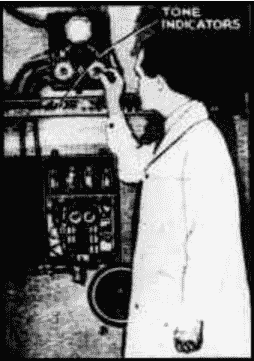

# Retrotechtacular:特雷明萜品酮

> 原文：<https://hackaday.com/2016/01/14/retrotechtacular-the-theremin-terpsitone/>

莱昂·特雷门于 1920 年在苏联的赞助下建造了他的同名仪器，以研究近程传感器。他后来将利用人体电容产生声音的想法应用于其他物理形式，如特雷门大提琴和特雷门键盘。其中之一是萜品酮，它有点像全身的 theremin。它建于特雷门琴之后大约 12 年，以希腊神话中舞蹈和合唱的九位缪斯女神之一忒耳普西科瑞的名字命名。

Theremin at the terpsitone controls.

与在环或棒附近挥动双手不同，特普西通是在一个大钢板上跳舞来演奏的。随着浮动辊向下弯向极板，电容增加，导致间距减小。从盘子上抬起来会产生相反的效果；电容骤降，间距增大。就像特雷门琴一样，由舞者控制的振荡器对着固定的振荡器拍子。输出经放大后发送到扬声器。

内置灯光秀将 terpsitone 与其他特雷门琴式乐器区分开来。舞者的动作每发出一个音调，相应的彩色玻璃灯就会亮起。每盏灯都由一个簧片驱动，簧片以一定的音调振动，关闭开关，点亮灯。

萜品酮甚至比特雷明更难控制。在休息后的短视频中，球员凑合着蹲在板上，用手臂和手指控制球场。不幸的是，只有三个萜品通曾经建成。最后一个是在 1978-79 年为著名的特雷门琴演奏家莉迪亚·卡温娜建造的，她恰好是莱昂·特雷门琴的侄孙女。这是唯一幸存的乐器，尽管手势控制音乐创作的精神在可穿戴乐器和 Wii Music 等主机游戏中仍然存在。

 [https://www.youtube.com/embed/gH0Y5M46Gqc?version=3&rel=1&showsearch=0&showinfo=1&iv_load_policy=1&fs=1&hl=en-US&autohide=2&wmode=transparent](https://www.youtube.com/embed/gH0Y5M46Gqc?version=3&rel=1&showsearch=0&showinfo=1&iv_load_policy=1&fs=1&hl=en-US&autohide=2&wmode=transparent)

Retrotechtacular 是一个专栏，专门介绍古代的黑客、技术和媚俗。通过[发送您对未来分期付款的想法](mailto:tips@hackaday.com?Subject=[Retrotechtacular])，帮助保持新鲜感。