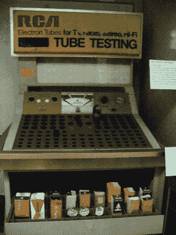
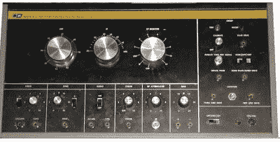

# 反技术:电视故障排除

> 原文：<https://hackaday.com/2016/05/03/retrotechtacular-tv-troubleshooting/>

随着技术的进步，找到故障设备的元凶变得更加困难。例如，对 AM 收音机进行故障诊断非常简单。有两个基本策略。首先，你可以注入一个信号，直到你能听到它。然后你倒着找不好的阶段。另一种方法是使用信号跟踪器或示波器跟踪信号。当信号消失时，你已经找到了坏的阶段。当然，你仍然需要找出舞台出了什么问题，但那通常是一两个晶体管(或电子管)和少数几个元件。

常见的信号注入器通常是方波发生器，可以产生音频和射频谐波。通常在音量控制(很容易找到)处注射，以确定问题首先出在射频还是音频部分。如果你听到嗡嗡声，你向后进入射频阶段。没有蜂鸣声表示音频部分有问题。

信号跟踪器只不过是一个带二极管解调器的音频放大器。从音量控制开始仍然是一个好主意。如果您通过信号跟踪器听到了无线电台，则 RF 部分是正常的。电视取代了收音机作为大多数家庭主要信息和娱乐形式的地位，因此电视维修行业应运而生。

## 哥伦布方法

 不过，老式的模拟电视稍微复杂一些。你不可能轻易地追踪一台电视的所有信号。当电视使用显像管时，很有可能其中一个显像管坏了。黑暗的显像管总是一个不好的信号。药店和其他零售商店有试管测试器(见右图),并实际出售替换试管。你可以把电视机的后盖拆下来，测试你的显像管，购买坏显像管的替代品，并且(可能)修理你的电视机。

这种故障排除方式通常被称为“复活节彩蛋”或“哥伦布方法”，或者简单地说，“寻找直到找到为止”它成功的原因是管道是最有可能失败的。

## 盒子里的电视台

当然，这并不总是奏效。对于固态电视，你可能无法使用这个选项。专业修理工有很多技巧。如果你知道信号应该是什么样的，示波器就非常有用。你也可以得到创建一些测试模式的小盒子。然而，电视维修的黄金标准是 B&K 制造的电视分析师(见下文)。

它可能看起来不怎么样，但这个不起眼的盒子是一个小电视台，适合放在你的长凳上。每一个信号都出来到前面板上，这样你就可以注入它。信号源是一个阴极射线管和一个光电管。阴极射线管扫描测试图像的透明度，光电管产生信号。阴极射线管实际上是一种特殊的类型，它发出的紫外光与显像管配合得很好，并且持续时间很短。

自然，这是一件黑白的事情，但是，分析师也有一个颜色条生成器来处理颜色集。这些并不便宜，但如果你有很多电视，你可以很快赚回成本。

使用分析师很容易。你把输出端接到了电视的输入端。据推测，因为电视需要修理，所以会出问题。屏幕可能是黑色或滚动，或者可能没有音频。您可以找到一个可疑的阶段(例如音频或垂直同步)，并使用分析师的相应输出将信号注入到布景中。如果事情开始工作，你就找到了问题所在。在某些情况下，你会通过电路向后移动，直到事情再次停止工作来找出问题。

就像修理收音机一样，你还是得找出电路的问题。但是把范围缩小到一个区域是个很大的帮助。

## 另一半是如何生活的

当然，并不是每个人都有这样的设备。事实上，大多数修电视的人都没有电视。实际上，如果你足够聪明，你只需要一个示波器。你可以用更少的钱来应付。尽管哥伦布方法对早期的固态电视没有太大帮助，但许多后来的型号电视都采用了模块化，所以你可以用复活节彩蛋模块代替电子管，直到电视再次开始工作。如果你有足够的备用主板，你可以试着更换模块，也许会很幸运。

当然，模拟电视机在今天已经是过时的技术了。今天的电视没有显像管，祝你好运排除内部电路板故障。当然，修复它们还是有可能的，但是这个过程肯定不需要去当地的药店。

* * *

**Retrotechtacular is a column featuring hacks, technology, and kitsch from ages of yore. Help keep it fresh by [sending in your ideas for future installments](mailto:tips@hackaday.com?Subject=[Retrotechtacular]).**