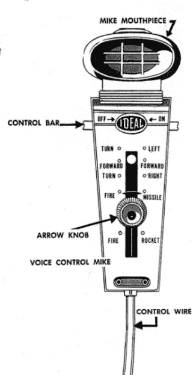

# 1961 年的语音控制机器人

> 原文：<https://hackaday.com/2018/06/15/retrotechtacular-voice-controlled-robot-from-1961/>

我们喜欢认为所有这些新的声控设备，比如我们的手机、谷歌 Home、亚马逊 Echo，以及所有这些都是新技术的巅峰。在最新的深度学习算法的支持下，语音控制的硬件在 20 世纪 60 年代还是科幻小说中的东西，对吗？不完全是。原来在 1960 年左右，Ideal 出售了机器人突击队，这是一种儿童玩具机器人，具有语音控制功能。

嗯，算是吧。如果你看看下面视频中的广告，你会看到一个孩子通过向麦克风发出命令，使机器人移动并发射导弹。1961 年某个玩具公司是如何做到的？

仔细看下面的视频。眼睛有自己的运动神经，可以自己移动。传动系统和导弹发射器受语音控制。如果你不能从视频中得到比例，这个机器人令人印象深刻地站在 19 英寸高。

 [https://www.youtube.com/embed/DJFzi6Gx7SA?version=3&rel=1&showsearch=0&showinfo=1&iv_load_policy=1&fs=1&hl=en-US&autohide=2&wmode=transparent](https://www.youtube.com/embed/DJFzi6Gx7SA?version=3&rel=1&showsearch=0&showinfo=1&iv_load_policy=1&fs=1&hl=en-US&autohide=2&wmode=transparent)

 遥控器有一个旋转开关(说明书上标有“箭头旋钮”)和一根粗电缆(控制线)从里面出来，连接到机器人上。结果电线根本不是电线。这是一个鲍登电缆。这是一种原始的波顿线缆，就像你在自行车上看到的一样，而不是 3D 打印的馈送机制。

移动控制器会拉动波顿线缆，并接合机器人内部的不同机构。看看[机器人的专利](https://patents.google.com/patent/US3103762)就能看出机理了。机器人内部也有 3 D 电池，所以遥控器里没有电池。

有趣的是，也没有麦克风。取而代之的是，有一个金属触点，你呼吸的空气压力会关闭这个金属触点，给机器人的马达供电。你会注意到一个“控制条”就在人造麦克风下面。在 on 位置，对着麦克风的第一次呼吸将闭合触点。它将保持关闭，直到您将杆推到关闭位置。因此，发出多个语音命令也需要在每个命令之间操作控制条。

如果你阅读机器人的[说明和故障排除指南](https://docs.google.com/viewer?url=http%3A%2F%2Fwww.tomenosuke.com%2FDownload%2Fbookret%2FRobot_Commando%2Frobot_commando.pdf)，你会发现你应该吹出第一个字母，如“FFFForward！”以获得所需的气压。

## 可收集的

这些机器人有相当多的收藏者，一个正常工作的机器人的价格可能相当高。显然，有一种吱吱作响的机制，使用乳胶橡胶球发出独特的声音。多年来，这些硬化，但它们可以被取代，正如你在下面的视频中看到的。

 [https://www.youtube.com/embed/V4vy57T1tiM?version=3&rel=1&showsearch=0&showinfo=1&iv_load_policy=1&fs=1&hl=en-US&autohide=2&wmode=transparent](https://www.youtube.com/embed/V4vy57T1tiM?version=3&rel=1&showsearch=0&showinfo=1&iv_load_policy=1&fs=1&hl=en-US&autohide=2&wmode=transparent)

你会在视频中注意到，语音命令仅仅是 10 秒钟内的一股气流。一旦激活，只要控制杆保持打开，你就不必做任何其他事情。

## 砍

当然，这是个骗局。这根本不是真正的语音控制。但在 1961 年，如果你只有 10 岁，它肯定会像今天的亚马逊回声一样酷。

顺便说一下，这个玩具是马文·格拉斯公司的产品。这是同样的装备，使摇滚袜子机器人，神秘的日期，行动，定时炸弹，Lite Brite，等等。显然，谷歌眼镜更多的是营销力量，所以并非所有这些玩具都来自同一个工程师，但一家公司生产出如此多的标志性玩具仍然令人印象深刻。

然而，对我们来说，这似乎是简化工程的一堂实物课。如果你今天正在建造机器人突击队，你会用 Raspberry Pi 运行张量流来进行语音识别，并且会有六个伺服电机和至少一个其他电机用于传动系统。格拉斯团队向我们展示的所有这些都是完全不必要的。