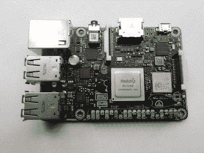
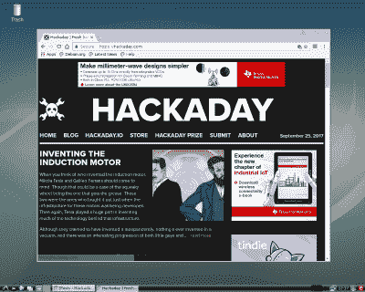
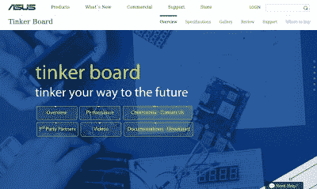
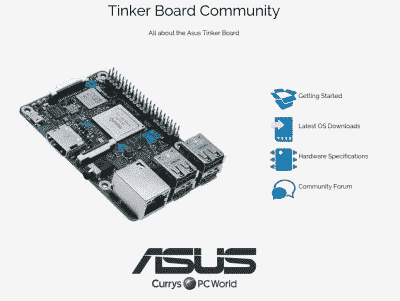

# 回归华硕补锅板:六个月改变了什么吗？

> 原文：<https://hackaday.com/2017/09/26/return-to-the-asus-tinker-board-have-six-months-changed-anything/>

The Asus Tinker Board, in all its glory

回到今年 2 月，我们订购了一台新的单板计算机，并对其进行了评估。问题中的主板是华硕 Tinker 主板，它是电子巨头 Raspberry Pi 3 的竞争对手，是 Raspberry Pi 外形的完美克隆。

[我们的审查](https://hackaday.com/2017/02/15/review-the-asus-tinker-board/)发现它的硬件是我们见过的最好的主板之一，但同时也发现了软件支持状态不佳的严重问题。没有网站，发行版必须从一个不知名的华硕下载网站下载，也没有用户社区或支持渠道可言。然后，华硕的一些人联系了我们，他们解释说，主板尚未正式推出，我们获得的设备已经提前退出了。

## 做了六个月的台式电脑

因此，这是一个恼人的不适，这是一个产品，我们没有真正做到足够的公正。在华硕的人回复我们之后，我们在我们的评论中进行了更新，但当时仍然没有在线支持，所以我们无法更新评论本身的内容，因为我们没有什么可继续的。

因此，六个月之后，是时候回到 Tinker Board，看看它的发行版及其支持产品的状态了。它改进了吗？除了非常强大的硬件之外，它现在是树莓派桂冠的有力竞争者吗？

我们的审查委员会在那个时候已经看到了大量的用途。它是我的台式电脑，让我告诉你，它是一个神奇的小主板。它提供了一个方便的网络终端，可以在硬件上工作的同时进行技术查询，对于需要一些工作时间的黑客故事，它还是一个非常有能力的创作和图形操作平台。如果你是一个经常阅读的人，你会读过很多关于它的文章。它有定期的 apt-get 更新/升级周期，我安装了它附带的小粘贴式散热器，因为最终我设法让它变得足够热，以至于它崩溃了几次，但除此之外，它一直保持着它在 2 月份与发行版的早期版本一起开箱时的状态。

## 发行版混乱，轻度缺乏润色

A tiny bit of apt-get magic gave us a screenshot of the Tinker Board desktop.

因此，为了更新这次重新评估，我去了 Tinker Board 网站下载了最新版本 TinkerOS 1.8。需要强调的是，这是官方版本:社区成员可以获得更新版本号的发行版，但不清楚它们是否不是 TinkerOS 的官方版本。社区成员在继续 Asus 编号方案的同时发布他们自己的发行版是不理想的——事实上他们可能应该是 forks——所以为了这篇评论的目的，我坚持从网站上官方下载，因为那将是零售客户找到的一个。值得指出的是，也有一个 Android 发行版，但因为这是与早期评论的比较，所以在这里被忽略了。

安装是一件简单的事情:将磁盘映像转移到 SD 卡上，如果你有一个 Raspberry Pi，你会很熟悉这一点。他们提到用 shell 脚本来完成这项工作，但是我是用我习惯的方式在命令行中手工完成的。从新发行版启动修补板后，我被直接带到了 Debian Stretch 上的 LXDE 桌面。

我立即碰到了第一个障碍。尽管运行了功能强大的监视器，修补板桌面还是以 SVGA-tastic 800 x 600 像素分辨率出现。遗憾的是，在桌面显示设置中没有改变这一点的选项，但快速的谷歌搜索将我带到了支持论坛和这个线程，这允许我为我的显示器创建一个条目。第二个障碍出现在我尝试截屏时:尽管被绑定到 Print Screen 键，gnome-screenshot 似乎在发行版中丢失了。TinkerOS 的最新版本比我在 2 月份得到的早期版本要简单得多，所以看起来好像我在吹毛求疵，但重要的是要记住该板的竞争及其可能的市场。这些都是在 Raspberry Pi 3 上的 Raspbian 发行版中不存在的问题。对于非技术用户和年轻人来说，他们可能最终会使用这个板，这可能会比你我这些黑客读者带来更多的问题。我感觉这个发行版的创造者可以相对容易地解决这两个问题；他们没有表明仍然缺乏对细节的关注。

## 也许(英国)论坛可以赢得你的心和思想

The [Tinker Board official website](https://www.asus.com/us/Single-Board-Computer/Tinker-Board/).

如果桌面还缺少一点润色，也许修补板可以挽回它在支持区的名声。有趣的是，在美国的 Tinker Board 网站上没有论坛链接，而英国的网站上有 tinkerboarding.co.uk 的链接。这个网站有一个 wiki 和一个论坛，似乎是与英国零售商 Currys/PC World 联合建立的，他们是英国主要的主板销售商。他们这样做得了满分；英国消费者一次也没有被冷落，这是一个罕见的案例，但令人困惑的是，华硕还没有找到自己提供资源的合适方式。因此，如果你是来自世界其他地方寻求支持的修补板所有者，请到英国论坛来。

The [tinkerboarding.co.uk](https://tinkerboarding.co.uk/) home page

如果有理由购买修补板，而不是高质量的硬件，那就是 tinkerboarding.co.uk 网站。它缺乏你会在 Raspberry Pi 论坛上找到的庞大的用户群和多年的档案，但就它对撰写本文期间出现的任何问题的回答而言，它已经证明包含了来自有知识的用户的高质量答案。这有可能成为 Tinker Board 用户的一个非常有用的资源，并可能被证明是平台的制作。

那么，在重新评估了 Tinker Board 软件和支持产品之后，它的表现如何呢？这肯定是一个比二月份更好的答案，但最终的判断不得不有点复杂。现在下载一个发行版并开始使用是很简单的，而且这个论坛已经被证明是一个有用的资源，但是在华硕的 Tinker 板支持包的交付上确实存在混乱。官方发行版缺乏润色，新版本存在令人困惑的情况，唯一有用的支持资源不是由华硕提供的，而是由一个国家的零售商提供的。零售商心血来潮地拿起和放下产品系列，没有人能保证这个论坛会成为一个永久的固定场所。

## 不再是只为 Linux 专家准备的论坛

几个月过去了，我们会建议你买一个吗？它仍然是一款真正能够击败 Raspberry-Pi-3 的硬件，所以我们最初对硬件方面的评估仍然是“是”。但是在软件和支持方面呢？早在 2 月份，我们就提出它更像是一个专家专用的董事会，并指责华硕的产品质量太差。现在他们已经大大改进了这个产品，但是如果给一个完全的非技术新手买一个的话，我们可能还是会建议稍微谨慎一点。例如，与 Pi 相比，如果我们在祖父母面前放一块修补板，我们仍然需要解决很多问题。不过，我们会改变我们的建议，采取中间立场。如果你正在为已经使用过 Raspberry Pi 并接触过一些 Linux 的人考虑这个问题，我们认为他们应该能够理解。他们将能够在论坛上找到解决方案，并使用 apt-get 安装软件，而天真的用户可能不会这样做。

所以你不再需要成为一个 Linux 专家来使用修补板，尽管对于新手来说可能还是有点棘手。这并不完美，但它代表了六个月来的重大进步。我们要了。