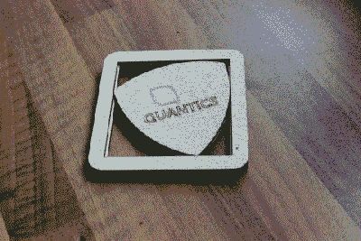

# 鲁洛杯垫

> 原文：<https://hackaday.com/2017/09/29/reuleaux-coaster/>

有什么比酷炫的身材更好？一个有价值建议的酷建筑！添加一些浮华的图片，你就有了【马丁·雷恩斯福德】的[罗勒三角杯垫博文](http://msraynsford.blogspot.co.uk/2017/09/coaster-jigs.html)。[Martin Raynsford]想分享他关于使用夹具的重要性的建议，我们被卖了。他能够在一天之内做 100 个杯垫，如果他像我们一样，在做了 10 个之后，工作会变得有点匆忙，这就是出错的时候。

当谈到工具时，夹具是一个宽泛的术语，但本质上，它在你加工它时将你的零件固定在适当的位置。在这种情况下，夹具是用来固定杯垫碎片的，而它们是粘在一起的。[Martin Raynsford]不需要在木材上做任何注册标记，所以甚至背面也是干净的。仔细看，杯垫是两部分，框架和三角形。每一部分都有三层，一旦胶水干了，它们就不能分开了。如果任何一个部分排列不当，整个杯垫就是废柴。

这个机器人手臂一天能雕刻 400 个杯垫，但是也许你更喜欢把你的 T2 啤酒送到你的新杯垫上。

