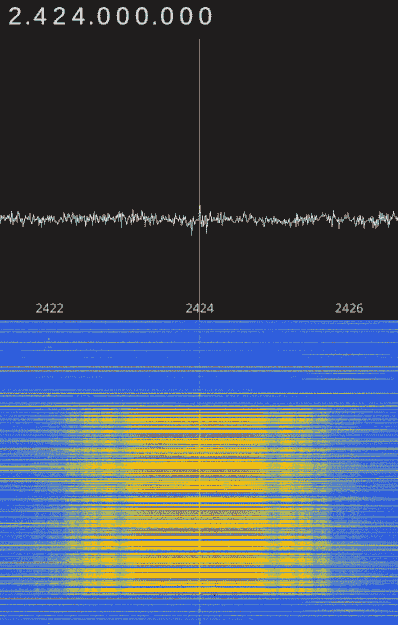

# 任天堂 Wavebird 的逆向工程

> 原文：<https://hackaday.com/2017/12/14/reverse-engineering-the-nintendo-wavebird/>

在 21 世纪初左右坚定支持任天堂团队的读者可以告诉你，任天堂 GameCube 没有比 WaveBird 更酷的配件了。以前对无线游戏控制器的尝试通常要么是粗略的第三方配件，要么是基于 IR，在这两种情况下，最终结果都是几乎不起作用。另一方面，WaveBird 不仅是任天堂的官方产品，而且使用 2.4 GHz 与系统通信。不得不对波鸟作出一些让步；它没有隆隆声，比股票控制器重一点，需要一个接收器“加密狗”，但总的来说，WaveBird 代表了游戏控制器未来的发展方向。

Finding the center frequency for the WaveBird

鉴于 WaveBird 非常受欢迎，[Sam Edwards]有些惊讶地发现关于控制器实际工作方式的信息非常少。为了寻找一个可以使用他的 HackRF 的项目，[Sam]决定看看他是否可以弄清楚他心爱的 WaveBird 如何与 GameCube 通信。他的这一好奇心催生了一个令人敬畏的 8 部分系列指南，展示了他用来解锁这个古老控制器的无线协议的一步一步的过程。

即使你从未见过 GameCube 或其有点矮胖的无线控制器，你也会想要阅读[Sam]为这个项目在他的 GitHub 库中收集的难以置信的大量信息。

从定义信号开始，[Sam]带领读者通过傅立叶变换，不同类型的调制，解码数据包，并了解纠错。最后，[Sam]展示了无线协议的最终总结，以及一个简单的 Python 工具，让 HackRF 模拟 WaveBird，发送按钮按压和将输入粘贴到未修改的 GameCube。

[这种工作量通常留给那些希望从头开始创建自己的控制器的人](https://hackaday.com/2012/02/13/wireless-controllers-for-all-your-retro-systems/)，因此我们感谢【Sam】为开发出可用于现有硬件的东西所做的努力。他的研究可能会在“工具辅助速度跑”或[甚至自动化无脑统计研磨](https://hackaday.com/2017/10/25/teensy-script-plays-nintendo-switch-strikes-out/)的世界中有非常有趣的应用。