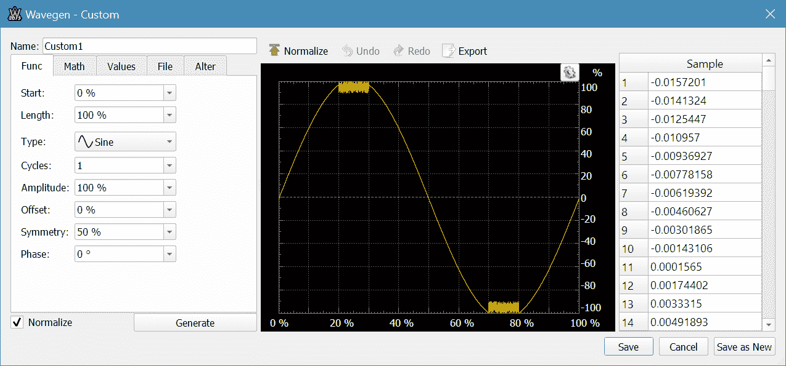
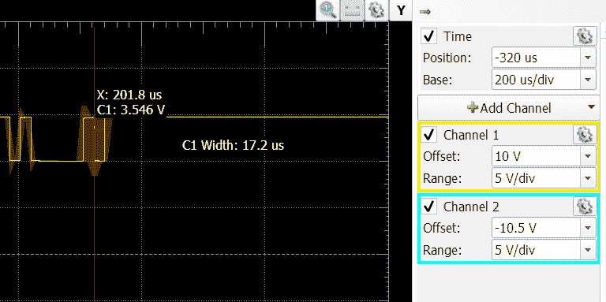
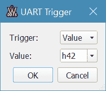
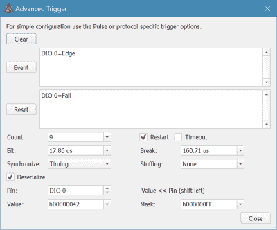

# 回顾:数字模拟探索 2

> 原文：<https://hackaday.com/2016/12/28/review-digilent-analog-discovery-2/>

我最近打开邮箱发现了一个白色城堡汉堡大小的小装置。这是 Digilent 的“模拟探索 2”。很难准确归类它是什么。从表面上看，它是一个 USB 示波器和逻辑分析仪。但它也是波形发生器、DC 电源、模式发生器和网络分析仪。

我以前看过这样的设备。有些比其他的好，但是通常所有的部分都不能同时很好地工作。也就是说，你可以使用示波器或者信号发生器。基于微控制器的往往会变得更糟，甚至当你添加通道。Analog Discovery 2 是围绕 FPGA 构建的，如果操作得当，它应该可以解决与其他小型仪器设备相关的许多问题。

我读到了关于发现号 2 的好消息，所以我急于测试它。我会说这是一个令人印象深刻的齿轮。不过，有几件事我不太满意，我会试着给你一个公平的解读，看看我发现的好的和坏的。

## 预先:价格标签

让我们先解决一件事。这东西不便宜(标价 279 美元)。你必须从价值的角度来看待它。你可以在一台电脑上使用多种乐器，而且——不像其他的——你可以(大部分)同时使用它们。另一件让我感到惊讶的事情是，它带有一个普通的插头，上面有许多小电线，末端是母头插座。这让我感到惊讶的原因是范围是相当有能力的(见下文),这意味着你真的想要一套好的探针。他们确实卖一个 20 美元的板上有 BNC 连接器(但一定要在同一时间得到它，因为最便宜的运费几乎是 20 美元)。

我知道这个单元对这个市场来说已经很贵了，所以再增加 20 美元(如果你包括便宜的探头，可能会更多)可能不是很有吸引力。但是对于范围的能力，它确实应该包括 BNC。看一下 Digilent 网站，他们似乎正在用这种设备瞄准教育市场。这意味着他们定价很高，可能会给教育用户打折，尤其是在数量上。

## 规格

示波器每秒可以进行 100 兆次采样，使用 14 位 A/D。如果你有 BNC 连接器，你可以得到 30MHz。输入实际上是差分的(尽管器件没有接地隔离)。波形发生器可以达到 12MHz。

说到功能，下面是 Digilent 对此的评论(经过一些编辑):

*   双通道 USB 数字示波器(1mω、25V、差分、14 位、100MS/s、30MHz+带宽–带 Analog Discovery BNC 适配器板)
*   双通道任意函数发生器(5V、14 位、100 毫秒/秒、12MHz+带宽–带 Analog Discovery BNC 适配器板)
*   立体声音频放大器从波形发生器驱动外部耳机或扬声器
*   16 通道数字逻辑分析仪(3.3V CMOS 和 1.8V 或 5V 容差，100MS/s)
*   16 通道图形发生器(3.3V CMOS，100MS/s)
*   16 通道虚拟数字 I/O，包括按钮、开关和 led
*   两个输入/输出数字触发信号，用于连接多个仪器(3.3V CMOS)
*   单通道电压表(交流，DC，25V)
*   网络分析仪–电路的波特、奈奎斯特、尼科尔斯传递图。范围:1Hz 到 10MHz
*   频谱分析仪–功率谱和频谱测量(噪底、SFDR、信噪比、总谐波失真等)。)
*   数字总线分析仪(SPI、I C、UART、并行)
*   两个可编程电源(0…+5V，0…-5V)。最大可用输出电流和功率取决于 Analog Discovery 2 的供电选择:
    *   每个电源最大 250mW，通过 USB 供电时总功率为 500mW
    *   使用外墙电源时，每个电源最大 700 毫安或最大 2.1 瓦

因此，就连他们也认为 BNC 董事会很重要。他们还忽略了一个最酷的特性——到处都有一种脚本语言，用于定制触发器或编排之类的东西。

我提到过你可以同时使用这些东西。有限制，但很容易理解。例如，网络分析仪使用示波器通道和波形发生器。因此，如果您正在使用分析器，您将占用那些资源。有道理。

该设备是基于 FPGA 构建的，因此它不会遇到基于微处理器的设备在共享定时方面存在的问题。所有的仪器同时工作正常。然而，它们共享缓冲存储器。连接时，您可以从多种配置中进行选择。想要一个 16K 的示波器通道缓冲器吗？好的，但是它会消耗你一些外围设备的内存。有一个固定的内存量是有意义的，而且在一定的参数范围内，你可以自己选择如何分配内存。

## 基础

因为设备只是一个盒子，里面有一些电线，所以软件就是一切。幸运的是，该软件是跨平台的(为此感谢您)。它很忙，因为有很多功能，所以你要探索的东西。大多数项目都有气球帮助(尽管有些没有，比如 UART 触发对话框)。在线帮助是最基本的，除非你是新手，否则不可能帮到你。

尽管如此，只要稍加努力，你就能找出其中的大部分。例如，这是一个正弦波的波形生成屏幕，在极端情况下有一些噪声:

[](https://hackaday.com/wp-content/uploads/2016/12/wave.png)

主屏幕上有许多类似于示波器屏幕上的小按钮:

[](https://hackaday.com/wp-content/uploads/2016/12/scope.png)

看到右上角的按钮了吗？最左边的一个显示了整个缓冲区的概况。第二个按钮打开热跟踪光标(波形上可见的红色自动光标)。齿轮设置一些选项，Y 按钮设置标签。

档位按钮特别讨厌。向下看屏幕的右边。还有三个档位按钮！当然，这些很容易，因为很明显，这些是频道 1 和 2 的选项，但在某些情况下，很难准确地记住哪个档位按钮隐藏了您正在寻找的一些模糊选项。

## 数字的

数字部分也差不多。您可以跨仪器触发(因此当 SPI 值进入数字端口时，您可以触发示波器)。像 UARTs 之类的东西有公平的协议转换。关于这些的文档很少，但是(或者我没有找到)，所以期待试验。例如，我的普通示波器让我在解码 RS232 信号之前将其反转。我没有找到一个选项。也许它足够聪明，能想明白。或者我可以翻转示波器的导线。但是没有试过，就看不出来。

事实上，我在协议解码上遇到了很多麻烦。我编写了一个非常简单的 Arduino 程序来生成一个测试模式:

```
void setup() {
 // put your setup code here, to run once:
 Serial.begin(9600);
}

int ct=0;

void loop() {
  if (ct++==1000)
  {
    ct=0;
    Serial.write("B");
  }
  else if (ct==1)
  {
    Serial.write("C");
  }
  else
  { 
    Serial.write("A");
  }
  delay(1);
}
```

我的想法是在字母 B 上触发，甚至可能用示波器观察它。起初，我没有循环结束时的延迟。我已经尽快发送了。我可以解码数据，但是触发不起作用。我一开始没有意识到，因为它处于自动模式，所以它最终会自己触发，我很困惑，我无法在数据流中找到“B”。

当我开始正常触发时，它根本没有触发。我从理论上讲，它无法在这样的数据流中间找出哪个位是起始位。平心而论，我的 Rigol DS1154Z 也想不通。然而，一个非常短暂的延迟(1 或更少)允许 Rigol 可靠地获取数据并触发。我从来没有得到它的工作与发现。

[](https://hackaday.com/wp-content/uploads/2016/12/trig1.png) 平心而论，一个新版本的 Analog Discovery 软件在那之后出现了，现在它可以工作了，尽管它需要比 Rigol 更长的字符间延迟。此外，屏幕底部的手动触发按钮似乎不起作用——至少在等待连续触发时不起作用。原来，我后来发现，与传统示波器上的手动触发按钮不同，这个按钮只有在你将触发器设置为手动时才起作用。你不能用这个按钮覆盖一个普通的触发器。如果是这样的话，这个按钮似乎应该被禁用。

事实证明，UART 触发器只是一个向导(见右图),它为您设置了一个复杂的触发器。您也可以在中断或空闲条件下触发。很明显，你不能(用这个对话框)做多个角色或者任何其他奇怪的事情。您也许可以用它为您定义的实际复杂触发器来完成。

[](https://hackaday.com/wp-content/uploads/2016/12/trig3.png)

这是真正的字母 B 触发器。对其中一些屏幕没有太大帮助，包括这个。大部分都很容易弄清楚，但至少有气球帮忙还是不错的。

## 判决

这听起来好像我对发现 2 很苛刻。我想是的，但实际上我印象最深。硬件好像很棒。不过，这个软件还需要改进。如果这是一个 50 美元的产品，这是显而易见的。如果软件是开放的，它会很快得到修复和增强。

然而，事实并非如此。以这个单位的价格——特别是加上 BNC 连接器——你可以买一个相当不错的双通道示波器。的确，这一发现远不止于此，但它也有其局限性。我们见过便宜的函数发生器，电源随处可见，还有大量的逻辑分析仪选项。如果你需要的话，网络分析仪可能是改变游戏规则的工具。如果你做了大量的自动化测试，将所有东西编写成脚本的能力也是一件大事。这不太像让 GPIB 保持一个装满齿轮的机架一起工作，但在某些方面，这是相似的，甚至对我们大多数人来说更好。

从好的方面来说，它体积小，便于携带。它是一个价格的一个包中的所有东西。如果你真的买了 Discovery 能做的所有东西，你会花更多。但你也可能会得到更多。例如，您可以为作用域设置的最大缓冲区是每个通道 16K。这年头不多了。

我对网络分析器很感兴趣，等我有时间玩的时候我会发帖子。这是你很难以这个价格替换的一件装备。

好吃吗？是的。完美吗？没有。你应该买一个吗？这将是个人的决定。对于冲动购买来说太贵了。它肯定是有用的，但只有你知道它是否有用到足以让你放弃几百美元。也许黑客空间或其他团体可以组织一次团购，协商一个更好的价格——我不知道，但问问也无妨。

我以前看过便宜的示波器，其中一些也是基于个人电脑的。它们与 Discovery 2 不在同一个级别，但它们的价格也只是 Discovery 2 的一小部分。我能想到的与 Discovery 2 最接近的是 LabTool(我[在早先的一篇文章中间接提到了它](http://hackaday.com/2016/01/28/a-tale-of-two-oscilloscopes-continued/))。它更便宜，但由于使用了微处理器，所以它不能同时做所有的事情，而且你做得越多，你可以采集的样本越少。另一方面，它带有 BNC 连接器。

## 进一步审查

这篇评论分享了我对 Analog Discovery 2 的想法，但我实际上并没有演示它。要了解更多信息，您可以观看 Digilent 的一个视频，向您展示下面的许多功能。还有一个来自[Nezbrun]的视频，将它与该装置取代的旧发现进行了比较。

**编者按:**本文的审核单位由 Digilent 免费提供给 Hackaday。

 [https://www.youtube.com/embed/TgQVBfNdJ2o?version=3&rel=1&showsearch=0&showinfo=1&iv_load_policy=1&fs=1&hl=en-US&autohide=2&wmode=transparent](https://www.youtube.com/embed/TgQVBfNdJ2o?version=3&rel=1&showsearch=0&showinfo=1&iv_load_policy=1&fs=1&hl=en-US&autohide=2&wmode=transparent)


 [https://www.youtube.com/embed/HXu2RxfJkKc?version=3&rel=1&showsearch=0&showinfo=1&iv_load_policy=1&fs=1&hl=en-US&autohide=2&wmode=transparent](https://www.youtube.com/embed/HXu2RxfJkKc?version=3&rel=1&showsearch=0&showinfo=1&iv_load_policy=1&fs=1&hl=en-US&autohide=2&wmode=transparent)

