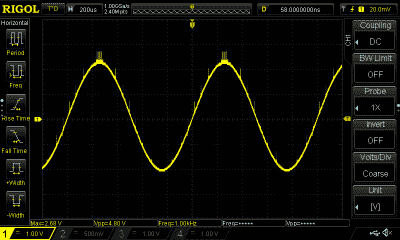
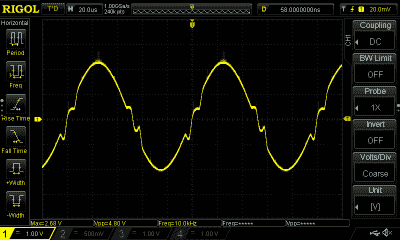
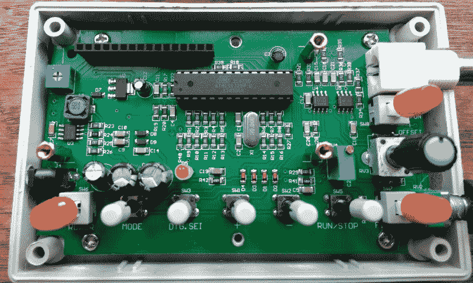

# 复习:FG-100 DDS 信号发生器

> 原文：<https://hackaday.com/2018/05/17/review-fg-100-dds-function-generator/>

我没有信号发生器，或者更确切地说，我没有低频信号发生器或函数发生器。最近，这一事实与我购买有时质量有问题的廉价商品的天真快乐发生了冲突。快速搜索你最喜欢的电子商务网站和语音控制互联网设备供应商，发现 FG-100 低频 1Hz 至 500kHz DDS 函数发生器仅售 15 英镑(21 美元)，还有什么不喜欢的呢？我被说服了，于是下了订单，急切地等待仪器的到来。

缺失的函数发生器是我工作台上的电子测试仪器阵列中的一个缺口，它可能不像以前那样是一个常见的设备。我的射频需求由 20 世纪 60 年代的一个古老的高级信号发生器提供，这是几年前在雷丁的[斯图尔特的密室里幸运发现的，但在频谱的底端，我的能力很弱。那么，为什么我需要另一个工作台工具呢？](http://www.stewart-of-reading.co.uk/)

有必要解释一下这些设备是什么，以及它们的功能应该是什么。简而言之，它们以用户定义的频率和振幅产生各种波形。一般来说，信号发生器只能产生一种波形，如正弦波或方波，而函数发生器可以产生多种波形，如正弦波、方波和锯齿波。更完善的函数发生器还允许产生用户定义的任意波形。重要的是，这些仪器在频率和输出幅度方面都有一定程度的校准。输出范围从一小部分伏特到几伏特是正常的。FG-100 如何满足这些要求？继续我对这个奇怪的廉价产品的评论。

## 吵得要命

包裹如期而至，里面是没有电源和说明书的设备。它在一个 ABS 外壳中得到了很好的展示，这个外壳比一包卡片稍大，带有一个定制的按钮前面板、LCD、一个 BNC 输出，加上右手边的一个振幅旋钮。左手边是一个电源插座，提供所需的 5 伏电压。方便的是，插孔的大小和极性与旧的 5 伏诺基亚手机上使用的相同，所以在墙上的疣盒中翻找了一个合适的适配器。我曾期待 2018 年无处不在的微型 USB，或者至少是 USB 到电源插孔的电缆，但遗憾的是，两者都没有出现。

A few transients showing on the 1kHz sine wave.

通电后，显示屏上显示“Wave: Sine”和“Freq: 100000”，并且频率显示屏上有一个闪烁的光标。界面有两种模式，一种是可以设置波形的模式，另一种是在治疗仪运行时锁定的模式。有一个“运行/停止”按钮在两者之间切换并启用输出，一个“模式”按钮在正弦、方波、三角波、锯齿波和反向锯齿波之间选择，还有一个有点不方便的三按钮界面来选择频率。还有一个可切换的过滤器和可切换的 DC 偏移设施。不幸的是，它没有能力记住最后使用的设置，所以它总是从 100kHz 开始。

评估信号发生器主要是通过示波器来完成的，因为现代示波器还包含频率计数器的功能，通过其 FFT 功能，还包含基本的频谱分析仪。FG-100 连接到可靠的 Rigol，值得一提的是，在这些测试中使用了各种不同的端接电阻，发现它们对结果几乎没有影响。

这是一个低频发生器，所以第一次激活时它被设置为 1kHz。无论选择哪种类型，波形上都有一些可见的瞬变。幅度从 0 到 24 伏特峰峰值变化，并且如果启用 DC 偏移特性，波形可以从大约-10V 移动到+10V。没有任何形式的偏移或振幅校准，但所有测量的频率都是发生器声称产生的频率。

At 10kHz that’s not a sine, it’s a sin!

随着频率的增加，正弦波形上出现了明显的失真，从大约 5kHz 以上开始，从 10kHz 以上变得非常明显。从波形上看，它类似于设计不佳的 B 类放大器上的交叉失真，尽管它似乎没有受到这种处理。失真增加到所有类型的支持波形在 50kHz 时近似于三角形的程度，之后幅度逐渐减小。

测量行人 25μS 的低频方波上升时间支持了这一发现，很明显这不是 500kHz 的设备。它在整个频率范围内产生某种可检测信号，其接口最高可达 999.999kHz，但很明显，其可用带宽仅低于 50kHz。

## 设计得很好，却被糟糕的组件所辜负？

Inside the FG-100, and despite its performance shortcomings it’s a physically well-designed piece of kit.

在外壳的背面是四个螺钉，这些是直接拧入 ABS 的长 M3 螺栓，它们不是预期的自攻螺钉。揭开盖子会发现 FG-100 的秘密，除了其核心插座中的 ATMega328 外，根本没有专用的 DDS 芯片。其他元件看起来像一个电阻梯形 DAC，一个开关电源芯片，几个用于信号调理的 TL072 运算放大器，以及一个也有插座的 HD4480 克隆 LCD 显示器。这些开关的质量似乎并不差，每个开关的前面板都有一个塑料盖。

## 结论

鉴于我对 FG-100 的调查，结论是什么？很明显，我购买它主要是为了继续我偶尔对廉价产品的一系列评论，而不是期望一个高质量的仪器，因此可以公平地说，它不会作为我的日常函数发生器加入我的工作台。它不是未经雕琢的钻石，虽然它在技术上使用 DDS 来产生波形。它没有专用的 DDS 芯片，其波形显示失真和瞬变，其带宽远不如宣传的那样，而且它没有任何幅度校准。

这很遗憾，因为它的构造显示了对物理设计细节的一些关注，但我不能诚实地建议任何人在他们的测试装备库中添加一个。对于你的 15，你得到一个 Arduino 盒子，里面有一个显示屏和一堆按钮，还有一点可疑的信号调节电路。假设它的设计师最初确实创造了一个不太像样的低频函数发生器，我只能得出结论，它已经被模拟部分的劣质或假冒元件所辜负，也许在某个时候我会尝试对它进行逆向工程，以找出问题所在。在网上快速浏览一下，发现大多数其他供应商都以比我支付的价格稍高的价格出售它们，所以也许我甚至被一些山寨货骗了。

你可能会问，为什么有人会期望这么少的支出获得更多，你绝对是对的，但如果你遵循了我的评论，你就会意识到在探索低质量硬件中找到的乐趣。它将连接[滑稽万用表](https://hackaday.com/2017/11/28/the-worst-piece-of-test-equipment-youve-got-to-try-hacking/)和[分解脱焊泵](https://hackaday.com/2018/04/10/review-hbtool-hb-019-desoldering-iron/)。但是为了避免你认为这 15 件商品都是垃圾，你应该看看更好的[温控烙铁](https://hackaday.com/2018/02/09/review-cxg-e90w-temperature-controlled-soldering-iron/)和[袖珍示波器](https://hackaday.com/2017/11/09/review-jye-tech-dso150-oscilloscope-kit/)。