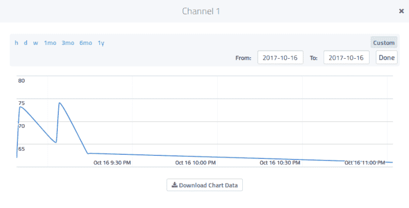
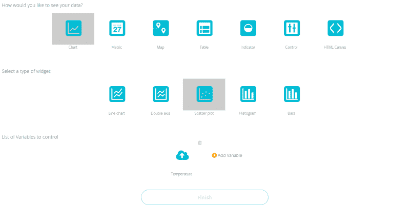

# 回顾:使用 MQTT 的物联网数据记录服务

> 原文：<https://hackaday.com/2017/10/31/review-iot-data-logging-services-with-mqtt/>

在过去的几个月里，我一直在使用 Sparkfun 的 Phant 服务器作为一个小型科学项目的数据记录器。不幸的是，他们遇到了一些严重的技术问题，已经停止了这项服务。Phant 还不错:它易于使用，免费，并允许我以 CSV 格式下载数据。它与 [analog.io](https://hackaday.io/project/4648-analogio-a-full-stack-iot-platform) 共享数据，这在当时是一个很好的数据可视化解决方案。

虽然我可以继续使用 Phant，因为它是一个开源项目，Sparkfun 友好地在 Github 上发布了服务器的源代码，但我认为最好还是做一些研究，看看那里有什么。我决定为每个平台编写一个最小的实现，作为一种有趣的方式来感受每个平台。为此，我将 DHT11 温度/湿度传感器连接到 NodeMCU 板，作为简单的数据源。

### 是什么让物联网数据记录服务变得有用？

首先，我有三个主要要求。首先，该服务将主要用于数据记录，因此适当的导出特性是必需的。

第二，它需要很好地支持 MQTT，并被适当地文档化，以便我可以在各种各样的硬件上实现它。Arduino 库是有用的，但还不够。如果您需要快速更新，我们之前已经介绍过 MQTT 的基础知识。

最后，它必须以合理的价格提供。它不一定是免费的，因为有很多方法可以让一个合理定价的服务在节省的努力或实际收入中获得回报。

在那之后，有很多事情是可选的。带有实时图表的光滑仪表板是快速共享数据和激发人们兴趣的好方法。对 MQTT QoS 级别 2 的支持(每个数据点使用 4 次握手发送一次)会很好，因为我将使用的一些网络不太可靠，这意味着更好的数据质量。最后，如果我可以在我自己的 VPS 上托管它，这样我就可以在我收集数据的国家租用服务器，这将真正提高我所在地区的可靠性。

在考虑了上述内容后，我找到了五个似乎符合要求的选项:Adafruit.io、Cayenne、Thingspeak、Thingsboard 和 Ubidots。我也考虑过 Blynk，但是他们似乎还没有将 MQTT 用于其服务的文档。这是一个耻辱，因为否则它看起来很光滑，有一个整洁的智能手机应用程序。

在每种情况下，我将从我的角度解释利弊，并提供一个使用通用 MQTT 库(来自 NodeMCU)的 Lua 实现示例。大多数平台也为 Arduino、Raspberry Pi 和其他平台提供定制库或现成的解决方案，但是我想在稍微低一点的层次上研究每个服务是如何工作的。作为一个额外的好处，代码将直接在支持 MQTT 的 NodeMCU 固件上运行。

没有考虑的一个标准是安全性——这些数据记录器收集的是非关键的科学数据。它们在加密的 Wi-Fi 网络上，不接受来自互联网的命令。

### 阿达果木卫一

我一直对 Adafruit 的文档印象深刻， [Adafruit IO](http://io.adafruit.com) 也不例外。MQTT 通信协议是定义良好的，它清楚地说明了如何进行设置而不会让任何方面感到“笨拙”,并且有进一步阅读的链接。

在 Adafruit IO 中设置一个设备首先要在用户界面中创建一个 feed，这看起来很简单，而且经过了深思熟虑:


创建提要后，如果愿意，您可以将其添加到仪表板中。与其他一些平台相比，小部件的集合有些稀疏，但所有必需的都在那里，并且可以根据需要调整大小:


要将数据添加到提要中，需要将 MQTT 客户机设置为连接到 io.adafruit.com，使用 Adafruit 帐户名作为用户名，使用 AIO 密钥(登录时位于左侧的黄色密钥)作为密码。请注意，如果您的设备没有使用 SSL，这些凭证可能会被拦截，并且 Adafruit IO 支持 SSL。如果你的设备支持 SSL，使用它是个好主意。

一旦连接上，要发布的 MQTT 主题就是您的用户名/提要/提要名称。尽管支持 JSON 数据格式，但是有一点需要注意，对于每个提要，一次只能记录一个值。您可以向单个提要添加纬度、经度和海拔，但不能添加温度和湿度。相比之下，一些平台允许你在一个 feed 中添加或多或少任意数量的变量，我经常发现这对于像气象站这样的事情很有用。没有什么可以阻止您将多个提要绑定到一个仪表板上，所以我不认为这是一个重大缺陷。我能找到的唯一缺点是 Adafruit IO 只支持 MQTT QoS 级别 0 和 1，不支持 2。

Adafruit IO 也有方便的数据管理。您可以手动添加和删除值，这是其他一些平台所没有的功能。从提要中下载数据很简单，当你查看提要时有一个按钮。

我想指出的一个真正优秀的特性是有一个错误控制台。不仅如此，当有新的东西给你看的时候，仪表盘会把它标为红色。这个特性加上优秀的文档使 Adafruit IO 成为学习的最佳平台——没有隐藏任何复杂性，但它是有文档记录的，并且有调试工具。我们测试该平台的示例代码如下:

```
ClientID = 'put anything here'
username = 'your username here'
AIOkey = 'your key here'

m = mqtt.Client(ClientID, 120, username, AIOkey)

m:connect(&quot;io.adafruit.com&quot;, 1883, 0, function(client) print(&quot;connected&quot;) m:publish(username..&quot;/feeds/temperature&quot;, temp, 0, 1) m:close() end)

function postThingSpeak(level)
m:connect(&quot;io.adafruit.com&quot;, 1883, 0, function(client) print(&quot;connected&quot;) m:publish(username..&quot;/feeds/humidity&quot;, humi, 0, 1) m:close() end)

end

tmr.alarm(1, 5000, tmr.ALARM_SINGLE, function() postThingSpeak(0) end)

```

### **Cayenne**

[Cayenne](https://mydevices.com/) 中的接口由设备组织。每个设备都有包含您的数据的通道。向通道发送数据时，设备可以指示发送的数据类型(例如湿度)以帮助处理。有很多[支持的数据类型](http://mydevices.com/cayenne/docs/bring-your-own-thing-api/#cayenne-mqtt-api-supported-data-types)。


您可以创建不同的“项目”,从不同设备上的通道获取数据，并将它们添加到一个通用仪表板中。每个频道可以显示为预设或自定义时间间隔的图表。这些图形很干净，但对于较大的数据集来说有点小，并且有一种奇怪的平滑效果，产生了不代表数据的曲线。我一点也不喜欢这个功能，因为它让我更难看清到底发生了什么。我希望看到的是完全关闭趋势线的能力，或者至少是平滑功能。

图表视图上有一个“下载图表数据”按钮，可将数据下载为 CSV 文件。



总的来说，Cayenne 检查了所有的框，但是编码有多简单呢？事实证明，在我研究的服务中，它有一个更不寻常的 MQTT 设置。它需要指定一个客户机 ID、一个用户名和一个密码来连接，并在 MQTT 主题中再次指定客户机 ID 和用户名:

```
ClientID = ‘your client ID here’

username = ‘your username here’

password = ‘your password here’

channel = ‘your device channel’

m = mqtt.Client(ClientID, 120, username, password)

m:connect(&quot;mqtt.mydevices.com&quot;, 1883, 0, function(client) print(&quot;connected&quot;) m:publish(&quot;v1/&quot;..username..&quot;/things/&quot;..ClientID..&quot;/data/&quot;..channel, &quot;temp,c=&quot;..temp, 2, 1) m:close() end)
```

添加到每个设备的通道在 web 界面中命名，并简单地用一个数字标识。例如，您的第一个频道是`v1//things/<ClientID>/data/0`。

最后，它工作得很好，甚至支持 MQTT QoS 级别 2。

### **说话的东西**

首先， [Thingspeak](https://thingspeak.com/) 已经与 MATLAB 集成。能够在同一个地方存储、可视化和分析数据似乎是一个很好的特性。我更喜欢用 Python 做假设检验，但 MATLAB 是一个很好的选择，所有常见的统计检验都可用。

换句话说，数据被分类到通道中。频道包含字段，字段包含您的数据。


Thingspeak 上的图表很整洁，清楚地显示了数据点。然而，我找不到在界面中调整图形大小的方法，这应该是可能的，因为它们似乎是作为 SVG 图形生成的。

一个非常有趣的特性是能够从图形中生成 iframe，并将它们包含在另一个网站上。我快速试了一下，效果非常好。这对这个辐射探测器来说是一个很好的附加物。

Thingspeak 的 MQTT 实现非常简单，只需要通道 ID 和 API 键:

```
ChannelID='your channel ID'

apikey = 'your API key'

m = mqtt.Client(ClientID, 120)

m:connect(&quot;mqtt.thingspeak.com&quot;, 1883, 0, function(client) print(&quot;connected&quot;) m:publish(&quot;channels/&quot;..ChannelID..&quot;/publish/&quot;..apikey, &quot;field1=&quot;..temp..&quot;&amp;amp;field2=&quot;..humi, 0, 0) m:close() end)
```

不幸的是，Thingspeak 只支持 QoS 级别 0，这意味着在不稳定的互联网连接上，数据可能会被复制或丢失。我不确定这在实践中有多重要，但是考虑到他们对数据分析的关注，不用处理丢失的数据点会更好。

### **东西板**

到目前为止，我们只研究了外部托管的服务。如果你需要一些可以自己掌控的东西，Thingsboard 值得一试。他们的设置与我们目前看到的有些不同。其中大部分是针对不同用户的访问控制、发出警报/动作的规则设置，以及超出本文范围的激动人心的事情。


就我们的目的而言，设备包含遥测数据。然后仪表板上的小部件连接到设备中包含的遥测装置。与其他一些平台相比，dashboard 的创建工作流程比较复杂，但它们拥有我所见过的最广泛的选择和最酷的 dashboard 小部件，并且每个都可以设置为全屏显示。


然而，数据导出一开始有些不方便——没有下载按钮，但可以通过 Curl 以编程方式完成[。这样，数据导出和备份可以自动化(例如使用 cron)，这很适合我。](https://thingsboard.io/docs/user-guide/telemetry/#timeseries-data-values-api)

这里的 MQTT 实现非常简单，并且支持 QoS 级别 2。在连接时使用与设备相关联的访问令牌，然后发送的任何遥测将属于该设备。一个非常重要的考虑因素是，您不能将整数或浮点数据作为字符串发送——它将在实时显示(如仪表)上工作，但任何图形都将无法正确提取历史数据。换句话说，不要发`{"temperature":"57"}`，一定要发`{"temperature":57}`。下面是代码示例:

```
ClientID = 'put anything here'

token = 'your token here'

m = mqtt.Client(ClientID, 120, token)

function postThingsboard(level)

status, temp, humi, temp_dec, humi_dec = dht.read(pin)

print(string.format(&quot;DHT Temperature:%d.%03d;Humidity:%d.%03d\r\n&quot;,

math.floor(temp),

temp_dec,

math.floor(humi),

humi_dec

))

print('{&quot;temp&quot;:'..temp..',&quot;humidity&quot;:'..humi..'}')

m:connect(&quot;demo.thingsboard.io&quot;, 1883, 0, function(client) print(&quot;connected&quot;) m:publish(&quot;v1/devices/me/telemetry&quot;, '{&quot;temp&quot;:'..temp..’,&quot;humidity&quot;:'..humi..'}', 2, 1) m:close() end)

end

tmr.alarm(1, 10000, tmr.ALARM_AUTO, function() postThingsboard(0) end)
```

### **Ubidots**

不像这里评论的其他平台， [Ubidots](https://ubidots.com/) 不提供免费账户层。也就是说，新帐户开始时有足够的信用来运行一台设备 5 个月，5 美元将购买足够的信用来运行一台设备 2 个月。

在 Ubidots 中，数据被发送给变量，而变量存在于设备内部。您可以通过添加小部件和选择数据变量来创建仪表板。用户界面是 Ubidots 真正闪光的地方；它拥有迄今为止最好的仪表板创建流程，总体来说，如何做您可能需要做的一切都一目了然…只有一个例外。



通过输入变量，然后点击“变量设置”，可以访问从变量导出所有数据的选项，这里仅有的两个选项是“导出到 CSV”和“删除值”，这两个选项都不是设置。另一方面，从设备中导出所有数据会被直观地标记，以及您希望它在哪里，我用一个大红色箭头表示:


至于 MQTT 实现，在我看来有点笨拙。您使用令牌作为用户名进行连接，数据与特定设备的关联是通过 MQTT 主题实现的。JSON 字典中的数据键必须与用户界面中设置的变量名完全匹配(必须是惟一的)。

在我看来，这不如其他一些平台容易管理，在这些平台上，您可以指定特定于设备的令牌，并且可以使用非唯一的变量名。也许我遗漏了一些东西，但是如果我记录 30 个不同管道的温度，我个人会发现管理唯一键比唯一变量名更容易。不过，它支持 MQTT QoS 级别 2，这很好:

```
clientID = 'anything can go here'

Token = 'your token'

Device = ‘your device name’

m = mqtt.Client(clientID, 120,Token)

m:connect(&quot;things.ubidots.com&quot;, 1883, 2, function(client) print(&quot;connected&quot;) m:publish(&quot;/v1.6/devices/&quot;..Device, '{&quot;Temperature&quot;:&quot;'..temp..'&quot;,&quot;Humidity&quot;:&quot;'..humi..'&quot;}', 2, 1) m:close() end)
```

### **总结**

所有这些平台都提供数据捕获、显示和导出。它们在 MQTT 实现上略有不同，但差别不大。对于数据记录的目的，它们都足够了。在尝试了每一种方法之后，有一些事情让我印象深刻。

Adafruit IO 无疑是学习的最佳平台。他们有优秀的文档、数据管理和用于调试的错误控制台。免费账号足够入门，付费账号价格合理，功能强大，可以做很多事情。如果我必须向想学习如何将物联网数据记录添加到项目中的人推荐一项服务，我会毫不犹豫地推荐 Adafruit IO。

Thingspeak 将数据分析整合到了他们的平台中。我还没有深入研究它，但在同一个地方自动进行数据采集、存储、分析和决策的想法似乎很棒。它能执行自动假设测试和基于拒绝/未能拒绝零假设的控制系统吗？我不是 MATLAB 用户，但从表面上看，它似乎可以。只是不要告诉任何直接回应营销团队。

Ubidots 有一个光滑的用户界面，很容易理解。如果我必须向孩子或经理介绍物联网，而不涉及许多技术细节，这就是我会使用的方法。这并不是恶意的评论，只是因为不同的原因对两个群体来说都很理想。

最后，东西板。我不知道物联网领域存在如此成熟的东西。个人和商业项目的可能性都是惊人的，因为它是开源的，可以自我托管。最重要的是，它有漂亮的仪表板部件，我可以向客户展示。当我看到它时，我的反应是立即拿起电话开始打电话。我还不知道我会做什么，但是会很有趣，有一天我会试着在这里分享。