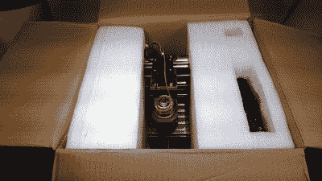
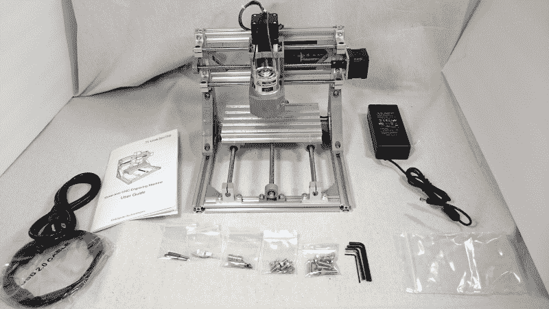
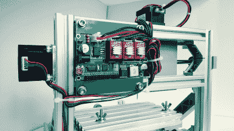
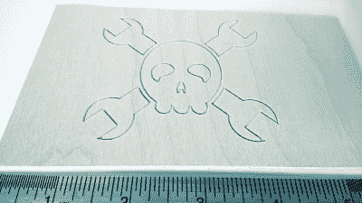
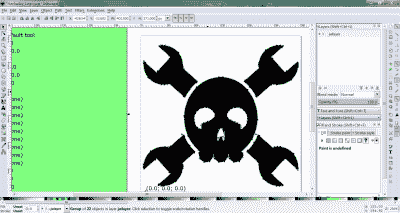
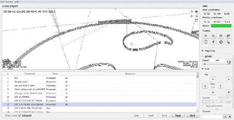
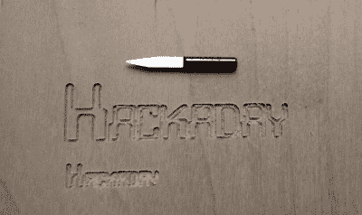

# 点评:LinkSprite 迷你 CNC

> 原文：<https://hackaday.com/2018/01/16/review-linksprite-mini-cnc/>

这是成为业余爱好者的大好时机。不管你对 Arduino/Raspberry Pi 效应有什么感觉，它所创造的普遍热情和需求的涌入转化为更好的组件可用性、更广泛的社区和大量免费可用的知识。当人们获得知识和想法时，伟大的事情就会发生。曾经仅限于工业使用的工具变成了开源，入门级版本的价格暴跌。

正如我们在过去几年中所看到的，廉价 3D 打印机的价格不断下降，而质量标准不断提高。激光切割机和雕刻工具也是如此。几周前，在逛 Microcenter 时，我在 3D 打印机旁边的后墙上发现了一个新玩具。那是 LinkSprite 的台式迷你 CNC。他们没有展出一个，但是有两个在架子上的盒子里。好家伙，那些盒子真小。可笑的小。我想知道，这个可爱的机器真的有什么好处吗？对一些人来说，200 美元的价格标签暗示了另一种情况。对我来说，价格标签使它变得合理，特别是考虑到业余爱好数控铣床的下一个价格点至少是两倍。我拿出手机，站在那里疯狂地寻找评论，文档，任何可用的东西。这似乎是普遍的，如果稀疏的共识是，这件事并不完全是浪费金钱。哦，还有一个维基。

根据 [LinkSprite 的 wiki](http://store.linksprite.com/diy-cnc-3-axis-engraver-machine-pcb-milling-wood-carving-router-kit-arduino-grbl-assembled-version/) ，这个小机器将雕刻木头、塑料、亚克力、PVC 和 PCB。它不会雕刻金属(尽管是 PCB 铜)。我对 PCB 蚀刻过程中使用的化学物质有点怀疑，所以用蚀刻代替的想法特别有诱惑力。我扣动了扳机。

### 我从哪里来

从经济角度来说，我是一个业余爱好者，我想为自己建造一个更好的家居空间。如果我在一个工具或玩具上的花费远远超过 200 美元，最好有一个很好的理由。我不是设计和销售工具包，但通过投资这样的工具，我已经使这种目标更容易实现。现在我只想抓住一点机会，找点乐子，学点东西，并希望能很好地利用这个机器人，而不会太沮丧或不得不经常摆弄它。

从经验上说，我以前从未使用过数控铣床。但是我有 3D 打印和设计的经验。虽然这些是不可互换的(事实上在技术上是相反的)，但在 3D 空间中移动的概念对两者都适用，所以我的经验帮助我根据我想象的学习曲线来证明我的购买是正确的。

Tableau from an unboxing.

### 你想要 200 美元吗？

一回到家，就该开箱了。我不知道我在期待什么，但很明显，LinkSprite 关心这个产品。它被包装在一个定制的聚苯乙烯泡沫塑料壳和一个厚纸箱里。我想，如果他们打算这样运送它，即使它在运输途中和/或被商店员工扔来扔去，当我收到它时，它也会处于良好的状态。

我的第一印象是它看起来很酷。它简约实用，占地面积很小。如果我想带它去某个地方，它很容易就能装进牛奶箱里。这东西有它需要的，仅此而已。机箱大约 80%是挤压铝，其余基本上是注射成型的塑料支架，铸铝连接器和少数 t 型槽硬件。在功能上，有三个用于笛卡尔运动的电机以及必要的杆和轨道，一个用于雕刻的主轴电机，一个控制板和一些电缆扎带。因为大部分是铝，它只有 12 磅重。

WYSIWYG

它配有两个 3 毫米的雕刻钻头，两者都是半圆形和尖形的，似乎适合雕刻丙烯酸树脂，适合雕刻工艺胶合板等较软的材料。由于我想雕刻 PCB，我可能会购买用于通孔设计的钻头和几个用于不同走线宽度的平端铣刀。

The heat-sunk Woodpecker 2.6 lies in wait at the machine’s rear.

### 没有设置

一旦开箱，就没什么可做的了。除了电源模块，它还配有一根 USB 迷你电缆、两个卡盘、两个钻头、夹紧硬件和五个内六角扳手。我得到的是完全组装好的。我所要做的就是扔掉其中一个芯片，把散热片放到电机驱动芯片上。也有一个套件版本，看起来便宜 50 美元左右，并解释了所有的内六角扳手。如果你得到了套件版本，[这里有一个流畅的构建视频](https://www.youtube.com/watch?v=XfhlZuw5mDs)与之配套。

最酷/最恐怖的是 [LinkSprite 卖 39 美元](http://store.linksprite.com/laser-head-for-diy-cnc-3-axis-engraver-machine/)的激光头附加件。我还没有去寻找激光安全的蜂窝床替代品的细节，但这是我在尝试皮尤-皮尤-皮尤之前首先要确保的事情之一。还有一个合适的外壳。

到目前为止，我对这台机器只有一个担心。也许这只是这个孤独的单位，或者可能是这个干燥的中西部冬季，但有一个火花在董事会当我插入桶连接器。几乎每次我用它的时候都会出现这种情况。

Hello, Hackaday!

### 雕刻一件东西:设计

就 3D 概念化而言，我在用 OpenSCAD 设计和用 Cura 在 Lulzbot Mini 上打印方面最有经验。如果你有 3D 打印的经验，那么在我看来，这台特殊的机器不应该呈现一个陡峭的学习曲线，就让它做任何事情而言。不过，要让它完全按照你的想法去做，还需要一些反复试验。

There’s snow and everything.

到目前为止，我已经用 LinkSprite 的 [Inkscape](https://inkscape.org/en/) 导入图片并创建文本，用于雕刻 3 毫米厚的工艺胶合板和一块类似厚度的丙烯酸树脂。我决定跳过“你好，世界！”径直走向快乐扳手。假期很快就要到了，这是一个展示和讲述的绝佳时机。我做了“节日快乐”的雕刻来展示给家人，因为我想看到它被雕刻在爱德华七世时代的国贸中心。

在未来，我将通过尝试不同的设计和基底来扩展我的视野，最终追求雕刻我自己的 PCB。就软件而言，当时机成熟时，我已经盯上了 [FlatCAM](http://flatcam.org/) 。

### 雕刻一件东西:准备好

LinkSprite 最终需要一个 g 代码列表和一个指定的步长深度。Inkscape 具有为您生成 g 代码的本机扩展，并允许您设置钻头直径、进给和深度步长。关于这个过程的教程超出了本文的范围，但是如果你对以后的文章感兴趣，请在评论中告诉我。

An SVG gets its wings.

Inkscape 能够将 g 代码直接发送到数控机床，但现在我将坚持使用 [Candle](https://github.com/Denvi/Candle) 。这就是小册子给我指出的程序，它已经从“grblController”更名为“grblController”。Candle 类似于 Cura，它提供了一个光滑的界面，用于手动控制工具头的 XYZ 位置并将 g 代码发送到机器。主要的区别是 Cura 也切片。据我所知，Candle 也可能会切片，但我一直在使用 Inkscape。为了继续 3D 打印的类比，Inkscape 还处理设置步长深度，这是减法过程对层高度的回答。

在工具头归位之前，是时候进行最重要的步骤了:夹紧工件。这台机器配有足够的 t 型槽硬件和垫圈来制作四个夹子，但对于我迄今为止所做的一切，我在后面使用了两个这样的夹子，在前面使用了一对大夹子。在我上面链接的套件视频中，这个家伙使用了用于加固关节的扁平角撑。我手头的某些直立人套装看起来也很有前途。

LinkSprite 不会自动将工具头归位，因此必须使用 Candle 手动完成。这很简单，只需一步一步地将床移动到起点，并将 XY 调零。然后，对工具头做同样的事情，将与材料厚度相关的 Z 调零。

Dig that Jolly Wrencher!

### 雕刻一个东西:钻头接触到基底的地方

一旦 g 代码准备好，工件夹紧，刀头在(0，0，0)，就该雕刻了。这就像启动主轴电机并点击发送蜡烛一样简单。

蜡烛显示，除其他外，雕刻时间估计。我所做的一切都比预期的时间长了一点。快乐假期的预计时间是 34:20，但实际上用了 39:17。这就是生活。

我最喜欢 Candle 的一点是，它让你在视觉上跟随——有一个工具头的线框 3D 表示，叠加在正在雕刻的任何设计的模型上。当它雕刻时，屏幕上的虚拟工具头实时跟踪实际工具头的每一步，如果你愿意，你可以放大并观察它做每一层。

### 迄今吸取的经验教训

*夹紧工件* *井* *。*是的，这是一台微型机器，但它仍然用锋利的工具以每分钟数千转的速度施加压力。如果一个固定不牢的基板突然在房间里旋转，钻头很可能会碰到床并脱落，造成难以想象的损害。(与其说这是一个教训，不如说这是一个预先的预防措施。)

不要忘记将所有东西归零。不像 3D 打印机和其他一些业余爱好的数控铣床，这台机器本身不会自动归位。必须通过 grbl 控制器手动完成。

Knife-dulling typography.

*首先启动主轴。*很容易忽略小册子中的警告，并假设主轴将在雕刻过程中开始旋转。并没有。你必须启动主轴电机，然后发送 g 代码，否则钻头会卡住并拖动，很可能会断裂。

尽快购买更多的钻头。特别是如果您没有先启动主轴电机而使其变钝。无论如何，你最终会需要更多。

*检查设计尺寸*。那把开心果扳手的直径是 5 厘米还是 5 毫米？同样，如果你打算刻字，检查你的字体大小，这样它不会变得非常非常小。

### 这是一个好机器人

根据我目前的经验，我对这次购买非常满意。即使价格是原来的两倍，这也是一笔划算的买卖。这是一款不错的入门级机器，相对容易使用，如果你有 3D 设计和打印经验，就更容易使用。如果你想花一点钱学到很多东西，这台机器可以成为你在减法艺术中的廉价教育。

### 下一步是什么？

我的最终目标是雕刻自己的 PCB。在亲自尝试之前，我将研究我们几周前出版的指南[Adil Malik 的] [PCB 铣削指南](https://hackaday.com/2018/01/04/guide-why-etch-when-you-can-mill/)。我还想尝试铣削一些材料，包括一些不明显的材料，看看会发生什么。这是入围名单:瓦楞纸板，一叠粘好的硬纸板(麦片盒纸板)，一个油毡雕刻块，还有一个扁平的小酒店房间肥皂。你会加入我吗？