# 评论:垄断制造商终极 3D 打印机

> 原文：<https://hackaday.com/2016/08/30/review-monoprice-maker-ultimate-3d-printer/>

几个月前，Monoprice 上出现了一款非常便宜的 3D 打印机。我对这台打印机的好奇心价值超过 200 美元，所以我挑选了其中一台。[Monoprice MP Select Mini 是一款非常棒的 3D 打印机](http://hackaday.com/2016/06/13/review-monoprice-mp-select-mini-3d-printer/)。对于一个可能正在经历“3D 打印阶段”的 13 岁孩子来说，这是一款完美的打印机。这是一个伟大的打印机打印更好的打印机。尽管有 Makerbot，这款打印机是 3D 打印行业没有崩溃的标志，预示着消费 3D 打印机时代的到来。

MP Select Mini 并不是 Monoprice 唯一的 3D 打印机；我买的打印机只是“好-更好-最好”系列中的“好”打印机。自从我对 MP Select Mini 进行评论以来，Monoprice 已经推出了他们的顶级产品，即 [Maker Ultimate 3D 打印机](http://www.monoprice.com/Product?p_id=15710)。Monoprice 问我是否想看看这个产品，我非常乐意。

经过一周的磨合，我可以有把握地说，你没有把钱浪费在这台 700 美元的 3D 打印机上。这不是一台入门打印机，而是一台可以用很长时间的打印机。2016 年是消费者 3D 打印机时代的开始，垄断制造商 Ultimate 不仅仅是这一点的证明。

### 是的，这是一个再边缘

[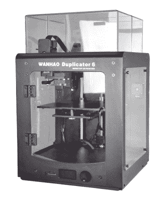](https://hackaday.com/wp-content/uploads/2016/08/wanhao.png)

One feature missing from the Monoprice version is the acrylic side panels and top. If you have a laser cutter, these can be easily fabricated. Image source: [wanhaousa.com](http://wanhaousa.com/products/duplicator-6).

垄断制造商终极版是万豪复印机 6 的翻版，应该被视为同一台打印机。Monoprice 售价 700 美元，而万豪售价 800 美元，但 Monoprice 没有为打印机的侧面和顶部配备丙烯酸面板。除了这一点小小的不同，你看到的是同一台打印机。增加丙烯酸外壳面板是否值得 100 美元的加价取决于用户。任何有激光切割机的人都可以很容易地替换这些面板，我热切地期待着这些。DXF 档案即将出现在网上。

事实上，这是万豪打印机的一个卖点。万豪有相当大的追随者，因为他们的 i3 版本，随之而来的是备件的可用性。我对低端垄断价格打印机 MP Select Mini 的评论哀叹道，垄断价格没有出售任何备件，在美国也找不到原始制造商的经销商。至少，你可以从万豪打印机公司的美国经销商那里买到垄断制造商 Ultimate 的零件。这种打印机也比按价格制造的 MP Select Mini 稍微标准化一些，并且可以通过通常的在线零售商获得替换喷嘴和 hotends。

### 规格、结构和印象

[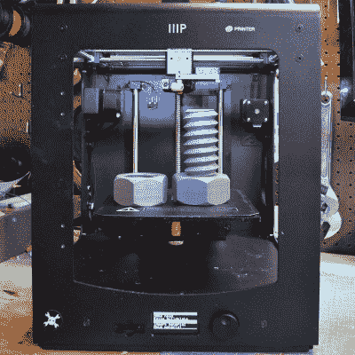](https://hackaday.com/wp-content/uploads/2016/08/herosq.jpg) 我们现在先解决一件事。这是一个终极克隆人。有机发光二极管控制面板的软件菜单与 Ultimaker 上的完全一样。X 轴和 Y 轴的机械设置几乎是*Ultimaker 的*，除了在托架上有两个横杆而不是一个。Z 轴完全相同，只是两个“角”床调整点在后面，而不是前面。Monoprice Maker Ultimate 和 Ultimaker 之间的唯一显著区别是 XY 托架上的挤出机。Ultimaker 使用鲍登设置，而 Monoprice 将步进机和直接驱动挤出机堆叠在支架上。就是这样。这是唯一的区别。由于挤出机在支架上，这台打印机的最高速度理论上低于 Ultimaker，但我没有发现任何问题。

这台打印机的外壳非常坚固。打印机的正面、顶部和侧面都是一片铝。两侧被焊接到这个薄板上，所有的部件都连接到这个非常坚固、非常结实的框架上。粉末涂层将保持相当好。这台打印机是所有关于质量，这种设计选择继续 1/4 英寸厚的铝建设板。与我的 6”方形 Printrbot Metal Simple 相比，这种铝制构建板加热速度很快，所有的电气连接都是牢固卷曲的，并覆盖有热收缩层。

[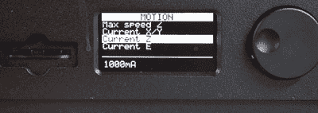](https://hackaday.com/wp-content/uploads/2016/08/motion.jpg)[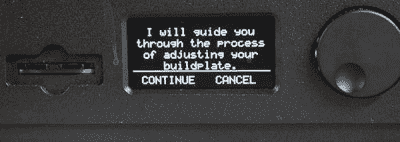](https://hackaday.com/wp-content/uploads/2016/08/guide.jpg)[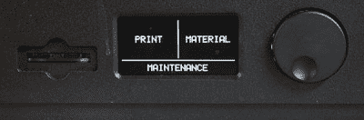](https://hackaday.com/wp-content/uploads/2016/08/printmaterial.jpg)[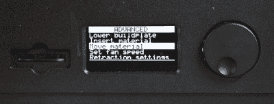](https://hackaday.com/wp-content/uploads/2016/08/advanced.jpg)

虽然我在一周内只使用了大约 130 个小时，但这比我在其他普通商店看到的每次 3D 打印机审查的时间要多得多。说一周左右或运行时间足以正确评估打印机是不准确的。为此，我需要几个月的打印时间，我需要喷嘴堵塞，如果运气好的话，一些轴承会出故障。不过，我很努力地推动这个东西，在挤压机里磨了一些 ABS，并在可替换的构建表面上留下了一些漂亮的深痕。我的印象是这是一台非常强大的 3D 打印机。它可以处理车间里的日常使用和教室里的日常虐待。它的设计经久耐用，而且我不认为这台打印机会很快停止使用。

规格-如手册中给出的，而不是在线规格表-列出的构建体积为 200 x 200 x 175mm 毫米。X 和 Y 轴上的位置精度为 12.5 微米，Z 轴上的位置精度为 5 微米。这是一台为 1.75 毫米灯丝制造的打印机，配有 0.4 毫米喷嘴。打印速度列为 1- 300 毫米/秒，行进速度为 1-350 毫米/秒。打印机重 30 磅。

### 样本打印、打印质量和功能

在测试过程中，我只使用了打印机上的库存设置(可通过有机发光二极管显示器更改)，以及 Cura 的建议设置。这些设置足以产生高质量的打印效果，尽管我在收缩时确实有拉丝的问题。这个问题很容易解决，只需稍微调整一下切片机的收缩设置，将温度设置得低一点。

[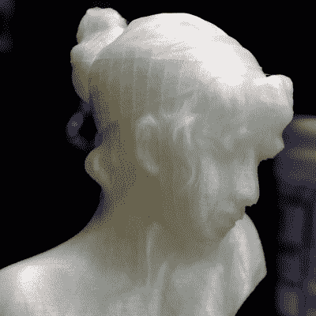](https://hackaday.com/wp-content/uploads/2016/08/sappho.jpg)

Sappho’s Head printed at 0.02mm layer height. Click to embiggen

多年来，最高质量的打印似乎总是出自 Ultimaker，由于这台打印机实际上是 Ultimaker 的克隆，我在测试中有一定的期望。我没有失望。

我相信只在 Z 方向移动床身的机器总是能打印出更高质量的照片。非常好的 i3 风格打印机是这个规则的例外，但 Monoprice Maker Ultimate 是我在这方面的期望:在非常小的层高度打印时非常高的质量。

与 200 美元的 Monoprice MP Select Mini 不同，它没有 Z 带。梯形 Z 轴丝杠能够将床向下移动到它需要的准确位置，而 Ultimaker 风格的笛卡尔布局几乎没有倾斜。

然而，这并不意味着打印机没有缺陷。一个明显的疏忽可以在用来向新挤出的塑料吹风的风扇上找到。这种风扇有一个问题:它不能将空气吹到新挤出的塑料上。相反，它会将空气吹到印迹右侧几厘米处。

[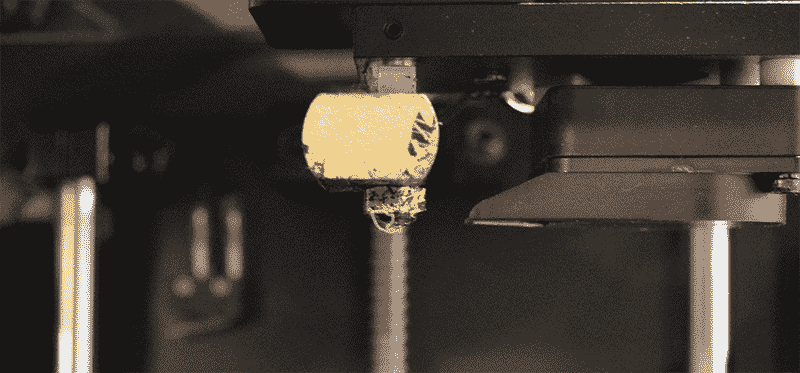](https://hackaday.com/wp-content/uploads/2016/08/blowsstraighdown.png)

The part cooling fan blows straight down, and does not actually cool the filament as it is extruded.

我能想到的证明灯丝冷却问题的最好例子是悬垂，我打印的 Benchy tuggle 提供了足够多的证据证明悬垂将是这台打印机的一个问题。部分冷却风扇的管道可以很容易地取下，一旦我拆除这台机器多一点，我将开始设计一个更好的低剖面管道，将空气吹得更靠近喷嘴。

除了突出的问题之外，这确实是一台具有卓越制造质量的打印机。所有样本打印尺寸准确，3D Benchy 的船头是我见过的最好的之一，甚至这个小拖船背面的名字也是可读的。除了回缩的问题——这是一种调整功能，可以通过正确的设置来解决——我很容易看到这台打印机产生 Ultimaker 质量打印的潜力。

 [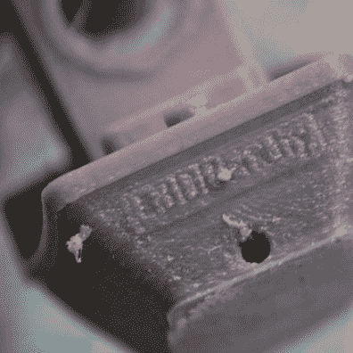](https://i0.wp.com/hackaday.com/wp-content/uploads/2016/08/benchyback.jpg?ssl=1) Yes, you can read the nameplate on this 3D Benchy. [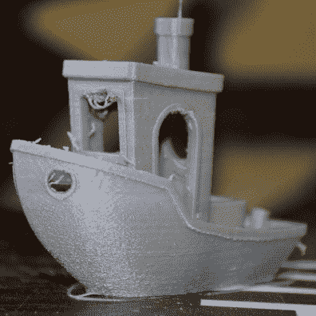](https://i0.wp.com/hackaday.com/wp-content/uploads/2016/08/benchy34.jpg?ssl=1) The overhang above the front window is sagging far more than what would be expected of this printer.

就床而言，这是可以接受的，尽管构建表面上可用的信息有限。床是铝制的，由 24V 印刷电路板加热。它很快升温。这台打印机配有一个“粘合片”，关于这个构建表面实际上是什么的唯一数据来自[万豪产品描述](http://wanhaousa.com/products/duplicator-6):这是一个“万豪粘合片”。这不是很多信息，但它似乎是一个完全可以接受的构建表面。ABS、PLA、PETG 和 Ninjaflex 粘在床上，印迹很容易去除。

我是裴造面的信徒。这是未来的构建表面，我最终将在这台打印机上使用的构建表面。这并不是要批评这台打印机附带的“粘合片”——这是可以接受的，即使去除它很痛苦。不过，我的建议是忽略这台打印机附带的备用构建表，花 16 美元买一张 PEI 表。

### 关于速度和加速度的一句话

在对 [Monoprice MP Select Mini](http://hackaday.com/2016/06/13/review-monoprice-mp-select-mini-3d-printer/) 的评论中，我指出 Monoprice 不知道他们在卖什么。在这种特殊情况下，这并不是一件坏事——打印机比他们的规格表所说的要好。它可以在比声称的 100 微米更低的层高度上打印，并且产品副本没有提到 ARM 控制器板。MP Select Mini 被低价出售，这只能是两个相互排斥的事实的结果。要么是买方希望低价出售他们最便宜的打印机，将潜在买家推上他们产品线中第二好的打印机，要么是买方不具备正确评估或撰写 3D 打印机副本所需的机构知识。

现在，有了两个数据点，哪一个真相更有可能就更清楚了。

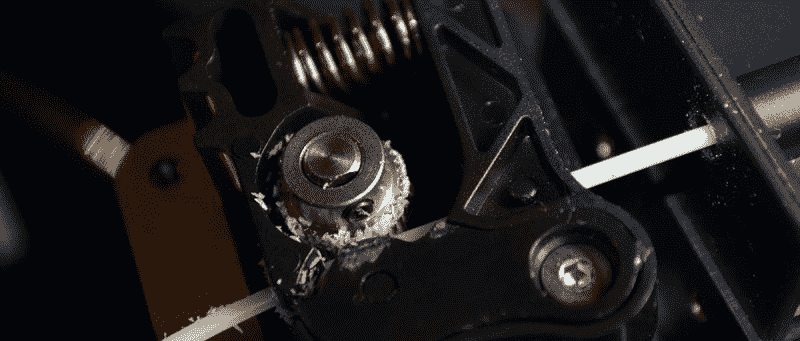

Push filament out of the nozzle too fast, and you’re going to grind some filament.

这款打印机的在线规格表显示，Monoprice Maker Ultimate 打印机的打印速度为 150 毫米/秒。这个速度很快，但是可以和一个非常好的 Ultimaker 相比。然而，在产品手册中找到的该打印机的规格列出了最高打印速度为 300 毫米/秒，最高行进速度为 350 毫米/秒。这个有点高。

为了测试一下，我试着以 300 毫米/秒的速度打印。在这个速度下，在 0.1 毫米的层高度，喷嘴以 12 毫米/秒的速度喷出塑料。对于 12V 的加热器来说，每秒钟的塑料量太多了，但 24V 的加热器表现得令人钦佩——当然，直到挤压机开始剥离细丝。无论规格表怎么说，你都不能那么快地把塑料从喷嘴里推出来。它可能在较低的图层高度下工作，但这给我们带来了另一个高打印和移动速度的问题:加速。

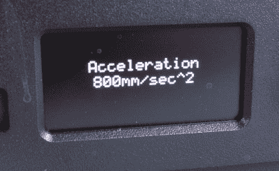

The stock acceleration of this printer is 800mm/sec². The default acceleration for Marlin is 3000mm/sec².

当打印和移动的最高速度设置为 300 毫米/秒，加速度设置为 800 毫米/秒时，打印机可能永远达不到这些速度。在这些行程设置下，打印头将仅在大约 50 毫米后达到 300 毫米/秒的速度。如果你正在用一米长的构建板构建一台打印机，快速行进和打印速度是很好的(稍后会有更多介绍)，但是如果你把几个数字输入到[【Prusa】的便捷的加速度计算器](http://prusaprinters.org/calculator/#speed)，你会发现无论如何你需要加速度来达到那些行进速度。

不知道为什么这款机器出厂默认加速度是 800mm/sec。马林固件的默认加速是 3000 毫米/秒，我见过的每一个 RepRap 似乎都做得很好。默认加速可以通过屏幕上的菜单来更改，更改后，打印机表现非常好。

快速行驶和低加速度意味着这些规格在最好的情况下过于雄心勃勃，在最坏的情况下又有点欺骗性。当然，野心或欺骗并不重要，因为所有这些都可以通过一些设置上的改变来解决。我建议将加速度设置为 2000-3000 毫米/秒(可通过有机发光二极管菜单配置)，并将切片器设置为 100 毫米/秒左右。这是这台打印机的一个很好的概数。

### 胆量

二十四伏。最后。自 RepRap 早期以来，打印机的设计就考虑到了 12 伏电压。旅馆是为 12V 设计的。加热构建板设计为 12V。慢慢地，这种情况一直在改变，我会建议任何想自己建造打印机的人选择 24V。V=IR，更高的电压意味着热端达到温度的速度更快。你可以更快地推动细丝通过喷嘴。商业印刷商发展缓慢。不是这台打印机，是 24V 的。加热床升温很快，几乎令人印象深刻的是，它正在加热一个四分之一英寸的铝板。

[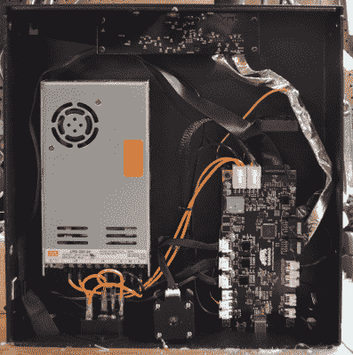](https://hackaday.com/wp-content/uploads/2016/08/bottom.png) 拧开机器底部的四个螺丝，肠子就露出来了。在打印机下面，你会发现电源、控制板和有机发光二极管/旋钮/SD 卡板。

控制器板是基于 ATmega2560，但不是基于任何板，我可以很容易地确定。它确实使用集成步进驱动器，而且如果我想在这块板上添加外壳加热器，似乎还有一些备用连接可用。不，这不是一个有着奇特加速度的 ARM 板，但这是未来，这是一个来自现在的 3D 打印机。

据我所知，有机发光二极管的显示器/界面*与 Ultimaker* 一模一样。有设置电机电流的选项，床调平向导完全相同。对于任何使用过 Ultimaker 的人来说，这款打印机的界面都非常熟悉。

### 语境化

[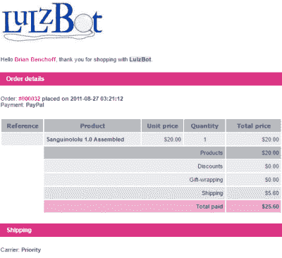](https://hackaday.com/wp-content/uploads/2016/08/lulzbot.png)

I’ll take my 3D printing cred now, thanks.

在我的电子邮件收件箱深处，日期几乎正好是五年前的今天，我有一张 Lulzbot 订单#000032 的发票。这证明了我亲眼目睹了这个行业的发展，我非常相信开放硬件能做什么。

今天，Lulzbot 正在大获成功，TAZ 6 仍然是完全开源的，Lulzbot 是您可以用开放硬件做什么的完美例子。特别是 RepRap 项目和 Lulzbot 颠覆了整个行业，推动了创新，极大地扩展了技术的思维份额。3D 打印机可以打印口袋妖怪。没有比这更具革命性的了。

200 美元的 MP Select Mini 是开放式硬件的对立面。它不是为改装而造的。你拿不到备件。这是一个黑盒子，当它坏了，你会再买一个。你不拥有那台打印机，它拥有你。不过，我可以接受低端单价打印机。这仅仅足以让某人对 3D 打印感兴趣，它可以为更好的 3D 打印机打印零件。

不知道用 Monoprice Maker Ultimate 能不能打印出更好的 3D 打印机。这台价值 700 美元的机器几乎可以满足你对 3D 打印机的所有需求。这台打印机的打印质量非常非常好。(被动)加热外壳的潜力简直令人敬畏。不，你不会做双重挤压，挤出机中的聚四氟乙烯管不会让你打印真正奇异的塑料，但大多数人不会用这些打印。

与任何你可以自己制造的打印机相比，垄断制造商 Ultimate 胜出了。它是您需要的一切，并且通过一点调整、专业知识，也许还有一个适配器来解决风扇问题，您可以使用这台打印机。我可怜的普鲁莎·孟德尔哭了。开放硬件社区应该从哲学上反对这台打印机。这是一台真正的消费级 3D 打印机。插上电源，打开电源，一个小时左右，你的手里就有了一些塑料小饰品。了解 3D 打印是如何工作的，你可以用这台打印机打印出一些非常棒的照片。

这是一个很好的打印机，我想你不会失望的。

### 总之…

您应该购买这台打印机吗？如果你是那些使用 GIMP 而不是盗版 Photoshop 的人之一，不，这不是你的打印机。

对于普通人来说，这款售价 700 美元的打印机很难被击败。软件方面，股票固件可以使用一点帮助，但它的所有问题都可以通过有机发光二极管控制面板修复。无论是谁在撰写垄断手册和产品文案，都需要花几周时间浏览 RepRap 论坛。

这是一台非常好的打印机，很有可能你会用不完。如果你正在寻找你的第一台 3D 打印机，你可能会做得更糟，并在这个过程中花费更多的钱。它的质量比我见过的无数 500 美元的 i3 克隆版要高一点(无论如何，以这个价格你应该给 Prusa 一枚戒指)。垄断制造商终极版是一款固体打印机。尽管与 200 美元的 Select Mini 相比，Monoprice 不会卖出这么多，但他们已经完成了自己的工作。垄断制造商 Ultimate 是我见过的 3D 打印中最有价值的产品之一，应该在任何计划购买 1000 美元以下打印机的人的候选名单上。

关于 700 美元的垄断制造商终极版和 800 美元的万豪 6 型复印机的问题，这是一个可能向任何方向发展的问题。从垄断市场上 MP Select Mini 的可用性来看，我预计他们的制造商 Ultimate 会经常缺货。对于耐心价值不到 100 美元的人来说，这将使天平向万豪倾斜。这 100 美元的不耐烦费也让你丙烯酸侧板和顶部。这不是一个糟糕的交易，尽管我非常希望美国经销商能在他们的在线商店里放一个“复印机 6”类别。

### 我们的审查政策

[就是这个](https://www.ftc.gov/tips-advice/business-center/guidance/ftcs-endorsement-guides-what-people-are-asking)。为了这篇评论，Monoprice 向我提供了这台打印机。负面披露，或者说这种评论是如何*而不是*受到供应商或公司的影响，是一个不合理的概念，与文明的话语不相容。