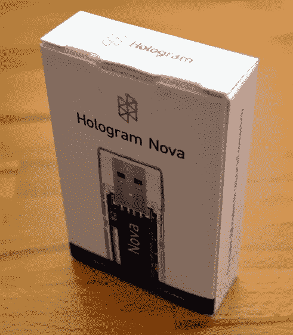
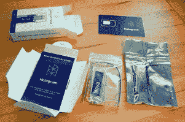
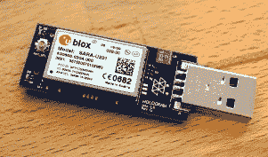
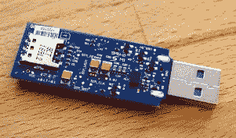
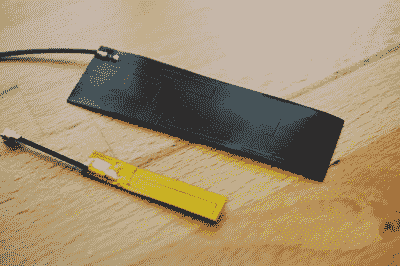
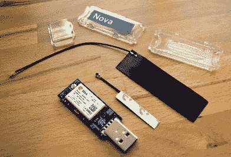
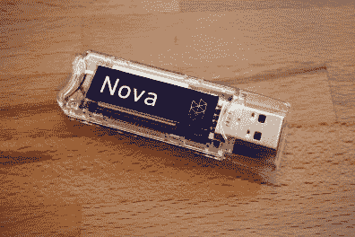
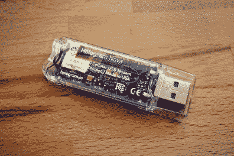
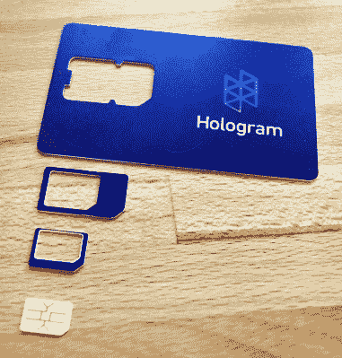

# 综述:新的 3G 和猫 M1 蜂窝硬件从全息

> 原文：<https://hackaday.com/2017/10/05/review-new-3g-and-cat-m1-cellular-hardware-from-hologram/>

7 月份，我们报道了全息图开发者计划的启动，该计划为那些想要在原型中建立连接的人提供免费的 SIM 卡和少量每月蜂窝数据。今天，Hologram 推出了一些新的硬件来配合这个程序。

[Nova](https://hologram.io/nova/) 是一款采用 USB 拇指驱动器外形的蜂窝调制解调器。它装在一个小盒子里，里面有一个承载 u-blox 蜂窝模块的 PCB、两个不同的天线、一个塑料外壳和一张 SIM 卡。该产品的目标是那些围绕单板计算机构建连接设备的人，可以轻松插入 Nova 并快速连接。

全息图发给我的这个设备是 3G 调制解调器。从今天开始，他们有大约 1000 个这样的产品可供发货，但我发现真正令人兴奋的是，还有另一种风格的 Nova ，它看起来一样，但拥有一个猫 M1 版本的 u-blox 模块。这是一种基于 LTE 网络的低功耗广域网技术。我们已经看到 2G 和 3G 调制解调器已经有一段时间了，但如果走这条路，你就在围绕一个有生命周期终结担忧的网络构建产品。

Cat-M1 将存在更长的时间，它被设计为低功率，并利用更窄的带宽来减少无线电打开时间。我向 Hologram 询问了两种技术之间的一些功率比较估计:

> **平均电流消耗比较:**
> 
> 卡特彼勒-M1:传输时低至 100 毫安，从不超过 190 毫安
> 等效 3G:传输时高达 680 毫安
> 
> **峰值电流消耗比较(这些通常通过电容过滤，因此电源永远不会看到这些值，它们只是瞬时的):**
> 
> 卡特彼勒-M1:低于 490 毫安
> 当量 3G:高达 1550 毫安

这是一个令人兴奋的发展，因为我们还没有看到 LTE 无线电可用于设备——当然有热点，但这些肯定不是针对低功耗或包含在产品中而优化的。但是，如果你知道你的 ESP8266 WiFi 规格，你就会知道上面的这些数字使猫 M1 在类似的电力预算和电池供电设备领域。

卡特彼勒-M1 Nova 可从今天开始订购，将在几周内限量发货，并在年底前广泛上市。如果你不能在第一波中得到一个，3G Nova 是软件方面的直接替代品。

我想我们会看到人们对卡特彼勒-M1 技术的兴趣越来越大，因为该技术承诺更低的功耗和更长的支持时间。(我尽量避免使用物联网这个术语……哎呀，就是它了。)今天，让我们来看看新硬件的 3G 版本以及支持它的服务。

### 3G 版本的实际操作

全息发给我一个复习单元，我试了一下。它非常容易启动和运行，我认为这在每个黑客工具箱中都有一席之地，还有其他无处不在的板，如 ESP8266 和 USB 转串行电缆等工具。这是因为，如果你已经在用 USB 运行一台单板计算机，那么你花在这上面的时间和精力是微不足道的。

          Two antennas ship with Nova  Dongle components (small antenna can be internal, case has a slot for large external antenna)

我最初在我的电脑上测试 Nova 它运行 Linux 就像一个树莓派，为什么要让我的测试复杂化呢？全息软件很容易用 curl 命令安装。当我的 WiFi 打开时，它无法连接到手机网络(更多信息请见下文)，但当我关闭 WiFi 时，它工作得很好。从 Hologram.io 基于网络的仪表板发送和接收消息很容易。你确实需要将软件设置为接收模式，否则你似乎会错过从仪表板上发送的信息。我有点抱怨在所有命令前加 sudo，但是我怀疑 udev 规则的魔力可以解决这个问题。

### 测试时的一些惊喜

    Smaller antenna adheres inside the plastic case

我在测试中遇到了一些问题。如果你打算尝试一下，请做好以下准备。

我遇到的一个真正的阻碍是当我接触单板计算机的时候。树莓派 B 型和惠普都存在电力不足的问题。在 3G 上传输需要很大的功率(参见本文前面引用的功率)。在额定电流为 1.2 A 的 USB 电源上，转换器可以很好地接收信号，但调制解调器在尝试传输时似乎会重置。我还在用 USB 供电的惠普上测试了 NOVA，它会在我插上 Nova 电源的瞬间关闭。我在笔记本电脑上没有这些问题，所以答案是获得更好的电源或使用电源 USB 集线器。(我觉得 Hologram 推荐树莓派的 2.5 A 电源。)

回想起来，第二个惊喜对我来说有点像掌脸时刻。我在没有意识到自己在做什么的情况下，吃光了这个月的开发者项目数据配额。当 Nova 枚举它时，它立即接管系统的 PPP 服务。这就是为什么我不得不禁用我的 WiFi 来使用它。事情是这样的，Hologram 为你连接的任何东西提供了互联网连接，所以我试图通过 WiFi 加载网页来使用数据。哎呀。

我询问了这一点，很可能一点 Linux Fu(或者关于什么是 alpha SDK 的可能的未来工作)将提供一个解决方法。更重要的是要意识到这是一个特性而不是一个 bug。你不必使用全息仪表板进行交流。如果你有一个(咳)物联网原型，需要一条通往互联网的路径，只需插入并发出 connect 命令，你就可以开始比赛了。

对于这两个问题，我认为是开发硬件的问题，在头脑中处理这些约束(或者自己解决它们)是合理的。

### 全息图不是一家硬件公司

我想 Hologram 的工程师曾经告诉我，Hologram 不是一家硬件公司。他们的重点是覆盖全球的蜂窝网络和在其上部署硬件网络所需的协调工具。他们的方法是 MVNO。就像 Google Fi 让你可以在世界任何地方携带一部手机和一张 SIM 卡并让它正常工作一样，Hologram 希望你的单一硬件调制解调器和 SIM 卡也能做到这一点。

SIM Card punches out to 3 different form factors

这是蜂窝连接硬件开发人员一直在等待的解决方案吗？假设您正在开发一个跟踪货运托盘的产品。它醒来并不时向蜂窝网络发出一些记录数据。无论在哪里，您的网络协议已经解决，而不是锁定到一个单一的网络提供商。

全息图确实覆盖了全世界。目前还没有一个你可以搜索的覆盖地图，但是当我问全息图时，他们提到他们很乐意与开发者密切合作，可以提供任何请求的具体信息。他们还提供了一个很好的网络界面，可以让你以多种不同的方式处理网络中的单个节点。换句话说，如果你需要一个庞大的细胞连接设备网络，全息图是值得测试的。

过去很难将设备连接到 WiFi，现在变得难以置信的简单。手机是电子行业的下一个无线前沿。3G Nova 让你自己尝试一下变得很容易。它的 USB 外形使它成为通向可制造设备的开发工具。但是 Hologram 不管你是用 Nova，还是自带硬件。这种自由放任的方法是非常受欢迎的，因为几十年来，电信公司在什么样的硬件可以连接到他们的网络上的问题上一直僵持不下。

* * *

**编者按:**全息图是 2017 Hackaday 超级大会的赞助商。这篇评论不是赞助的一部分。Hackaday 喜欢先看看新的硬件，我们尊重新闻禁令。如果你有新的硬件出来，想让我们先睹为快，请[与编辑](mailto:editor@hackaday.com)联系。