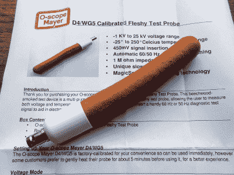
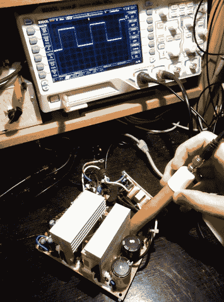

# 回顾:O-scope 迈耶 D4/WG5 校准肉质测试探针

> 原文：<https://hackaday.com/2017/04/01/review-the-o-scope-mayer-d4wg5-calibrated-fleshy-test-probe/>

[![A selection of probes, from [Jim Williams'] Linear Technology app note 72.](img/5a3d5287030dedd505b6def3094b459b.png)](https://hackaday.com/wp-content/uploads/2017/03/lt-probe-configurations.jpg) 

探头精选，来自【吉姆·威廉姆斯】[线性技术 app note 72](http://cds.linear.com/docs/en/application-note/an72f.pdf) 。

在 Hackaday 上，我们很少看到全新的测试设备，所以最近我们收到了新的 O-scope Mayer 产品，这让我们有些惊讶。如果你最简单的测试设备是你自己的手指，能够测量温度，检测电压，并注入 50 或 60 赫兹的正弦波，那么他们所做的就是产生一个具有校准读数的合成模拟。这个想法是，以前你只能说“太热了！”，或者“高电压！”现在，您应该能够使用他们的校准探针获得准确的读数。

O-scope 迈耶 D4/WG5 校准肉质测试探针是一个大约 4 英寸(100 毫米)长的圆柱体，由他们的 InteliMeat 合成手指模拟物制成，端接一个校准匹配单元和一个 BNC 插座。说明书旁边的盒子里有一根 BNC 导线，通过它你可以把它连接到示波器上。

The D4/WG5 in the flesh.

拿着探头，很明显，我们已经考虑到了操作者的感受。重量差不多，稍微有弹性但感觉不太重，外表面有光滑的皮肤一样的纹理。商业结束大约与你的手指结束一样大小，并且大致是半球形的，而不是像其他探针一样终止于金属点。O-scope Mayer 的工作人员告诉我们，这是为了提供尽可能接近真实手指的使用体验，尽管一开始对于有点神经质的黑客作者来说有点不舒服，但我们很快就在实践中习惯了。

因此，开箱检查后，我们开始将它连接到可靠的 Rigol 1054z 示波器上。BNC 电缆是双向的，巧妙的是，如果你把它连接到一边，探头读取电压，而把它连接到另一边，探头读取温度。使用不带 BNC 电缆的探头可实现 50 或 60 赫兹的进样模式。一旦我们习惯了，我们发现这是一个非常方便的系统，因为它巧妙地避开了任何复杂的开关。

Measuring high voltage with the D4/WG5

该规范称，它的电压范围为-1 KV 至 25 KV，对于大多数多肉测试探头来说应该足够了。它的分辨率为 1mV/V，对于 25 KV 的最大输入电压，最大输出为 25 V。如你所料，在低压电路中，它不如普通探头有用，考虑到其 1000 倍的衰减，这并不奇怪。示波器描迹在这些电压下有噪声，但它能保持精确的电压读数。对于更高的电压，我们在我们的工作台上对 PC 开关模式电源进行了尝试，从“热”端获得的 350V 读数与我们用传统探针获得的读数完全一致。遗憾的是，我们的工作台没有任何明显的高电压源，因此我们无法在高于通常的英国电源容易产生的电压下测试探头。

在 BNC 电缆反向的温度模式下，探头在-25 到+250 的温度范围内提供每摄氏度 10mV 的电流。我们能够在多种环境中测试这一点，从一杯冰水、体热和一锅沸水的家庭深度冷冻，到断开冷却风扇的 PC 电源的温暖散热器。在每一点上，它的读数都与我们的温度计一致，我们用于低温的玻璃水银温度计和我们古老的辐射高温计都用于高温。在高温下使用探测器的一个有趣的效果是一种独特的和奇怪的开胃气味，我们将它描述为在一个清爽的秋日空气中接近山毛榉烟雾的味道。

The probe immersed in boiling water for a few minutes to gain an accurate reading.

第三种模式是信号注入模式，在没有 BNC 电缆的情况下使用时，探头以 50 Hz(如果您在欧洲)或 60 Hz(如果您在美洲)注入校准的 450 mV RMS 正弦波。对于模拟音频电路的故障检测，这是一个非常有用的功能，让您只需通过聆听独特的音调就能追踪每条信号路径。我们使用我们的台式放大器验证了这一点，校准的一致性以及 O-scope Mayer 工程师在保持正弦波纯度方面所做的工作给我们留下了深刻的印象。

D4/WG5 已经在我们的板凳上坐了几天了，我们的结论是什么？这当然是一个不寻常的调查，鉴于它正在寻求取代你拥有的最基本的测试设备，它肯定面临着一个艰巨的任务。但我们喜欢精确的校准，我们也喜欢它提供的安全功能，与插入高温或高压电路的危险相比。我们肯定会在我们的储物柜里腾出一个人的空间，我们会毫不犹豫地建议你也这样做。这可能不是你拥有的最令人印象深刻的测试设备，但购买 O-scope 迈耶 D4/WG5 校准肉质测试探头不会证明是你的香肠决定。