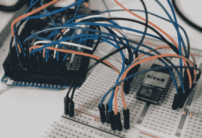

# 用 Arduino 复活电子显微镜

> 原文：<https://hackaday.com/2018/04/07/reviving-an-electron-microscope-with-arduino/>

我们不了解你，但当我们的朋友问我们是否想帮他们修理东西时，他们通常会谈论他们的电脑、电话或汽车。到目前为止，它从来没有帮助他们重建旧的电子显微镜。但这正是本杰明·布伦德尔(Benjamin Blundell)收到的请求，当时一位来自当地黑客空间的朋友问他是否可以看看他们在一个棚子里发现的一台老式剑桥立体扫描 200。很明显我们和一群错误的人在一起。

 正如你可能想象的那样，显微镜在远不如理想的条件下度过一段时间后，极度需要一些爱。当一些黑客空间成员开始处理机器的硬件方面时，[本杰明]的任务是[找到一种方法从](https://benjamin.computer/posts/2018-04-05-rom-reading.html)恢复示波器的内容。虽然他仍在努力验证，但他迄今为止对立体扫描 200 中的各种 rom 进行的转储一直很有希望，他相信他的方向是正确的。

显微镜混合使用了德州仪器的 25L32 和 2516 芯片，在确保记录了所有东西后，[本杰明]必须小心翼翼地撬出这些芯片，这样他才能知道什么去了哪里。一些芯片不愿意被从他们 30 多年的家中取出，所以有一些断了的引脚，但总的来说手术是成功的。

每个芯片都被放置在试验板上，并连接到 Arduino Mega，因为它有足够的数字引脚来连接，而不需要移位寄存器。布线相当简单，[本杰明]只需要写一些代码来读取芯片的内容，他已经很慷慨地提供给了其他可能从事类似项目的人。在这一点上，他还没有在他的 ROM 转储中找到任何可识别的东西来证明它们已经被成功地制造出来，他现在真正知道的是他有*一些*东西。至少这是个开始。

越来越多的老式电子显微镜获得了第二次生命,这要感谢[在他们自己的实验室里专注的黑客们](https://hackaday.com/2017/06/11/scanning-electron-microscope-adds-to-already-impressive-garage-lab/)。让你怀疑是否会有黑客社区*不会*屈从于他们意愿的硬件。