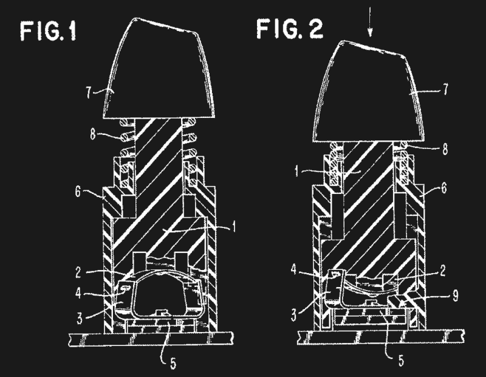
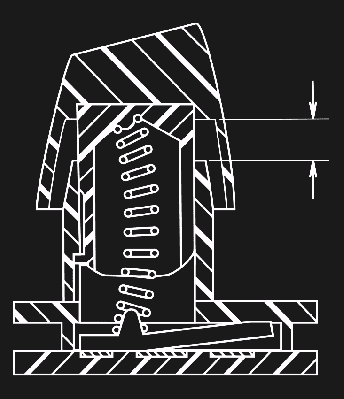
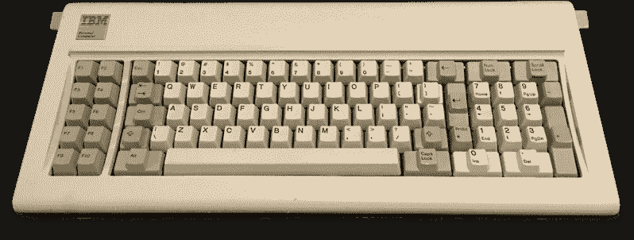
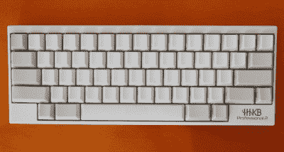
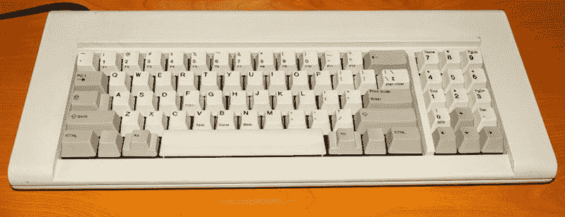
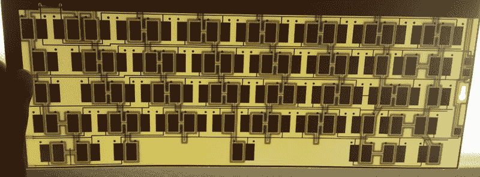
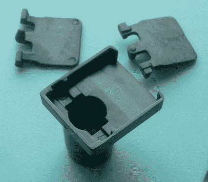
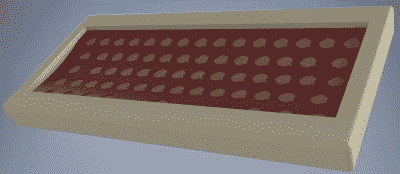

# 复兴有史以来最好的键盘

> 原文：<https://hackaday.com/2016/03/07/reviving-the-best-keyboard-ever/>

在过去的几十年里，计算机键盘一直被视为另一种外围设备。传统观点认为，没有必要购买高质量的键盘，因为花哨的“发烧友”键盘和世界各地办公室 it 壁橱中无处不在的戴尔键盘之间没有真正的区别。

就像只会买特定品牌扳手的机械师，有最喜欢的镊子的工程师，或者使用 150 年前制造的手刨的业余木工一样，一些每天使用键盘八到十二个小时的人已经意识到越老的工具越好。老式键盘，或者至少是带机械开关的键盘，不会粘糊糊的，它们很精确，你不用敲键盘，而且更符合人体工程学。他们听起来更好。即使只是安慰剂效应，也没关系:有效果。

这种认识导致了高端键盘和键盘爱好者的激增，他们在装有 Cherry MX、Alps、Gateron、Topre 和其他纯“机械”按键开关的主板上敲打。今天，打字爱好者的选择比以往任何时候都多，尽管一些顽固分子仍在敲打他们 1989 年购买的那台电脑的键盘。

市场在增长，受欢迎程度在提高，随之而来的是一场巨大的努力来复兴这个被认为是有史以来最伟大的键盘。这是 IBM 4704 终端键盘的复兴。这款 62 键 IBM 型键盘最初出售给银行和其他机构，非常罕见，令人垂涎。今天获得一个意味着在 IT 壁橱的架子后面找到一个，或者在易贝的拍卖会上出价 500 美元，然后期待最好的结果。

现在，这种键盘正在起死回生，与连续制造了 30 年的 IBM M 型键盘不同，62 键的 IBM F 型“Kishsaver”键盘正在通过构建新的模具、设计新的电路板和重新制造 IBM 在 20 世纪 70 年代末所做的一切而重获新生。

### 机械键盘的兴起

在 Commodore 64、最初的 Macintosh 和第一台个人电脑中发现的第一个计算机键盘不是你今天会发现正在使用的键盘。这些键盘使用带有活动部件的机械开关，发出令人满意的咔嗒声，但是非常昂贵。标准化也很少；DEC VT100 终端使用 Hi-Tek 制造的复杂板簧开关，最初的 Macintosh、Commodore Amiga 和 Atari 800 使用 Mitsumi 制造的螺旋弹簧开关。IBM 通过其打字机部门，从 20 世纪 70 年代开始制造自己的按键开关，从 20 世纪 70 年代将计算机用电动打字机转换为梁式弹簧按键开关到 20 世纪 80 年代的扣式弹簧开关。

IBM’s beam spring key switch mechanism

The buckling spring key switch in action. In the Model F, the paddle is a contact between two capacitive sensing pads. In the Model M, the paddle closes a membrane switch.

当计算机行业的其他公司慢慢从机械按键开关转向薄膜或“橡胶圆顶”开关时，IBM 却出人意料地坚定不移。第一个使用弯曲弹簧的键盘 IBM Model F 将于 1981 年 8 月与 System/23 一起出现在市场上，比最初的 IBM PC 早一个月。IBM 型键盘将在 1985 年取代 F 型键盘，但基本机制保持不变:弹簧将按下按键底部的摇杆，施加足够的力，弹簧将“弯曲”，将摇杆向下推到电容触点或薄膜开关上。

如今高端键盘中常见的机械按键开关机制——基于 Cherry MX 和 ALPS 开关——具有板簧和电触点的双重功能。屈曲弹簧机制的复杂性是巴洛克式的，依靠弹簧和桨来记录按键。这种复杂性肯定不是将键盘降低到某个价位的结果，而是给弯曲的弹簧键盘带来了令人满意的触感，只有在使用几十年后才会变得更好。

IBM 于 1991 年将负责制造 M 型车的部门出售给了利盟，1996 年，这家工厂的员工购买了权利和注塑模具，创建了 [Unicomp](https://www.pckeyboard.com/) 。是的，你仍然可以买到肯塔基州列克星敦生产的 M 型键盘，价格和 IBM 在 1986 年销售这些键盘的价格差不多。不过，这些是 M 型键盘，生产 F 型键盘所需的工具和技术在 20 世纪 80 年代的某个时候从地球上消失了。

The IBM Model F, released with the IBM PC 5150, the first IBM PC

### 基什 saver

IBM 的 F 型键盘在现代人看来很奇怪。20 世纪 70 年代和 80 年代的大多数键盘也是如此。这是一个键盘布局不断变化的时代。在这个时代，即使是电脑键盘最常见的元素也在不断变化。箭头键的“倒 T”形布局在 1982 年由 DEC LK201 键盘首次推广，最常见的是与 VT-220 终端一起使用。数字小键盘相当普遍，但是左手小指下面的按键——Control、Alt、Caps Lock 和 Tab——直到 20 世纪 80 年代中期才被标准化。即使是 Windows 键，或者任何介于左控制键和 Alt 键之间的键，直到 1994 年才出现在微软的自然键盘上。

The Happy Hacking Keyboard. [Image source](https://commons.wikimedia.org/wiki/File:Happy_Hacking_Keyboard_Professional_2.jpg)

虽然键盘布局设计会在 80 年代后期的某个时候围绕 ANSI 或 ISO 规范进行标准化，但仍然有爱好者在寻找紧凑和极简的键盘。对这些人来说，数字小键盘不是必需的，一切都更有效率。控制键是大写锁定键所在的位置，这是上帝的意图。Happy Hacking Keyboard 是一款为*nix 操作系统设计的 60 键微型键盘，已经成为一种身份的象征。键盘发烧友的时代已经到来。

大约在 2012 年的某个时候，在互联网上几个最大的机械键盘社区中，关于一种奇怪的 IBM 键盘的消息四处传播。它很小，只有 62 个键，由金属制成，使用 f 型的弯曲弹簧键开关。它是 IBM 4704，零件号 6019284。这个键盘是一个叫 [Kishy](http://kishy.ca/?p=894) 的论坛成员重新发现的。由于 IBM 习惯于在较小的键盘上贴上“节省空间”的标签，组合词“Kishsaver”就被沿用了下来。

Kishsaver 是一个真正的 F 型机器人，由金属制成，可以在僵尸来袭时作为一种即兴近战武器。它有 IBM 的光环，这是罕见的。这不是任何购买家用电脑的人都会有的键盘——这是一个连接到终端和主办公室主机的键盘。这是一款布局相对现代的键盘，符合机械键盘爱好者的极简主义倾向。不用说，供不应求，今天一个 Kishsaver 大概要 500 美元，如果你能找到的话。

### 重新制造 Kishsaver

An original IBM F77 Kishsaver

找到任何流行的、停产的技术，你都会找到它的复制品和复制品。在计算机世界里，很容易找到苹果 I 的复制品。这种观察延伸到老爷车、摩托车，甚至手动工具。几乎不可避免的是，一个经典的 IBM 键盘最终会被克隆和再制造，所需要的只是有人集中他们的资源，找到能做这项工作的人，然后开始创业。只需要有一点经验的人。

这个人恰好是 Geekhack 和 Deskthority 键盘论坛上的【椭圆】。他曾为论坛成员处理过开源键盘控制器的团购，这些开源键盘控制器将 IBM 键盘内的古老电子设备转换成可以使用 USB 的东西。这些键盘控制器[是由【xwhatsit】设计的，作为旧电子板](http://downloads.cornall.co/ibm-capsense-usb-web/ibm-capsense-usb.html)的开源替代品，但正如许多电子项目一样，许多人不想处理 Mouser 或 Digikey 订单，而且他们无论如何也不会使用烙铁。

[Ellipse]在制造了一点产品后，转向了 F 型 Kishsaver。这些年来，他拆卸、修理、清洁和修复了很多这样的键盘，在仔细测量了他收集的 77 键和 122 键的 f 型键盘后，他有了开始与制造商交谈的数据。

就像如今的任何制造项目一样，[椭圆]转向了中国。当然，Kishsaver 最初的模具已经不存在了，但是很多跑腿的工作已经完成了。由于[xwhatsit]的现代化，键盘控制器板已经被处理好了。F 型键盘是围绕一个巨大的 PCB 构建的，有几个 Kishsavers 在周围浮动，对这个 PCB 进行逆向工程被证明相对容易。

The capacitive sensing PCB for the 62-key Kishsaver

The switches of the Model F are capacitive, meaning the paddles need to be conductive. These paddles were replicated from conductive plastic.

与许多项目一样，问题在于机械设计。需要制作模具，需要为屈曲弹簧机构的导电“鳍状物”寻找正确类型的塑料，铸造零件，并形成模具。为 Kishsaver 打造了新的金属外壳，并进行了粉末喷涂。如果你有一个旧的 Kishsaver，每一个新零件都是旧零件的替代品。甚至泡沫聚苯乙烯包装都是复制品；[Ellipse]对原始 IBM 包装材料进行了测量，并用新模具进行了复制。

IBM f62 键键盘的再制造是老式计算机爱好者的最高成就之一。唯一可比较的项目是由带有 1975 年末日期代码的零件组装而成的苹果 1 复制品。对于机械键盘社区来说，这是一个非凡的成就，更令人印象深刻的是，没有键盘制造商采用 F 型制造。

A render of the Kishsaver ultra compact aluminum case design. This design appeals to more modern proclivities.

这些努力最终导致了互联网主要键盘论坛上的团购，以及一家将根据选项以 325 美元至 376 美元的价格出售 62 键和 77 键型号 F 的网上商店。粉末涂层蛋壳和有点过时的工业灰色外壳都可用，键帽来自 Unicomp，即 m 型的当前制造商。

尽管如此，通过社区的信任来启动整条生产线并不容易。[Ellipse]说他想做压铸铝外壳，而不是他现在用的机加工铝外壳。压铸将极大地降低制造成本，对于一次性的但是生产钢模具的高成本来说，对每个单独的外壳进行相对便宜的加工。尽管如此，单独加工的外壳允许一些实验，如“超紧凑”的外壳设计，利用现代的，更小的控制器板，并呼吁现代设计的敏感性。

对于所有硬件企业家、创客运动、众筹、快速原型和中国制造的喧嚣，没有多少真正的成功故事。当然，有一些硬件初创公司依靠 Y Combinator 的资金，但当涉及到实际生产人们想要的东西时，真的没有多少公司在那里。对于一个仅仅是爱好者的人，一个不是程序员、工程师或产品设计师的人来说，将一个团队团结在一起，再造出 IBM 在 20 世纪 70 年代的最佳产品是非常了不起的。这证明了一个社区能做什么，以及一个专注的人能取得什么成就。

标题图片来源:murium on[desk authority](https://deskthority.net/photos-f62/kishsaver-photothread-t7483-30.html#p179934)