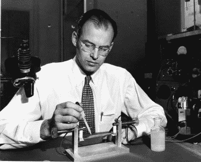
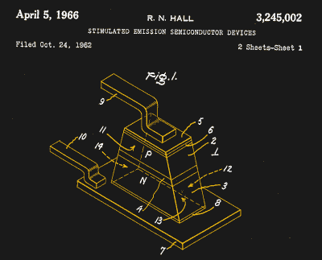

# 罗伯特·豪尔和固体激光器

> 原文：<https://hackaday.com/2018/05/22/robert-hall-and-the-solid-state-laser/>

我们所有人欠下的债务总有一天会偿还，对于发明家罗伯特·n·霍尔来说，这笔债务将在 2016 年到期，享年 96 岁。罗伯特·豪尔的去世几乎没有引起任何人的注意，除了他的家人和通用电气公司纽约州斯克内克塔迪研究实验室的几个亲密同事，霍尔在那里度过了他非凡的职业生涯。

一个人活了一个世纪的 96%，会比他认识的大多数人都长寿，这并不奇怪，但更令人惊讶的是，他的生活和遗产没有得到更多的关注。没有他的努力，那么多我们认为理所当然的现代生活工具就不会出现，或者会被推迟。他的主要贡献始于一个简单但看似离谱的想法——制造固态激光器。但他最终做出了如此多的贡献，值得看看他在漫长的职业生涯中所取得的成就。

## 圣诞快乐

Robert N. Hall in his lab. Source: [General Electric](https://www.ge.com/reports/edisons-heir-bob-halls-invention-lit-future/)

罗伯特·豪尔的中间名是诺尔，以纪念他在 1919 年圣诞节的到来，他从一开始就是一个好奇的孩子。发明似乎是家族遗传，他的叔叔悉尼是一名飞机引擎设计师，自称是职业发明家。在他年轻的时候，他的叔叔带他去了他的家乡康涅狄格州纽黑文的一个工业博览会，在那里罗伯特看到了各种最新的电气创新的演示和展示。他的叔叔解释了一切是如何工作的，这激励了年轻的罗伯特尽可能多地阅读和学习。

到高中毕业时，他已经在自己卧室里建的实验室里做实验了。他还发现了天文学，并从零开始建造自己的望远镜。罗伯特显然是个很有前途的学生，在第二次世界大战开始前，他被加州理工学院录取并获得了奖学金。当他的资金耗尽时，他在洛克希德飞机公司工作，获得了宝贵的行业经验，并建立了对他以后很有帮助的联系。

他终于在 1942 年获得了物理学学位，并被通用电气公司招入他们的斯克内克塔迪研究实验室。在战争和全民动员期间，作为 R&D 一家工业工厂的测试工程师，霍尔有机会发挥影响力，并充分利用了这个机会。霍尔的团队与一个专注于使用磁控管干扰德国雷达的团队合作，设计并建造了第一台连续波(CW)磁控管。这些设备将在战争期间使用，但也将成为今天使用的每一个微波炉的核心。甚至有人说，可能是虚构的故事，雷神公司的工程师受到融化的巧克力棒的启发，制造了第一台微波炉，他的口袋被霍尔的一个连续波磁控管击穿。

霍尔被鼓励离开通用电气，去加州理工学院攻读物理学博士学位。1948 年，他回到斯克内克塔迪，准备在相对较新的半导体领域领导自己的实验室。在一堂完美的精致计时课中，贝尔实验室在他到来后不久就宣布了晶体管，整个半导体领域爆发了。因为是通用电气公司，他们主要对半导体在电力电子中的应用感兴趣，所以霍尔研究大功率晶体管和锗整流器。他通过分步结晶提纯锗的创新对该领域做出了巨大贡献，达到了其他小组无法达到的纯度。他还研究硅晶体管，发明了两种掺杂硅的方法:合金化和杂质扩散。几乎所有的晶体管都可以追溯到这两种方法。

## 接受挑战

霍尔的创新使阿格在 20 世纪 60 年代初成为硅晶体管领域的领导者，并确保了霍尔作为半导体领域领先专家的地位。1960 年 5 月，激光发明的消息传到了物理学界，霍尔和他的团队消化了他们所能获得的关于这个充满希望的新领域的所有信息。但是早期的激光器是复杂而繁琐的设备，显然需要一种更简单的激光器。

霍尔性情温和，深受同龄人的喜爱，有人取笑他说，既然他已经发明了这么多东西，他应该尝试一下固态激光器。尽管他认为这是不可能的，但他还是接受了挑战，开始用功读书。他知道砷化镓二极管可以发射大量的红外光，所以他分析了这些数据，发现他可以用这种材料制造激光器。他组织了一个小团队开始工作，仅仅几天时间，他们就用一块边长只有 1/3 毫米的晶体制造出了一个工作装置。它需要液氮冷却，并且只能在脉冲模式下工作，但世界上终于有了不需要外部能源泵浦的激光器。固态激光器已经到来。

US Patent 3,245,002, for a “Stimulated Emission Semiconductor”

通用电气团队很快写下了他们的结果，并向《物理评论快报》提交了一篇论文。可悲的是，当论文被发送出去进行同行评审时，出现了一些欺诈行为。其中两位评审来自两个不同的竞争企业实验室，从事固态激光器的研究，当他们读到霍尔的成功时，他们缩短了流程，召开了新闻发布会，宣布他们已经“发明”了固态激光器。幸运的是，霍尔的专利和其他专利一起被授予；无论如何，他的团队是第一个发表论文的，所以固态激光器的始祖是毫无疑问的。

霍尔一直在通用电气工作到退休，获得了 43 项专利和 81 份出版物。他的另一项工作影响了核物理领域，他的高纯度半导体被用于灵敏的伽马射线探测器。虽然通用电气从未将霍尔的激光器开发成商业产品——制造连续波室温固态激光器的工作留给了其他人——但每一台销售点条形码扫描仪、CD 播放器、激光指示器，或许最重要的是，每一个最终将互联网主干缝合在一起的光纤连接，都可以追溯到 1962 年罗伯特·豪尔实验室工作台上的那个小晶体。