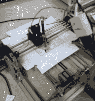

# 机器人在纸上解数独

> 原文：<https://hackaday.com/2017/07/10/robot-solves-sudoku-on-paper/>

数独是消磨时间的好方法，尤其是在长途飞行中。然而，我们认为航空公司不会让萨纳姆带着他的数独机器人登机。基本的机器看起来像一个用铝挤压制成的 2D 绘图仪，外加一个树莓派和一个摄像头。机器可以阅读数独谜题，解决它，然后用笔填写谜题。不像人类，它永远不需要删除它的工作。

该软件使用 OpenCV 来处理相机数据，找到网格，以及拼图提供的单元格。TensorFlow 识别数字。从那以后，解决这个难题就只需要数学了。一旦解决了，机器人的绘图仪部分就会接管并填补空白。毕竟，这似乎是容易的部分。

 没有视频，但原始帖子有一张机器在做它的事情的图像。该存储库拥有关于电子、机械结构和固件的所有信息。

我们记得一个类似的项目是用乐高思维风暴完成的。如果你需要在树莓派上获得 OpenCV 的帮助，我们[在](https://hackaday.com/2013/03/04/using-opencv-with-the-raspberry-pi/)之前也讨论过这个问题。