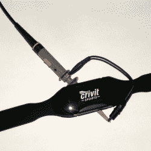

# 罗杰·乔治攻击脉搏计

> 原文：<https://hackaday.com/2017/07/22/rogeorge-attacks-a-pulse-meter/>

“Crivit Sports”是一款廉价的胸带监视器，它可以在专用的手表上显示你当前的脉搏率。如果它有一个日志选项，或者任何将你的脉搏数据导出到一个功能更强的设备的方法，这将更有用，而且可能更贵。所以[罗格]开始工作。到目前为止，这个由三部分组成的系列的每一篇文章都值得一读，尤其是因为它使用了很酷的技术。

 在[第一部](https://rogeorge.wordpress.com/2016/08/13/the-wireless-protocol-of-a-sports-wrist-watch/)中，【罗格】从截取信号开始。他的射频嗅探器？一个示波器探头在心脏监视器周围的回路中短路了。能够读取信号，是时候解码了。做俯卧撑和解码开关键控射频信号听起来像是理想的黑客训练方案，但[RoGeorge]使用了一个信号发生器，夹在胸部监视器上，产生良好稳定的“心跳”，然后毫不费力地读取示波器上的代码。

有了编码，在互联网的帮助下，他在第二部分测试了他的假设。他使用 Arduino 来产生第一部分中记录的脉冲，对线圈施加脉冲，并设法将心率显示在手表上。

这就把我们带到了第三部分。如果还有其他秘密有待发现呢？暴力破解每一个可能的射频信号并查看手表来查看结果可能是有用的，但对 8192 个可能的代码这样做将使任何人发疯。所以[罗乔治]用 Python 自学了 OpenCV，并把一个网络摄像头对准了手表。他编写了一个程序，检测心形图标的闪烁，这是手表收到有效代码的标志，然后传输所有可能的代码，看看哪些是有效的。除了发现一些多余的代码，他没有从这个练习中学到多少新东西，但这是一个很好的技巧。

我们不确定在克里维特号上还能做什么。[RoGeorge]已经找到了心率数据协议，可以很容易地制作自己的记录器。我们确信我们喜欢他的全面和自动化的测试方法，从信号发生器作为心跳到 OpenCV 作为强力例程中的反馈。我们迫不及待地想知道接下来会发生什么。