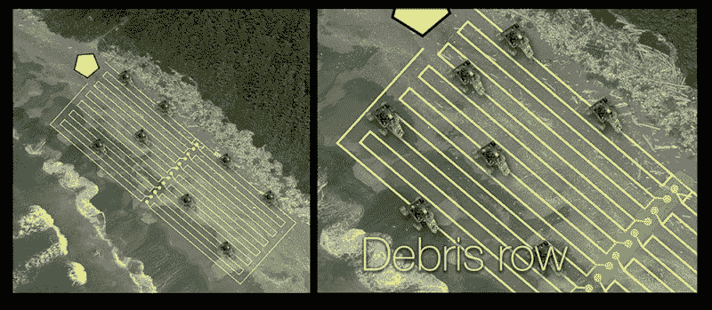

# 漫游者救援:机器人任务处理垃圾

> 原文：<https://hackaday.com/2017/07/18/rovers-to-the-rescue-robot-missions-tackles-trash/>

每个人都知道塑料垃圾是一个垃圾填满垃圾填埋场和分散海滩的问题。更糟糕的是，塑料没有完全溶解，而是分解成更小的塑料块，小到足以被鸟类和鱼类摄入，并装载了不可消化的 gutfill。自然灾害加剧了垃圾问题；在接下来的几个月里，日本 2011 年海啸的残骸被冲上了温哥华岛。

艾琳·肯尼迪沿着多伦多岛海滩散步时，注意到了一眼望不到头的塑料垃圾。作为一名开源机器人制造商，她的第一个想法是用机器人来收拾残局。与拿着棍子和垃圾袋四处走动的人相比，大量遵循自动化程序的小型机器人可能能够更快、更有效地清理海滩。

艾琳创建了机器人任务来探索这种可能性，目标是将开源“制造商”及其技术知识与环保主义者团结起来，后者更清楚地了解需要做些什么来保护地球。它入围了 2016 年 Hackaday 奖的公民科学类别，非常适合今年的[车轮、翅膀和步行者](https://hackaday.io/prize/details#three)挑战赛，该挑战赛将在一周内结束参赛。

休息之后，请和我一起看看机器人任务的由来，以及 Erin 为该计划的未来准备了什么。

### 指定每个机器人的任务

在你建造一个机器人群体之前，你需要设置群体完成什么和如何工作的参数。艾琳和机器人任务小组想出了一个假想的任务可能如何进行。

第一步包括检测需要清理的区域，要么通过无人机调查该区域，要么通过卫星图像。人类操作员在清理现场附近建立了一个基地，主要由控制机器人的数字指挥所组成。机器人还将垃圾运送到大本营，在那里进行分类和打包。

操作员定义清理场地的边界，控制软件设计清扫模式。机器人部署并遵循一种模式，清理塑料垃圾以及烟头等。回到基地后，操作员通过远程操作控制受影响的机器人并引导它越过遇到的任何障碍来整理垃圾和解决问题。

### 沙滩清扫机器人鲍伊

现在他们只需要一个机器人来做实际工作。获得一个能够按照他们希望的方式自主工作的机器人将是一个巨大的收获，所以他们从小处着手。

Erin 设计了她的机器人——名叫 Bowie——来做一件事:在人类操作员的无线控制下铲起垃圾。你可以看到右边的图表显示了原始机器人底盘的各个部分。

至关重要的是，要让机器人制造起来简单、便宜，或者至少尽可能多。机器人任务组建立了以下约束条件:机器人可以被其他团队复制，在建造价格方面经济实惠，并且可以在 10 厘米的建造平台上打印，每件最长打印时间为 4 小时。

Bowie 由一个水平平台组成，前面有一个由三个伺服系统驱动的勺子，并将垃圾分配到一个背面安装的料斗中。四个多节的 AWD 轮子使机器人四处移动，而超高亮度的发光二极管照亮机器人前面的区域，以便遥控操作者操作。它大约有狮子狗那么大，当它的勺子被拉回来时，可以放进一个 15 英寸的立方体。

底盘:随着项目的发展，PVA 印刷的底盘已经经历了多次迭代。它由一个水平平台组成，通过一套骑在全地形悬挂系统上的 3D 打印车轮高出地面几英寸。铲斗臂由底部的一对伺服系统控制，第三个伺服系统用于移动铲斗。M3x10mm 硬件固定各种部件。最新版本的机箱通过垃圾桶和铲斗两侧的大梁来保护电子设备。

 电子 : Teensy 3.2 在加速计、高度计、一对超声波传感器、10DOF 板、蓝牙模块、一对触发超亮 led 的 TIP120s 的帮助下控制每个机器人。带有鸭形天线的 XBee 系列 2 无线电帮助机器人与基站通信。

动力:爱好王的一双 Turnigy 5000mAh LiPos 常用于四轴飞行器。

马达:Erin 选择了 Pololu 75:1 齿轮马达，相对便宜，每台 20 美元，但对于典型的海滩来说已经足够了，尤其是全轮驱动。勺子伺服系统每个也要花费 20 美元左右，使整体价格尽可能的低。

模块化 GPS 单元 : Erin 创造了一个独立的 GPS 单元，装在一个 Pelican 1010 箱子里，可以简单地插入主机器人，或者可以拆卸下来用于另一个项目。它由一个 Arduino 组成，配有 GPS 屏蔽和高度计，由一个 A 2500mAh LiPo 供电。坐标每 2-5 秒记录到 SD 卡中。

### 控制系统

虽然未来的 Bowie 有时会自动操作，但仍有许多情况下操作员可能必须控制。例如，机器人如何在树桩周围导航？

计划呼吁通过手机、平板电脑或电脑，通过 WiFi 控制树莓 Pi 指挥所服务器。然而，现在他们有一个相当于 RC 的设置。

最初的控制盒实际上是一个纸板盒子，装有 XBee 和与机器人匹配的天线，由 Erin 的 [RoboBrrd 项目](http://robobrrd.com/)中基于 ATmega328P 的大脑板控制——本质上是一个 Arduino，她为了初学者的利益打破了 RobotBrrd 的所有引脚。最近的更新将内脏放入 3D 打印的外壳中。

机器人任务计划还要求试验一种远程操作头带。艾琳异想天开的风格在头带的原型中显而易见。她在 Fabacademy 期间开发了它，在那里她创建了她的[快速部署自动化系统](https://hackaday.io/project/6647-rapidly-deployable-automation-system)项目，其中有许多机器人任务的影子。艾琳的头带配备了一个加速度计来检测她的头部运动，伺服控制的翅膀提供触觉反馈，加上一排 RGB LEDs。

### 增量更新

 自从 Bowie 出道以来，它几乎在每个领域都有了巨大的改进，包括一个新的底盘，它能更好地保护电子设备，并且在浅灰色 PLA 中看起来很棒。

最近，该团队增加了一个重新设计的勺子，看起来很像商业猫盒勺子，有孔可以让沙子倒出来，让垃圾留在勺子里。GoPro 兼容的相机支架也被添加进来，指向不同的角度，以查看独家新闻发生了什么。

还有一个新的伺服驱动料斗托盘，鲍伊可以存放任何垃圾收集。它有一个盖子，可以根据需要升降，另外，当机器人去倒垃圾时，整个托盘会在另一个伺服系统的帮助下向侧面倾斜。

车轮也得到了加强。在一个车轮的支柱在冰上滚动时断裂后，团队[在 Fusion 360 上对车轮进行了应力模拟](https://www.youtube.com/watch?v=ZMXV0eCquYY&t=3s)，并确认新设计在轮毂和轮辋之间提供了更强的支撑。

最后，今年六月的机器人任务创造了新的操作员界面板，由团队成员兰迪·格伦设计，奥什·帕克制作。该板是一个新的 3D 打印外壳手持控制器的支柱，但基本上包含了与旧盒子相同的内容。

### 在野外

机器人的第一稿完成后，艾琳成功地在 Kickstarter 上筹集了约$10K，为一系列实地测试提供资金。

随着基础平台的创建，Erin 在过去的一年中领导了一系列现场测试，围绕她的家乡多伦多进行。

在该市的樱桃海滩举行了许多活动，志愿者和好奇的路人有机会了解这个项目，并引导鲍伊四处参观。该团队还在 2016 年 Hackaday SuperCon 上演示了该项目。

整个冬天，它在太薄的冰上测试，无法支撑一个人的重量。鲍伊在金斯顿的柯林斯湾滚了出去，随后[弄坏了一个轮子](https://www.youtube.com/watch?v=liu7CZek9Yk)，但是能够用三个轮子继续前进。虽然零件被重新设计，但这次事故凸显了在沙地上爬行的车轮不适合其他地形的可能性。

对于机器人任务来说，2016 年是令人兴奋的一年。他们的实地测试包括 188 名参与者，机器人收集了 2.75 公斤的碎片，并在各种测试中滚动了近一公里。下一步是什么？Erin 似乎满足于朝着她大部分自主的蜂群的目标努力，每隔几个月就会在电子设备、底盘和编程方面有所改进，我不会让她失望。

### 创始人

艾琳·肯尼迪(Erin Kennedy)以[robotgrrl]这个角色在创客圈出名，她是可爱友好的机器人的制造者，这些机器人探索了玩具和项目的交集。作为 Maker Faires 的一员，Erin 继续在火星探索区寻求以领导力为导向的奖学金，然后在 Fabacademy 学习，在那里她开发了她的 RDAS，这是 Bowie 的前身，由一个可折叠的机器人组成，[可以放在一个 10 厘米的立方体](https://www.fablabs.io/projects/44)内。她还主持一个名为[机器人派对](http://robotgrrl.com/robotparty/)的每周 Google+聚会。

如果你想了解更多关于机器人任务的信息，请查看 Hackaday.io 上的[机器人任务](https://hackaday.io/post/35632)项目页面。此外，他们的 Twitter feed 提供了[经常更新](https://twitter.com/RobotMissions)，他们的脸书页面提供了项目的[视频和照片](https://www.facebook.com/robotmissions/)。最后，你还可以通过 Erin 的 Patreon 页面[支持机器人任务](https://www.patreon.com/robotgrrl)。