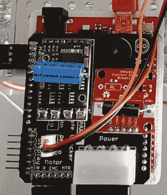

# 安全破解是[内特]最新的 R&D 项目

> 原文：<https://hackaday.com/2017/03/27/safe-cracking-is-nates-latest-rd-project/>

我们喜欢承担新的和令人敬畏的构建，但是找到每个项目的第二部分(“令人敬畏的”)通常是一个挑战。看起来[内森·赛德尔]正在让 awesome 成为他在 Sparkfun 所驾驶的 R&D 大赛的焦点。他们刚刚推出了这个包含一点游戏化的安全破解项目。

保险箱的起源故事本身就很精彩。(内特的)妻子在克雷格的清单上捡了便宜，因为之前的主人忘记了密码。我们已经看到了足够多的 reddit/imgur 线程，以至于根本不在乎里面有什么，但我们都在致力于破解代码。

SparkX([新的快速原型努力](http://hackaday.com/2017/02/15/sparkfun-gets-back-to-their-roots-with-sparkx/)在 Sparkfun)的方法是设计一个 Arduino 安全破解盾。它有一个电机驱动器来旋转转盘，并可以驱动一个伺服机构来拉动杠杆开门。有一个压电蜂鸣器指示成功，该板作为一个显示标题，已标记但未使用，大概是为了显示当前正在测试的组合。我们说“大概”是因为他们在破解之前不会公布所有细节，这个过程将从周三开始直播。这将让我们猜测插入保险箱破解屏蔽的 INA169 电流传感器的用途。表盘上方似乎有一个反射传感器，用来精确跟踪旋转的表盘。

从电气上来说，这是我们所期待的，但从机械上来说，我们喜欢这种构造。转盘和控制杆都有 3D 打印适配器，可以与系统的其他部分连接。整体框架由铝槽制成，用稀土磁铁固定在保险箱上——这是这种装置非常巧妙的应用。

该项目的游戏化与他们正在做的一对 100 美元的赠品有关，以最接近的猜测破解需要多长时间(我们希望它是一个相当快的破解者)以及实际的组合可能是什么。现在，我们想听听你对两件事的看法。首先，电流传感器在电路中的作用是什么？第二，有没有一个很好的技巧来优化像这样的暴力方法？我们已经看到[主锁的机械特性被利用](http://hackaday.com/2013/05/14/master-lock-auto-cracker-built-as-coursework-at-university/)进行快速破解。但对于这一点，我们更感兴趣的是先听听测试可能组合的数学技巧。请在下面的评论中发表意见