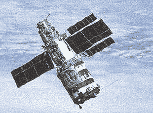

# 礼炮:我们如何学会建造空间站

> 原文：<https://hackaday.com/2018/02/12/salyut-how-we-learned-to-make-space-stations/>

当你想到空间站时，首先想到的是哪几个？你可能会想到[天空实验室](https://hackaday.com/2015/10/14/hacking-when-it-counts-much-space-station-hacking-saved-skylab/)、[国际空间站](https://hackaday.com/2015/08/30/its-10-pm-do-you-know-where-your-space-station-is-at/)，或者可能是俄国的和平号。但是在这些进入天堂之前，有礼炮。

俄罗斯的礼炮 1 号是人类第一个空间站。随后的礼炮计划从 1971 年到 1986 年持续了 15 年，从这一系列引人注目的实验中吸取的经验教训今天仍在国际空间站(ISS)使用。在美国载人航天计划处于休眠状态的时候，该计划是如此成功，以至于有人可以说俄罗斯人失去了月球，但赢得了太空竞赛。

## 俄罗斯自己的太空竞赛

Almaz space station

礼炮计划起源于 20 世纪 60 年代俄罗斯内部鲜为人知的太空竞赛。一方是 OKB-52 设计局，它致力于建造一个军事空间站。另一方是 OKB 1 号，它试图做同样的事情，但用于民用科学目的。

军方在 Almaz 空间站的核心方面处于领先地位。为了赶上进度，平民将 Almaz 船体与他们自己的联盟号飞船系统结合起来，并增加了更多的太阳能电池板。这些被指定为 DOS(持久轨道站)站。

民用礼炮计划创建于 1970 年 2 月 15 日。随着冷战的全面展开，这个军事项目通过伪装成礼炮的一部分而对世界隐藏起来。到 1971 年 4 月 19 日，第一艘礼炮号和世界上第一个空间站发射升空。

## 礼炮 1 号(DOS-1):第一次和悲剧

Salyut 1 and Soyuz spacecraft

与今天由多个模块组成的空间站不同，第一批礼炮是单体的。他们作为一个单元发射，装满了他们需要的所有供应品以及他们所有的实验。宇航员们分别到达，当所有的补给耗尽，实验完成后，空间站脱离轨道。

虽然礼炮 1 号任务创造了许多第一，但也不是没有一些困难。1971 年 4 月 22 日，第一批宇航员乘坐联盟 10 号升空，但他们无法进入空间站，不得不中止任务。

联盟 11 号的第二批宇航员成功进入空间站并停留了 23 天，创下了当时太空停留时间的新纪录。然而，悲剧发生在机组人员返回地球期间，联盟号飞船轨道舱和下降舱之间的压力平衡阀在太空中过早打开。三名宇航员在几秒钟内窒息而死。迄今为止，他们是唯一死于太空的人。(对于吹毛求疵的人来说，哥伦比亚号灾难发生在 60 公里左右，大多数人认为太空从 100 公里开始。)随后对联盟号进行了重新设计，只能容纳两名宇航员，但穿着压力服。

## 挫折和军事任务

正如太空旅行的标准一样，仍处于襁褓中的民用项目继续遭受挫折。

在质子号火箭第二级发生故障坠入太平洋之前，DOS-2 本应是礼炮 2 号。礼炮 2 号被命名为首次使用 Almaz 空间站的军事任务。DOS-3 将成为下一个民用礼炮，但在超出地面控制范围时，其飞行控制系统的错误导致了不必要的轨道修正，耗尽了所有的燃料。因此，礼炮 3 号的命名与另一个阿尔马兹站一起进入了下一个军事任务。最后的军事任务被称为礼炮 5 号。

## 礼炮 4 号(DOS-4):做科学

Salyut 4

下一个民用空间站，礼炮 4 号，本质上是 DOS-3 的翻版。它有三个大型太阳能电池阵列，而不是礼炮 1 号的两个，发电 2 千瓦。科学仪器包括一台太阳望远镜、短波衍射光谱仪和两台 X 射线望远镜。它还配备了测试和最小化零重力对人类影响的设备。

两名船员在船上呆了一段时间，第二名船员在船上呆了 63 天。第三次是计划中的，但是发射失败了。一艘无人驾驶的联盟号宇宙飞船也与空间站对接了三个月，以测试其耐用性。

## 礼炮 6 号(DOS-5):下一代

Salyut 6 with Soyuz and Progress spacecraft docked. [(fair use image)](https://en.wikipedia.org/wiki/File:Salyut_6.jpg)

礼炮 6 号预示着下一代空间站的到来，这种空间站允许连续占用，并可以长时间停留在太空中，这是我们今天认为国际空间站正常的两件事。

主要通过添加第二个对接端口，连续占用和长持续时间成为可能。以前的礼炮既不能再补给，也不能清除它们的废物，除了那些可以在联盟号载人宇宙飞船有限的空间里携带的废物。一种新的宇宙飞船——无人驾驶的进步号货运飞船被制造出来，用于向空间站运送物资。供给包括空气、空气再生器、食物、水、衣物、邮件和推进剂。废物被装回“进步”号，在重返大气层时被烧掉。进步号至今仍在使用，每年向国际空间站运送三到四次补给。

你可能想知道为什么你不能使用一个单一的对接端口进行补给。为什么你不能暂时让联盟号脱离空间站，对接并卸载进步号，然后重新装载联盟号？一个原因在几年后的和平号空间站上被弄清楚了，当时一个进步号对接出现了严重的问题。它错过了对接端口，而是与一些太阳能电池板和和平号的一个模块相撞，造成空气泄漏。幸运的是，他们能够封闭泄漏的模块，但如果事情有一点不同，他们将不得不放弃空间站。如果他们只有一个对接端口，他们的逃生飞船“联盟号”就会暂时脱离对接，为误入歧途的“进步”号货轮腾出空间。不太好。有了两个对接口，联盟号已经准备好等待了。

这两个对接端口也允许访客和船员交接，新的船员将抵达，而以前的船员仍然存在。礼炮从未被持续占领，但这是这种可能性的开端。

礼炮 6 号于 1977 年 9 月发射，使用五年后于 1982 年 7 月脱离轨道。它容纳了 5 名长期乘员和 11 名短期乘员。它本来可以使用更长时间，但管理生活隔间中的霉菌变得太困难了。

## 礼炮 7 号(DOS-6):最后的航行

  Salyut 7\. [(fair use image)](https://en.wikipedia.org/wiki/File:Salyut7.jpg)  ISS’s Cupola with shutters

在他的 [*宇航员日记:太空 211 天*](https://www.amazon.com/Diary-Cosmonaut-211-Days-Space/dp/0553287788/ref=sr_1_1) 中，瓦伦丁·列别杰夫讲述了在礼炮 6 号工作的五年中积累的经验如何导致礼炮 7 号内部的许多变化。首先，为了更有效地工作、服务和维修，设备被完全重新安排。他们现在有各种各样的食物可供选择，还有改进的医疗设备。

舷窗现在配有外部百叶窗，以保持发动机燃料的清洁，并保护它们免受微陨石的影响。类似的百叶窗今天在国际空间站上使用，以保护冲天炉模块的大窗户免受微陨石的影响。

在礼炮 6 号上，水被装在 15 公斤重的球形容器中，这些容器必须用手从进步号补给船运送到礼炮号上。至少有一名船员通过将进步号上的软管穿过对接端口，将水直接泵入 Rodnik 储水系统，从而侵入了这个系统。这一改进被纳入礼炮 7 号和后来的和平号。

也许最重要的是，礼炮 7 号开始了从整体式空间站向模块化空间站的转变。为了帮助和平号的设计，测试是通过对接和使用“重型宇宙模块”进行的，这实际上是俄罗斯的 TKS 航天器。

即使和平号于 1986 年开始使用，礼炮 7 号仍将继续使用，空间站被提升到更高的储存轨道。但随着苏联的解体及其随之而来的经济困难，空间站的资金从未兑现，最后一艘礼炮号的轨道逐渐衰减，直到 1991 年它在南美洲上空经历了一次不受控制的重返。

## 遗产

我们已经提到了许多从礼炮计划延续下来的东西，包括外部百叶窗，进步号补给船，以及整个模块化空间站的概念。但是即使今天仍在使用的模块也是礼炮的后代。米尔的代码模块是 DOS-7。国际空间站上的 Zvezda 服务舱是 DOS-8。国际空间站的扎里亚舱是用礼炮 7 号测试的 TKS 飞船的后代。

还有哪些冷战时期的俄罗斯科技延续到今天？强大的 RD-180 火箭发动机是用于俄罗斯 N-1 月球火箭的闭合循环发动机设计的现代版本。在[克里斯蒂娜·帕诺斯的]文章[中阅读所有相关内容俄罗斯火箭技术从寒冷中走出来](https://hackaday.com/2016/02/03/russian-rocket-technology-comes-in-from-the-cold/)。