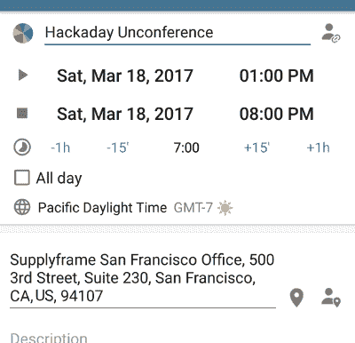

# 旧金山在 3 月 18 日召开了黑客大会

> 原文：<https://hackaday.com/2017/02/27/san-francisco-tapped-for-hackaday-unconference-on-march-18th/>

我们希望你能让下一次 Hackaday 现场活动精彩纷呈。这是 3 月 18 日星期六在旧金山举行的一次非正式会议，它完全取决于你。[立即报名](https://www.eventbrite.com/e/hackaday-unconference-san-francisco-tickets-32360986582)！

### 你控制着黑客大会

unconference 是一个现场活动，由你决定主题，引导讨论，通常会让它成为一个史诗般的周六。我们有几个发言人排着队来帮助我们开始。但我们也希望你能准备好演讲。每个到场的人都应该准备好站起来发表八分钟他们现在觉得令人兴奋的东西。

晚上开始时，我们会要求每个人告诉我们他们演讲的标题或主题，以及演示的大致长度。一旦所有的标题都写下来了，我们将当场敲定时间表。如果你还没有参加过一个非正式会议，现在是时候报名参加了，收集你的想法，投入到一个下午的即兴想法分享中。如果你参加过一个非会议，我们猜测你一看到这个公告就注册了。

### 非会议主题:构建重要的东西

Click here to [RSVP](https://www.eventbrite.com/e/hackaday-unconference-san-francisco-tickets-32360986582)

你可以谈论任何你想谈论的事情，但是约束是有帮助的。这次非正式会议的主题是*打造重要的东西*，这是我们在这里非常重视的一句口号。我们花了太多的时间进行黑客攻击和设计，除了学习之外没有其他目的。但是有时候你应该把这些疯狂的技能用在一些有益的事情上。当你想到你可能会在八分钟的荣耀中讨论什么的时候，问问你自己什么事情对你来说是重要的，你的构建如何适应它。我们迫不及待地想听到你对这个问题的回答。

### 会议的所有舒适

这些讲座进行得很快，因此相应地计划任何演示或幻灯片，并至少用实际的时钟练习一次。我们会有投影仪和讲台。我们还将确保准备好食物和饮料，并计划发放一些硬件赠品。

这就像其他黑客日聚会一样:挤满了有技术头脑的人，他们知道自己在做什么，并且非常乐意分享他们所知道的。这是和你感兴趣领域的人交往的好方法。不要错过这次会议，你将很难找到另一个这样的会议。