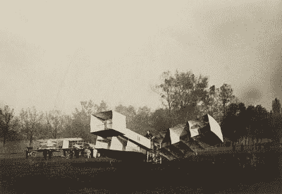
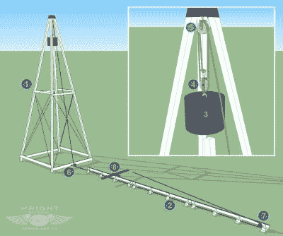

# 桑托斯·杜蒙和航空的起源

> 原文：<https://hackaday.com/2017/02/08/santos-dumont-and-the-origins-of-aviation/>

航空史令人着迷，从风筝和跳塔开始跨越了两千多年。许多黑客也是航空迷，阿尔贝托·桑托斯·杜蒙(Alberto Santos Dumont)的名字可能很熟悉，但如果不是，这里我们谈谈他在该领域的作用和成就。桑托斯·杜蒙是为数不多的在气球、飞艇和重于空气的飞机方面做出贡献的航空先驱之一。

## 从比空气机器更轻到更重

桑托斯·杜蒙是巴西一位富有的咖啡生产商的小儿子。从早年起，他就对咖啡种植园的机械着迷；蒸汽拖拉机、机车和其他设备。怀着这种热情，他 18 岁时被安排到巴黎学习物理、化学和电学，并很快对热气球和飞艇产生了兴趣。

这种兴趣发展起来，桑托斯·杜蒙制作了许多气球。他的第一个，Bresil，是一个非常了不起的设计。与当时的其他设计相比，它非常小巧轻便(与标准设计的 750 米 ³ 相比，它只有 113 米 ³ ),但却为这位年轻的发明家展示了许多希望。

他开始研究可操纵的气球和飞艇。“桑托斯·杜蒙 1 号”于 1898 年 9 月 18 日升天。“二号”是一次不成功的实验，但“三号”却取得了圆满成功，绕着埃菲尔铁塔飞行，并在巴盖特勒机场完美着陆。

从那次胜利开始，他的兴趣转向了动力飞行。他有一辆机动三轮车，像任何优秀的黑客一样，他在里面搜寻他的第一个动力气球。那是“第四号”，概念的证明导致了更强大的“第五号”，他在一次不成功的尝试中建造了它以赢得一项航空奖。但是坚持不懈得到了回报。1901 年 10 月 19 日，桑托斯·杜蒙凭借他的“6 号”飞艇赢得了德意志奖，他从圣克劳德公园出发，绕着埃菲尔铁塔飞行了 30 分钟后返回。

一旦他掌握了如何驾驶轻于空气的飞机，桑托斯·杜蒙就把注意力转向了飞机。他在 1905 年建造了一架不成功的单翼飞机，还建造了一架直升机，其旋翼由涂漆丝绸制成，伸展在竹子框架上，由一台 25 马力的 Antoinette 发动机提供动力。值得注意的是，在第二次尝试制造飞机时，桑托斯·杜蒙成功了。他拿走了 14 号飞艇的机舱，增加了双翼、机身和一个安托瓦内特 24 马力 v8 引擎。由此产生的鸭式(尾翼向前)双翼飞机被命名为“14-bis”。第一次不成功的飞行表明机器动力不足，所以他把发动机换成了更大功率的，40 马力。然后他第一次飞行了大约 10 米，在着陆时损坏了飞机。修理后，他驾驶他的“14-bis”飞机，并于 1906 年 11 月 12 日因首次官方观察到的超过 100 米(330 英尺)的飞行而赢得了法国航空俱乐部奖。这架 14-bis 飞机完成了美国境外的首次动力飞行。

Santos Dumont’s 14-bis flying machine. By Jules Beau, via [Wikimedia Commons](https://en.wikipedia.org/wiki/Santos-Dumont_14-bis#/media/File:14-bis_de_Alberto_Santos_Dumont.jpg).

他又制造了几台机器，“15 号”和“17 号”，甚至还有一架螺旋桨驱动的水上飞机。但直到 1907 年，他才完成了他的杰作《蓑羽衣舞娘》，如图所示。这是一架优雅轻巧的单翼机，机身是用竹子制成的开放式框架。飞行员穿着与驾驶杆相连的特殊服装。通过向左或向右倾斜，机翼扭曲并充当副翼，从而使飞机在飞行中倾斜。这只是在标准化控制方法被开发出来之前，飞机设计中测试过的许多方法之一。

Santos-Dumont 免费发布了 Demoiselle 的图纸，它们发表在 1910 年 6 月版的*大众力学*上。作者说，“对于那些希望以最少的花费和最少的实验获得结果的人来说，这台机器比以往任何一台机器都要好。”

## 与莱特兄弟的首次飞行争议

Catapult and launching rail used by the Wright brothers. Image from [www.wright-brothers.org](http://www.wright-brothers.org/Information_Desk/Just_the_Facts/Airplanes/Flyer_II.htm).

虽然莱特兄弟被广泛认为是第一架成功的飞机的发明者，但关于第一次动力飞行仍有争议，迄今为止至少有六项“重大声明”。有人说莱特兄弟没有发明飞机，但是“仅仅”控制了动力飞行——这一点在我们[最近关于莱特兄弟方法的文章](http://hackaday.com/2017/01/10/the-wright-flyer-engineering-and-iterating/)的评论中得到了体现。他们的主要突破是三轴控制(滚动、俯仰和偏航)。

关于桑托斯·杜蒙的飞行，人们经常说莱特兄弟使用轨道和弹射系统来发射他们的飞行器，而不是使用轮子的桑托斯·杜蒙飞机。事实上，莱特兄弟的第一架用轮子代替滑橇的飞机是 1910 年的“B 型”。当然，用轮子代替滑道可以被认为是一个小的技术问题；更重要的是使用弹射系统来发射飞机，然而莱特兄弟仅使用导轨作为导向系统进行了许多飞行，飞机仅使用自身动力起飞，远在桑托斯·杜蒙 1906 年的飞行之前。

1904 年，桑托斯·杜蒙被邀请到白宫会见罗斯福总统，罗斯福总统对在海战中使用飞艇很感兴趣。有趣的是，桑托斯·杜蒙和莱特兄弟从未谋面，尽管他们听说过对方的工作。

## 最后几年

桑托斯·杜蒙有时被认为是手表的发明者。事实是，他是路易·卡地亚的朋友，并告诉他在飞行中检查怀表的困难，这次谈话引出了第一块飞行员手表，Santos Dumont 每次飞行都戴着它。由于他已经是欧洲的名人，公众很快就注意到了这块手表。当时只有女性使用手表，但桑托斯·杜蒙让手表在男性中也很流行。卡地亚仍有一系列桑托斯·杜蒙手表。

桑托斯·杜蒙于 1910 年从航空业退休，他患有多种硬化症，并因在战争中使用飞机而经历抑郁症。他于 1911 年移居法国，被指控为德国人做间谍。这件事使他非常沮丧，他烧掉了所有的文件和计划。他于 1931 年回到巴西，一年后上吊自杀。他对航空的贡献是他留给人类的遗产。