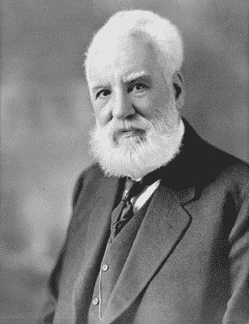
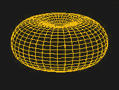
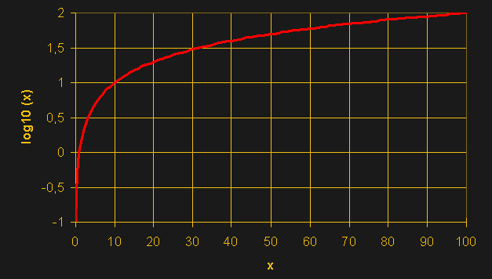
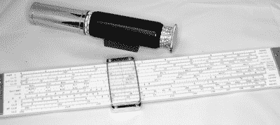

# 贝尔拯救了我们——了解分贝

> 原文：<https://hackaday.com/2017/03/07/saved-by-the-bel-understanding-decibels/>

如果你接触电子产品有一段时间，你肯定听说过分贝(通常缩写为 dB)。分贝是功率比的量度。实际上，真正的衡量标准是一个贝尔，但在实践中你几乎看不到它。如果你精通公制，你就不会惊讶地得知分贝是贝尔的 1/10。有时在电子学中，我们会处理非常大的比值，因此分贝是对数的，以应对这种情况。分贝数加倍并不会使比率加倍，你很快就会看到这一点。一切都与对数有关，在测量天线或放大器增益之类的东西时，对数非常有用。

除了天线，分贝也常用来衡量声音和光线。原因是人类的耳朵和眼睛对那些量有对数反应。例如，你的耳朵有很大的动态范围。也就是说，你可以听到一声耳语或者一次航天飞机发射。这个比率大约是 1 万亿比 1，但那只是 120 分贝。这也是为音量控制制作的电位计具有对数锥度的原因。一个线性的锅似乎是关闭的，因为，举例来说，在一个极端的十分之一圈对表观音量的影响比在另一个极端的十分之一圈要大得多。不管这些旋钮升到 11，这都是正确的。

### 历史

分贝可以追溯到旧的电话系统。最初，用于测量电话和电报电缆损耗的单位是“标准电缆英里数”(MSC)。对于什么是标准电缆，有一个详细的定义，1 MSC 是指一英里长的电缆中预定义信号的损失量。这种情况一直持续到 1924 年。

 那一年，贝尔电话公司推出了传输单元(TU)，后来(1928 年)被称为贝尔，以纪念亚历山大·格雷厄姆·贝尔(左边的小伙子)。我们不知道贝尔名字中最后一个 L 发生了什么。它流行起来，我们今天仍然用它来衡量收益和损失(损失显示为负数)。

### 为什么？

除了便于表示较大的比率外，分贝还便于计算系统增益或损耗。例如，如果有一个发射机以-3 dB 的损耗馈入同轴电缆，一个放大器以 25 dB 的增益馈入同轴电缆，一个电缆以-3.3 dB 的损耗馈入同轴电缆，一个天线以 3 dB 的增益馈入同轴电缆，那么只需将它们相加即可:-3+25–3.3+3 = 21.7 dB。总增益约为 148 倍( *log(148)=2.17 贝尔= 21.7 dB*——有关这些计算的帮助，请参见下一节)。

注意损耗是如何显示为负分贝的？不过，您可能想知道，拥有一个 3 dB 增益的天线意味着什么？根据公式，这意味着天线的输出是输入的 3 dB(大约两倍)。然而，测量功率输出很困难(可能也不太有用)，因为它不是真正的双端器件。相反，天线是通过各向同性天线(一种不可构建的天线，它是空间中的一个点，向所有方向均匀辐射输入功率)的增益来测量的。当然，这并不实际，所以有时你会测量偶极子天线峰值增益的增益。为了避免混淆，您几乎总是看到天线增益被写成 3 dBi(各向同性)或 3 dBd(偶极)。dBd 值总是比 dBi 值小 2.15 dB。

[Dipole antenna pattern](https://commons.wikimedia.org/w/index.php?curid=960123) CC-BY-SA 3.0

考虑天线时要考虑的另一件事是方向。例如，偶极子的增益为 1.64:1 (2.15 dBi)峰值。但在某些方向上，它要少得多。你可以在右图中看到偶极子的辐射图。各向同性的图案是完美的球体。

### 日志和数据库数学速成班

如果你的数学有点生疏，你可能需要快速复习一下对数。

对于分贝，你需要以 10 为底的对数，所以这就是我们要讨论的。考虑数字 100:

*   10 的平方(即 10 的 2 次方)是 100，所以 100 的对数是 2
*   1000 的对数是 3(因为 10 的 3 次方是 1000)
*   10 的对数是 1
*   任何数字的 0 次方都等于 1，所以 1 的对数是 0
*   我们可以讨论反对数，这是逆运算，所以 2 的反对数是 100(本质上，取 X 的反对数，你会发现 10 的 X 次方)

Common Logarithm [by Ellywa](https://commons.wikimedia.org/wiki/File:Graph_of_common_logarithm.png) CC-BY-SA 3.0

当你有一个大范围的数字时，对数很方便，因为它压缩了事物。如果你想做的不仅仅是记住分贝公式，你还需要知道一些方便的数学事实。将两个对数相加就像将两个原始数字相乘，然后取对数:

*   100×10=1000，1000 的对数是 3
*   对数(100)+对数(10)=2+1=3

顺便说一下，这是计算尺的工作方式。

更重要的是，使用对数计算一个数的幂是多么容易。假设你想找到 20 的 9 次方(写成 20^9).当然，你可以把 20 乘以它本身。但你也可以通过取 20 的对数(约 1.3)乘以 9 来找到答案。答案将和 log (20^9).)一样

您将会看到，用于计算分贝的公式有时会使用 10 倍的系数(将贝尔转换为分贝)，有时会使用 20 倍的系数(10 倍和比值的平方的组合)。为什么？请记住，bel 是一个衡量功率比的指标。如果你只是想记住一个经验法则，带 10 的公式(见下文)是功率公式，带 20 的是电压或电流比公式。为什么？继续读。

## 比率和参考值

简单来说，bel 就是输出功率与输入功率之比的对数。因此，如果你输入 1 瓦，输出 10 瓦，那就是 10 倍的增益，也就是 1 贝尔。但是就像我说的，没有人用贝尔，所以把答案乘以 10 得到分贝(10dB)。

就知道这些，对吧？不完全是。还有两件事需要考虑。首先，如果你测量的是电压而不是功率呢？分贝是功率的度量单位，但你知道功率与电压的平方成正比。因此，如果计算电压比，必须将计算值乘以 2，因为将该值乘以 2 相当于将比值平方，然后取对数。因为您仍然需要乘以 10，所以如果它是指电压或电流比，结果是您的 bel 值乘以 20 而不是 10..

*   处理功率时 dB=10*log(输出/输入)
*   当处理电压或电流时 dB=20*log(输出/输入)

然而，还有一个问题:很多时候您会听到 dB 测量应用于单个值。如何测量一个值并得到一个比值？答案是:不能。当您看到 dB 中出现单个值时，这意味着有一个假定的参考值。有时这是显而易见的，有时只是暗示。例如，如果您看到 5 dBm 的测量值，这意味着该测量值相对于 1 毫瓦。在音频工作中，您可能会遇到相对于. 775 VRMS 的 dBu 或 dBv。这是将大约 1 毫瓦的电压传递给 600 欧姆的负载。

想想这背后的数学原理。以 5 dBm 为例，5=10*log(output/.001)。一点代数运算就会告诉你，输出功率大约是 3.16 兆瓦。20 dBm 就是 100 mW。有时会看到 dBV，它以 RMS 为基准。

## 回归基础

如果你只从这里拿走关于分贝的两件事，就让它是这两件吧:

1.  功率用 10，振幅用 20
2.  总是问自己比率的两个部分是什么。

如果你记住这些，分贝是很容易处理的。

现在你可以用集成电路做一些非常复杂的事情。考虑到所有这些复杂性，很容易忽略基本要素。虽然分贝并不能让您构建任何新的东西，但了解它在从滤波器插入损耗到光纤衰减(通常用 dB/m 或每米分贝数表示)等各方面的工作原理是很有用的。

还有许多其他的基本话题，这些天你可能会忽略，或者可能在很久以前的课上忘记了。有时候去读一本基础书是值得的。或者重温一下[控制论](https://hackaday.com/2015/12/02/beyond-control-the-basics-of-control-systems/)。不管怎样，带着更多的经验重温旧梦通常会给你一些新的见解。