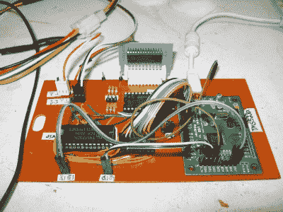

# 通过转储 rom 保存旧声音

> 原文：<https://hackaday.com/2016/01/20/saving-old-voices-by-dumping-roms/>

有些人收集邮票。其他人收集瓷器微缩模型。收集声音合成器和它们的光盘。在这个视频中，他刚刚得到了 80 年代早期克莱斯勒汽车公司的极其罕见的电子语音警报。

早在 20 世纪 80 年代，随着 TI 的线性预测编码语音芯片的开发，语音合成正处于黄金时期。这些是给说话和拼写、许多视频游戏机和 TI 99/4A 计算机的语音模块赋予声音的硅片。显然，克莱斯勒的一些车型。

 我们追踪到了【大卫】的网站。他发布了[一个简短的条目，描述了他的模仿和 ROM-dumping 设置](http://ploguechipsounds.blogspot.de/2014/12/chipspeech-diary-part-2.html)。他说他用它来测试他的(软件)TMS5200 语音合成器仿真。

该板似乎有一个 TMS 系列语音合成器芯片的插座和另一个 ROM 插槽。它看起来像一个 FTDI 2232 USB 串行转换器正在以 bit-bang 模式使用，一些自定义代码驱动一切，并可能在中间嗅探数据。我们希望看到更多的细节。

除了 rom 转储的好处之外，视频最精彩的部分出现在结尾，当[大卫]将 ROM 的内容扔进他自己的[chip speech](http://www.plogue.com/products/chipspeech/)模拟器，并开始在键盘上上下播放“你的机油压力很关键”。太棒了。

 [https://www.youtube.com/embed/8DwKqCZlKnw?version=3&rel=1&showsearch=0&showinfo=1&iv_load_policy=1&fs=1&hl=en-US&autohide=2&wmode=transparent](https://www.youtube.com/embed/8DwKqCZlKnw?version=3&rel=1&showsearch=0&showinfo=1&iv_load_policy=1&fs=1&hl=en-US&autohide=2&wmode=transparent)

谢谢[威廉]的提示！