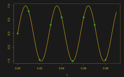
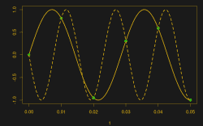
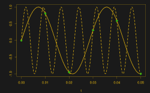
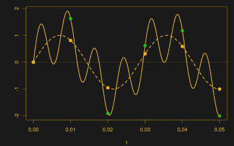
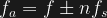
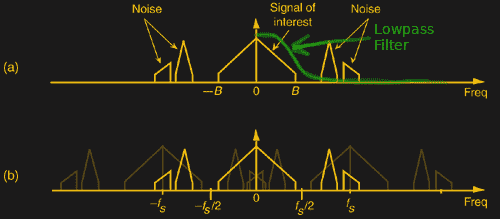

# 跟我说:别名

> 原文：<https://hackaday.com/2017/03/23/say-it-with-me-aliasing/>

假设你对时变信号进行几次测量。具体来说，你有一个微控制器，每秒钟可以读取 100 次电压。将一堆数据点收集在一起，绘制出来——你会说，这肯定来自 35 赫兹的正弦波。用正弦波把这些点连接起来就行了！这和你脸上的鼻子一样明显。

Sampling a 35 Hz wave at 100 Hz

35 Hz with -65 Hz

35 Hz with 135 Hz

然后，某个捣乱者出现了，并引入一个-65 Hz 的正弦波，然后是另一个 135 Hz 的正弦波。然后在-165 Hz 和 235 Hz 或-265 Hz 和 335 Hz 处更多。然后是符合完全相同数据的任意数量的潜在正弦波，所有正弦波的间隔都是 100 Hz 采样频率的正负整数倍。很快，您非常漂亮的图片看起来比您预想的要复杂一些，并且您不知道这些频率中的哪一个生成了您的数据。好像没希望了！你哭着回家。

但随后你意识到这种现象给了你超能力——能够分辨比你的采样频率高得多的频率。正如以 100 Hz 采样时，235 Hz 波在数据中留下明显的 35 Hz 波形一样，237 Hz 信号看起来也像 37 Hz。你可以区分它们，即使它们远远超出了你快速采样的能力。你正在从超过[奈奎斯特极限](https://en.wikipedia.org/wiki/Nyquist_rate)的地方获取信息！

采样中的这种本质模糊性——所有频率偏移采样频率的整数倍产生相同的数据——被称为“混叠”。理解混叠是真正理解采样的第一步，也是进入广阔的数字信号处理世界的第一步。

混叠是破坏原始数据还是为您提供超能力取决于您对这种效果的理解，也许还需要一些明智的预采样过滤，所以让我们了解一些知识。

## 错认假频伪信号

You say “aliasing”, I say “addition”: 35 Hz + 135 Hz, sampled at 100 Hz.

从某种意义上来说，别名是你的全部想法。当您获取 100 Hz 样本时，您可能在寻找相对较低的频率。否则你会采样更快，对不对？但是大自然怎么知道你想要测量哪些频率呢？她只是给你从 DC 到日光的所有频率的所有电压信号的瞬时总和，然后让你去整理。

如果将 35 Hz 和 135 Hz 的波形相加，得到的模拟波形*将*在对应于 100 Hz 的采样点处具有两倍的振幅。当你采样时，你会得到准确的值。为什么你会有不同的期待？

*为什么*是因为当你想到采样值时，你在欺骗自己，以为你看到了整个画面，而不是仅仅几个微小的时间点，中间没有数据。但是原则上，*样本之间的信号可以发生任何*的事情。我们只是选择使用最简单(最低频率)的解释。

这不仅看起来合理，而且这在人类生理学中也根深蒂固，所以对抗它是没有用的。当你观看一部西部片时，公共马车加速，这样轮子上的辐条[就与电影的帧速率](https://en.wikipedia.org/wiki/Wagon-wheel_effect)相匹配，你会看到轮子停止了，因为每一帧都是在下一个辐条与前一帧处于相同位置时拍摄的。当它进一步加速时，你甚至认为你看到了轮子在向后转。采样数据来自“明显的”基础信号的错觉很强烈。

 [https://www.youtube.com/embed/FOBUUjy1tNI?version=3&rel=1&showsearch=0&showinfo=1&iv_load_policy=1&fs=1&hl=en-US&autohide=2&start=290&wmode=transparent](https://www.youtube.com/embed/FOBUUjy1tNI?version=3&rel=1&showsearch=0&showinfo=1&iv_load_policy=1&fs=1&hl=en-US&autohide=2&start=290&wmode=transparent)

那么，如果采样把不同频率的信号加在一起，我们如何才能把它们分开呢？简单的回答是，一旦数据被收集，你就不能。那里没有足够的信息来重现宇宙的全部带宽。

但是我们可以避免混淆。强力方法是简单地获取更频繁的样本。由于混叠频率是所需频率加上或减去采样频率的整数倍，  ，所以采样速度越快，就会将那些会扰乱数据的频率推开。如果你能看到不同图表中的数据点之间的关系，你就能看出并非所有信号都来自 35 Hz。

事实上，如果您事先知道 35 Hz 信号被 135 Hz 信号污染，您可以以 120 Hz 进行采样，从而在-115 Hz 和 15 Hz 处产生一阶混叠。现在，您可以使用复杂的 DSP 技巧将信号相互分离。当然，如果信号也有 155 Hz 的滋扰信号，这个就不行了。

## 抗锯齿

另一种方法是首先在采样前去掉可能的别名。当你早上醒来，看着外面的太阳升起，你不会问自己是否睡了一两个晚上。那是因为你已经睡了 32 个小时而没有察觉是不可能的，对吗？同样，要在采样前消除数据的锯齿，只需用滤波器排除较高倍数的采样频率。

From Lyons’ “Understanding Digital Signal Processing”, with Lowpass Filter Profile Added

*低通采样*是在对数据进行采样之前对其应用低通滤波器的过程的名称。在采样前过滤掉高频成分意味着没有什么可以混叠，而最低频率，也就是你认为是“样本”的频率，是唯一存在的频率。几乎每个模数转换器都以这样或那样的方式实现这一点。

因为负频率会干扰我们的目标信号，所以滤波器的截止频率需要设置为采样频率的 1/2，或目标带宽的上限，以较低者为准。例如，当录制 CD 时，在以 44.1 kHz 采样之前，它们通过陡峭的 20-22 Khz 截止滤波器。潜在的 30.1 kHz 污染信号在采样后会混叠至-14 kHz，在到达 ADC 之前会被简单地滤除。

使用 ADC 采样时，请考虑在采样频率的倍数下会发生什么。你需要低通滤波器吗？我们怀疑你可能会。

## 带通采样

最后，这里是混叠的超能力的一面。正如您可以计算 Stagecoach 中“停止”的马车车轮上的辐条数量一样，您也可以通过利用混叠来获得高于采样速率的频率信息。就像车轮上的辐条一样，尽管看起来像是从波形的单个周期中抽取样本，但实际上是从波形的多个周期中获得不同相位的快照。但如果想要的信号相对一致——马车的辐条大致可以互换——那就无关紧要了。

*带通采样*(或*欠采样*)是这个超级功率的 DSP 名称。您知道，采样时，所有采样频率倍数的信号都会混在一起。诀窍与低通情况相同:只需过滤掉除所需频带之外的所有频带，让混叠为您完成下变频。

 因此，如果我们想要捕捉 135 Hz 的波形，只需尽可能紧密地围绕所需的 135 Hz 进行滤波，以 100 Hz 进行采样，并读取 35 Hz 的结果频率。请注意，您使用的 ADC 仍然必须能够解析 135 Hz 信号，如果其输入太慢，它会抹掉高频内容，留下一片混乱。(电影摄影机的曝光速度必须足够快，以便“冻结”马车车轮。垃圾进，垃圾出。)不过，如果您的 ADC 能够胜任，使用这种技巧，您可以仅使用每秒 100 个样本而不是每秒 270 个样本来获得关于 135 Hz 信号的相同信息。

## 关于别名的更多信息

实际上，混叠问题远不止这些，主要是因为它影响采样的方方面面，进而影响 DSP。如果想深入一点，任何好的 DSP 教材都行。我非常喜欢理查德·莱昂斯的《理解数字信号处理》。(这里是带通采样的[章节，供大家欣赏。)](http://www.informit.com/articles/article.aspx?p=345472&seqNum=3)

如果你对上面所有的“负频率”有点不安，那么从复平面和 I/Q 采样的角度来看，它实际上更有意义。对于复杂信号和采样理论的视频介绍，我喜欢[Michael Ossmann]关于[软件定义无线电基础知识](https://www.greatscottgadgets.com/sdr/)的视频系列。至少看第六章关于复数，然后看第九章关于混叠。如果您对 SDR 应用不感兴趣，并且已经熟悉复杂信号，您可以从 14:00 开始学习第九章，一直学到 24:00。这会是你度过的最美好的十分钟。(当然，除了十个阅读这篇文章的人之外。)

如果你想知道这些信号最初是如何被采样的，试试[Bil Herd]的[ADC 技术综述](https://hackaday.com/2016/05/05/analog-to-digital-conversion/)。