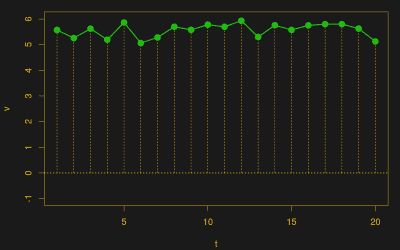
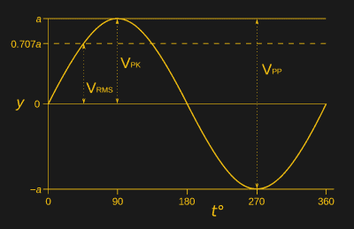

# 跟我一起说:均方根

> 原文：<https://hackaday.com/2017/04/13/say-it-with-me-root-mean-square/>

如果你测量一个 DC 电压，并想知道它随着时间的推移有多大，这很简单:只需进行多次测量并取平均值。如果您对同一时间范围内的平均功率感兴趣，它可能与使用平均电压计算功率而不是计算瞬时功率并求平均值得到的答案非常接近(尽管不完全相同)。DC 电压变化不大。

用交流电压试试同样的把戏，你会得到零，或者接近零的值。为什么？对于交流波形，正电压偏移会抵消负电压偏移。如果翻盖关闭，你会得到同样的结果。显然，简单的平均值并不能反映我们所认为的交流波形的“大小”;我们需要一个新的“大小”概念。输入均方根电压。

要计算均方根电压，您需要取多个电压读数，对它们求平方，将它们加在一起，然后除以平均值中的条目数，然后求平方根:。这种奇怪的平均程序背后的基本原理是，通过简单的乘法运算，得出的数字可用于计算交流波形的平均功率，就像计算 DC 电压一样。如果这个答案不完全令你满意，请继续读下去。希望我们能帮助它变得更有意义。

## 必需品

说到平均值，交流电压和 DC 电压的“大”和“小”的概念是完全不同的。DC 波形大致不变，重要的是离零的距离。交流波形总是围绕一个中心点摆动，这通常是接地。如果波形是对称的，并且你采集了足够多的样本，它的平均值将会是零。

Average Power Close to Power at Average Voltage

Average Voltage = 0, Average Power Not Zero

测量交流电压大小的一种方法是取一段时间内的最大值和最小值:峰峰值电压。另一种可能是取每个电压的绝对值，然后将它们平均在一起。那也行得通。第三种选择是在将所有单个电压测量值相加之前，对它们求平方。这与取绝对值的效果是一样的——所有的单项现在都是正的，不会抵消——还有一个额外的副作用，就是让大值变大，小值变小。我们选哪个？

## 物理学

在平均值中使用电压的平方可以得到正确的物理结果。如果您对从交流信号中获得的功率感兴趣，无论如何，电压的平方是相关的。让我们假设你现在正在驱动一个阻性负载——也许你正在给你的公寓供暖或者使用电炉——然后做一点代数运算。

请记住，功率等于流经我们想象中的设备的电流乘以它上面的压降:`P = IV`。谁会忘记欧姆定律呢？`V = IR`或`I = V / R`。把它们放在一起，还有`P = V² / R`。在任何给定时刻，系统中的功率与电压的平方成正比。因此，时间上的平均功率与电压平方的平均值成比例。听起来很熟悉吗？因为瞬时电压平方的平均值是以伏特平方为单位的，所以求最后的平方根(“平方平均值的根”)就能得到正确的结果。

同样的逻辑也适用于均方根电流测量。以另一种方式代入欧姆定律，你得到`P = I² R`，功率与电流的平方成正比。平衡交流波形中的平均电流为零，但均方根平均电流的平方与功率成正比。

By[[Alan m1](https://commons.wikimedia.org/wiki/File:Sine_wave_voltages.svg)]，Public Domain

再次强调，均方根电压是衡量平均交流电压或电流的指标，让您可以假装它是一个 DC 平均值，以获得平均功率。通过在平均值内求平方，可以避免符号相反的电压抵消，通过在最后求平方根，可以得到正确的单位。

如果 DC 元件上有交流电压，均方根值仍然有效。在这种情况下，DC 分量的平方在再次除以`n`之前累加`n`倍，并且你得到类似这样的结果:，其中`v`仅仅是纯交流电压。

## 经验法则

一个可以看到均方根电压的地方是市电电源。事实上，美国的 120 V(或欧盟的 230 V)电压是有效值。对于正弦波，就像你从电气公司得到的那样，峰值电压是均方根电压的`sqrt(2)`倍。美国的峰值电压大约是`120 V * sqrt(2) = 170 V`，峰峰值是 340 V，欧洲是 650 V 峰峰值；呀！

这也意味着，如果您缺少均方根测量仪，需要快速估算类似正弦波的信号，您可以将幅度除以 1.414，或者将峰峰值除以两倍。

您可能关心的另一个波形是 PWM 方波，我们经常用它来驱动微控制器的电机。很明显，如果你在 0 伏和 12 伏之间变换，只有在 12 伏时，它才给电机供电。相应地，当听到 PWM 波形的均方根电压等于占空比的平方根乘以导通电压时，你不会感到惊讶。

维基百科已经涵盖了三角波和其他有趣的波形。

## 到处都是 RMS

原来你经常关心的是数量的平方。例如，动能与速度的平方成正比，所以均方根速度用于从气体中分子的平均速度计算温度。如果您有一个平均来说可能正确的测量程序，但您也担心结果的分散，您可能希望最小化均方根误差。统计学家对[标准差](https://en.wikipedia.org/wiki/Standard_deviation)的概念是类似的，事先减去平均值。

你甚至用同样的程序计算三角形的斜边，只是不用除以`n`。(好吧，这有点牵强，但是平方和的平方根无处不在！)我将把这个问题留给你们当中的数学哲学家，让他们在评论中讨论为什么 L2 范数 T2 出现得如此频繁。对于电气黑客来说，记住欧姆定律的基本原理就足够了:当你对功率感兴趣时，你会对平方感兴趣。