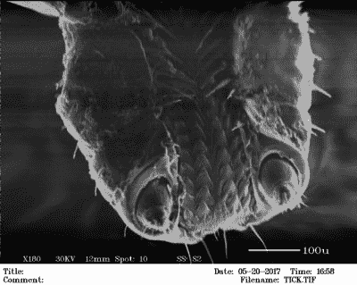

# 扫描电子显微镜增加了已经令人印象深刻的车库实验室

> 原文：<https://hackaday.com/2017/06/11/scanning-electron-microscope-adds-to-already-impressive-garage-lab/>

当你是一个高中生，在你的车库里建了一个半导体工厂，你的下一步计划是什么？为什么，[在你的实验室里增加一台扫描电子显微镜](http://sam.zeloof.xyz/category/electron-microscope/)，很自然。你问得真愚蠢。

 上次我们偶然发现新泽西最有趣的车库里发生的事情时，【萨姆·泽洛夫】正带着[参观他在](http://hackaday.com/2017/02/25/the-fab-lab-next-door-diy-semiconductors/)的 DIY 半导体制造实验室，并展示他在那里制造的一些设备，包括二极管和 MOSFETs。尽管这些组件令人印象深刻，但他积累的设备真的让我们惊叹不已。因此，在组合中加入易贝 SEM 似乎是一个自然的过程，也是使用他拥有的一些高真空设备的一个好理由。下面的视频显示[Sam]正在参观一台 20 世纪 90 年代的老式乐器，并展示了各种铜溅射样品的图像，包括一只扁虱，它显然是新泽西州的州鸟。

SEM 黑客在这里并不常见，但也不是闻所未闻。[本·克拉斯诺]已经用他的影像切割工具和[留声机唱片](https://hackaday.com/2015/06/16/phonographs-through-the-eye-of-an-electron-microscope/)在运作，还有一些[自制的 SEM](https://hackaday.com/2016/12/02/nascent-project-open-source-scanning-electron-microscope/)也在四处游荡。但是我们向[Sam]脱帽致敬，因为他又一次获得了一个很棒的教程。

 [https://www.youtube.com/embed/RJXio_jpc_Y?version=3&rel=1&showsearch=0&showinfo=1&iv_load_policy=1&fs=1&hl=en-US&autohide=2&wmode=transparent](https://www.youtube.com/embed/RJXio_jpc_Y?version=3&rel=1&showsearch=0&showinfo=1&iv_load_policy=1&fs=1&hl=en-US&autohide=2&wmode=transparent)

感谢[吉姆·奎因]的提醒。