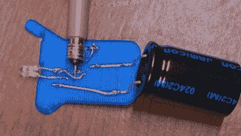
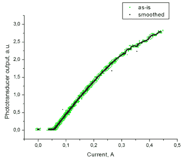

# 科学 DVD-RW 激光二极管

> 原文：<https://hackaday.com/2016/04/18/sciencing-dvd-rw-laser-diodes/>

如果你摆弄过从旧设备中捡来的激光二极管，你就会知道这可能是一个漫无目的的提议。(如果你还没有，你还在等什么？)除了过热或用静电电击会在提取时杀死二极管的实际风险之外，还有一个问题是要输入多少电流。

决定用科学来回答后一个问题！ —他有一个 DVD 刻录机。他的仪器技术含量低，但绝对出色，看起来他得到了很好的数据。所以让我们来看一看。

Laser Detector on 3D Printer Scrap

首先是检波器，它只不过是一个光电二极管、100k 欧姆负载电阻和一个用作电源的大电容。我们会使用硬币电池，但鉴于放电电流如此之低，这种电容是一种很好的可充电电池。光电二极管的输出直接进入示波器探头。

然后他将光电二极管对准激光点(在键盘上？)并通过对电容器充电并通过激光器和电阻器放电以限制总电流来使激光器产生脉冲。通过激光二极管的瞬时电流也在示波器上测量。绘制从光电二极管汲取的电流和测量的亮度，给他一个 L/I 曲线——“流明”对电流。

在曲线上寻找它不再是一条直线的地方，就在开始摆动之前。这大约是最大持续工作电流。为了安全起见，最好将该值降低到 90%。这里看起来最大电流是 280 毫安，所以你可能不应该长时间运行在 250 毫安以上。如果二极管发热，请将其散热。

如果你想全面了解激光器，尤其是二极管激光器，那就最好不过了。不过，我们喜欢[DeepSOIC]的测试平台，也想看看他的测试驱动程序的原理图。多年来，我们一直使用“[山姆的激光二极管测试电源 1](http://www.repairfaq.org/sam/laserdps.htm#dpssglt1) ，我们很喜欢它，但脉冲激光测试仪将是实验室的一个很酷的补充。

如何处理你的垃圾 DVD-ROM 激光器？用剩下的零件[做一个数控雕刻机](http://hackaday.com/2016/03/14/laser-pcb-exposer-built-from-cd-rom-drives/)？但是我们不需要告诉你如何使用激光。只是不要用你剩下的好眼睛看光束！