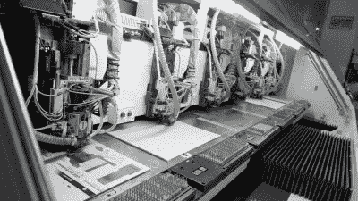

# 斯科蒂·艾伦的 PCB 工厂之旅就像是威利·旺卡的硬件极客之旅

> 原文：<https://hackaday.com/2018/06/12/scotty-allens-pcb-fab-tour-is-like-willy-wonkas-for-hardware-geeks/>

低成本、高质量印刷电路板的出现真正改变了我们制作电子产品的方式。在 Hackaday，我们看到人们越来越频繁地放弃家庭制作，转而去小规模工厂制作他们的原型和项目。今天，你可以看看使这成为可能的工厂流程的类型。[Scotty Allen]刚刚发布了一次 PCB 工厂的(赞助)参观,展示了世界电子产品消费者从未考虑过的难以置信的机床和化学浴。如果你有一个欣赏多氯联苯，这是一个快乐的过程中遵循设计，让你的咖啡休息，让这个视频滚动。

这其中的几个部分会非常熟悉。双层电路板的光刻胶和蚀刻过程与您自己的车间差不多。当然，这些面板比你在家里尝试的要大得多，而且它们没有使用食物储存容器和自制腐蚀剂。事实上，这些过程基本上都是自动化的，考虑到像这样的工厂的生产量，这是有道理的。就连在工厂里搬运成堆的电路板也可以用自动化的手推车来展示。

Six headed PCB drilling machine (four heads in use here).

我们发现这次参观最有趣的是多层板工艺、钻孔机和阻焊膜应用。对于使用两层以上的电路板，设计是从内向外构建的，在构建过程中添加基板和铜箔层。看起来很整洁，但我们仍然想知道内层是如何与外层对齐的。如果你对此有什么见解，请在下面的评论中发表。

钻孔过程与其说是一个惊喜，不如说是看到六个钻头同时在多块板上工作的巨大机器是一个奇迹。这肯定比德雷尔钻床强。阻焊工艺是一种我们不常看到展示的工艺。面具的墨水被涂在整块木板上，然后烘烤使其变粘。然后利用光处理，其工作方式与光致抗蚀剂蚀刻铜的工作方式非常相似。印有图案的透明膜固化了应该留下的阻焊膜，而其余的在下一步被洗掉。

电路板继续通过丝网印刷、表面处理和走线工艺将单个电路板从面板上分离下来。进行电气测试，完成~~糖果制作~~ PCB 制造过程。从开始到结束，看到每一步的一致性和速度，都很满足。

想做一大堆板子吗？您可能会对[[Brian bench off]的小组讨论指南](https://hackaday.com/2017/06/21/panelizing-boards-the-easy-way/)感兴趣。

 [https://www.youtube.com/embed/ljOoGyCso8s?version=3&rel=1&showsearch=0&showinfo=1&iv_load_policy=1&fs=1&hl=en-US&autohide=2&wmode=transparent](https://www.youtube.com/embed/ljOoGyCso8s?version=3&rel=1&showsearch=0&showinfo=1&iv_load_policy=1&fs=1&hl=en-US&autohide=2&wmode=transparent)

