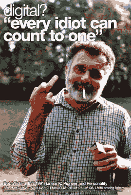

# Scratchy 为黑胶世界带来数字清晰度

> 原文：<https://hackaday.com/2017/04/01/scratchy-brings-digital-clarity-to-the-vinyl-world/>

如果你走在听力爱好者的大厅里，你可能会意识到已经有大量的工作投入到软件设计中，以清理旧的录音而不损害录音本身的质量。有时结果可能会令人惊讶，例如当立体声在 20 世纪 30 年代 EMI 工程师眼中甚至还是一个亮点时，从平行单声道录音中创建立体声图像。

 

【鲍勃·威德拉】论模拟与数字。原文: [EDN](http://www.edn.com/electronics-blogs/anablog/4311277/Bob-Widlar-cherry-bombs-the-intercom-speaker-item-2) 。但是，如果你在家里，没有最先进的工作室或高端数字信号处理的好处呢？当你放上一张黑胶唱片时，你怎么能让你的高保真音响没有爆裂声呢？[Paul Wallace]可能已经有了答案，[他开发了一款名为 Scratchy](http://ynformatics.com/2017/scratchy-digital-vinyl/) 的智能手机应用程序，它可以收听转盘的输出，识别正在播放的曲目，并播放合适的 MP3 文件，以获得黑胶唱片的数字体验。它使用 Shazam 发布的算法来识别曲调。该软件也有一个学习模式，在此期间，它可以学习收集的新记录。该应用程序本身是使用 Xamarin 框架编写的，[在他的 GitHup 资源库](https://github.com/ynformatics/scratchy)中有其源代码，因此它有可能为其他平台以及 Android 生产。

现在，黑胶纯粹主义者将对这种肆意亵渎其格式的行为感到恐惧，而音响发烧友将对中档 MP3 的油污感到愤怒，但如果你的黑胶唱片不干净，我们就可以看到它的吸引力。公平地说，虽然这里的立体声系统不会播放它，但你会从我们冰冷的双手中撕裂我们的模拟信号路径。你们自己看看吧，他放了一段视频展示它的运作。

 [https://www.youtube.com/embed/YKHLM1gt0rM?version=3&rel=1&showsearch=0&showinfo=1&iv_load_policy=1&fs=1&hl=en-US&autohide=2&wmode=transparent](https://www.youtube.com/embed/YKHLM1gt0rM?version=3&rel=1&showsearch=0&showinfo=1&iv_load_policy=1&fs=1&hl=en-US&autohide=2&wmode=transparent)

如果你喜欢通过应用程序播放黑胶唱片的体验，当然[你甚至不需要转盘](http://hackaday.com/2009/04/27/ipod-spinning-vinyl/)。如果你对转盘感到困惑，也许你应该读一读[我们的便捷指南，找到一个好的](http://hackaday.com/2017/03/03/record-players-explained-for-the-streaming-generation/)。如果你没有收藏唱片，[为什么不为自己激光切割一张](http://hackaday.com/2015/08/07/laser-cut-your-own-vinyl-records/)？