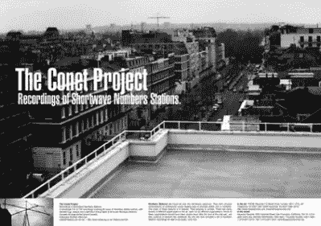

# 数字秘密电台

> 原文：<https://hackaday.com/2015/10/29/secret-radio-stations-by-the-numbers/>

几十年来，有一件事一直伴随着詹姆斯·邦德电影系列:邦德先生总是拥有最棒的小玩意。无论是手持设备、车载设备还是其他设备，总有一些令人激动的东西是可信的。

所有这些小玩意的最大问题是，它们把邦德指挥官标记为一个明显的间谍。“邦德先生，我看到你的书里有许多随机的五个字符组。一点也不可疑！”我们都知道进出口专家经常携带爆炸的袖扣或公文包，里面装满未知的电子产品。

正如隐写术在众目睽睽之下隐藏数据一样，最好的间谍工具是那些看起来不是间谍工具的工具。难怪一些旧武器只不过是棍棒或农具。你可以告诉一个农民他不能有剑，但很难禁止棍棒。

想象一下，你是一名冷战时期的间谍，生活在一个敌对国家，从事通用出口的掩护工作。你更愿意被复杂的加密机还是普通的消费类收音机抓住？我猜你用了收音机。你不是唯一一个。这是被称为数字电台的神秘短波广播的假定目的之一。这些在冷战期间非常普遍，但仍有一些在运行。

## 关于数字电台

实际上有几种类型的号码站，但最典型的一种只是空中阅读号码列表(或通过莫尔斯电码发送号码)的人。一些人读出其他编码信息(如语音字母)或在背景中有声音，这些声音可能是也可能不是数字编码信息。其中一个甚至使用了燥山姆卡通中的声音片段来分离数据脉冲。

Conet Number Station [poster](http://www.irdial.com/conet.htm)

根据 Conet 项目，早在第一次世界大战期间就听到了数字电台。在大多数情况下，没有人确切知道这些电台的用途，但有专门的团体试图找到它们，甚至解码它们在说什么。然而，据认为，他们中的大多数使用某种形式的一次性密码，这使得试图解码他们是一个很长的镜头。然而，人们普遍认为，大多数(如果不是全部的话)这些电台的目的是传递秘密信息。

例如，假设我想给你发送秘密信息，我给你一个短波接收器。我告诉你在特定的时间听特定的频率，然后我读出一系列的数字。为了解码我的信息，你把我读到的数字当作一个页码，后面跟着一个单词，比如说，一两天前的报纸。只要你保留一份报纸，并且有收音机，我就可以给你发送难以破译的信息，除非有人告诉你我们同意使用哪种报纸。这是一种一次性密码本，如果你保守秘密，这个方法实际上是无法破解的。不过，关键是，当他们搜查你的酒店房间，发现一个短波接收器和几天的报纸时，这并不特别可疑。

有一个名为 [ENIGMA 2000](http://www.apul64.dsl.pipex.com/enigma2000/) 的小组对数字电台进行编目和分析，制作了 ENIGMA 控制列表(尽管最新的列表是几年前的)。他们有一个命名方案，根据语言或信号的其他特征来识别电台。例如，以 E 开头的电台用英语广播，而以 S 开头的电台用斯拉夫语广播。m 电台使用莫尔斯电码。自然，这些只是方便的名称(如 E22)。在大多数情况下，我们不知道这些站自称什么。

## 联邦调查局利用数字站抓捕间谍

1998 年，美国联邦调查局逮捕了五名古巴情报官员。间谍通过一个数字站(使用索尼短波收音机)接收信息，加密信息是联邦调查局法庭案件的一大部分。美国联邦调查局获得了间谍用来解码这些信息的软件，并能够阅读它们(并在法庭上出示)。这可能是政府唯一一次承认这些电台与秘密行动有关。

被称为迈阿密五人组(Gerardo Hernández、Antonio Guerrero、ramón laba ino、Fernando González 和 René González)的古巴五人组(T1)受到审判并被判犯有阴谋从事间谍活动、阴谋实施谋杀、充当外国政府代理人和其他罪名。

2001 年，古巴政府最终承认这些人是情报人员。然而，他们坚持说，他们是在监视迈阿密的古巴流亡社区，而不是美国政府。

## 为什么不

你一定想知道，在这个有互联网和卫星电话的时代，为什么这些电台还在运作。毕竟，短波接收器在今天比过去更不寻常了。也许接收器被伪装成标准的收音机，需要一些詹姆斯·邦德风格的小玩意来把它们放在短波波段上。毕竟，卫星电话意味着你在和某人通话，互联网的使用是可以追踪的。除非当场被抓(或者像古巴人一样使用软件)，否则没有证据证明你在收音机里听的是什么。

然而，令人难以置信的是，显然现在仍有特工在某个地方从这些数字站复制编码指令。你只能怀疑他们在做什么。

## 我怎么能听到他们？

如果你有一个软件定义的无线电设置，这是完美的。当然，一个覆盖面广的接收器或者一个接收范围大的业余无线电也可以。找到常用电台的一个简单方法是查看显示当前时间收音机正在播放什么节目的在线页面。查找包含“间谍”一词的条目。另一个报道这类站点的网站是[间谍号](http://www.spynumbers.com/)。你可以搜索他们的数据库，看看其他人最近听到了什么，并输入你自己的位置，尽管那里的活动相对较少(今年数据库中大约有 30 个条目)。还有[一个非常活跃的日志论坛](http://www.hfunderground.com/board/index.php/board,7.0.html)，你可以尝试一下获取技巧。

当然，自己去找更好玩。如果你手边没有收音机，这可能是一个很好的用途，我们过去已经讨论过的网络 SDR 之一。这也让你有机会从你自己以外的地方听(也让你很容易记录你所听到的)。

小心点。偷听间谍的谈话会让你毛骨悚然。尤其是当你在听的时候，你听到了敲门声…

 [https://www.youtube.com/embed/aIH7cG3YmIo?version=3&rel=1&showsearch=0&showinfo=1&iv_load_policy=1&fs=1&hl=en-US&autohide=2&wmode=transparent](https://www.youtube.com/embed/aIH7cG3YmIo?version=3&rel=1&showsearch=0&showinfo=1&iv_load_policy=1&fs=1&hl=en-US&autohide=2&wmode=transparent)

