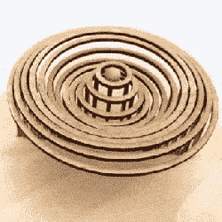

# 看看这个迷人的 3D 打印水滴机器人

> 原文：<https://hackaday.com/2017/09/21/see-this-mesmerizing-3d-printed-water-droplet-automaton/>

*水实验第 33 期*作者【迪安·奥卡拉汉】

大多数现代自动装置都是手摇动力雕塑，通常由木头制成，而【videohead118】的灵感来自一个模拟一滴液体波动模式的视频。于是，他们制作了一个自己的 [3D 打印版本](https://www.thingiverse.com/thing:2542655)，并在 Thingiverse 上分享了文件。

在这件作品中，手动曲柄转动一组凸轮，这些凸轮以模拟的波浪模式升高和降低一系列环，显然是对中心轴上球体的运动做出响应。原件(如右边的动画所示)是由一个名叫[迪安·奥卡拉汉]的人用木头制作的，完整的视频嵌在裂口下面。

 [https://www.youtube.com/embed/ZqzjAmPFND8?version=3&rel=1&showsearch=0&showinfo=1&iv_load_policy=1&fs=1&hl=en-US&autohide=2&wmode=transparent](https://www.youtube.com/embed/ZqzjAmPFND8?version=3&rel=1&showsearch=0&showinfo=1&iv_load_policy=1&fs=1&hl=en-US&autohide=2&wmode=transparent)

如果这类事情激起了你的兴趣，你可以看到一些现代艺术的例子，或者惊叹于被称为“男孩作家”的 [240 年历史的钟表杰作。](https://hackaday.com/2013/10/29/retrotechtacular-automata/)