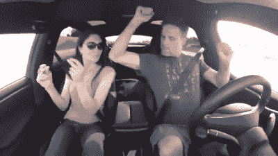
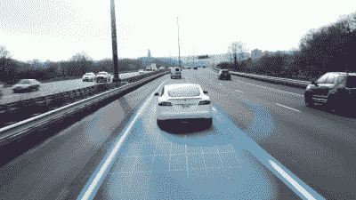
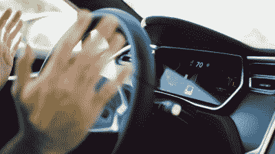

# 无人驾驶汽车(还)不安全

> 原文：<https://hackaday.com/2016/12/05/self-driving-cars-are-not-yet-safe/>

上个月发生的三件事让我更多地思考自动驾驶汽车的安全性。美国交通部(DOT)发布了其关于半自动和自动驾驶汽车安全的[指南](http://www.nhtsa.gov/About-NHTSA/Press-Releases/dot_federal_policy_for_automated_vehicles_09202016)。与此同时，[Geohot]的黑客无人驾驶汽车公司[以监管纠纷为由退出了这项业务](https://hackaday.com/2016/10/29/geohots-self-driving-car-cancelled/)。最后，特斯拉的自动驾驶仪[杀死了它的第二名乘客](http://www.nytimes.com/2016/09/15/business/fatal-tesla-crash-in-china-involved-autopilot-government-tv-says.html)，这次是在中国。

当[埃隆·马斯克]、[奥巴马总统]和谷歌都在吹捧无人驾驶汽车是解决方向盘后人为错误的[解决方案时，公开辩论相反的情况有点大胆，但这些数字就是不合理。无人驾驶汽车可能还没有一个清醒的好司机安全，但还没有足够的数据来证明这一点。然而，人们肯定不能说*比*更安全。](http://www.post-gazette.com/opinion/Op-Ed/2016/09/19/Barack-Obama-Self-driving-yes-but-also-safe/stories/201609200027)

## 误区:自动驾驶汽车更安全

 首先，让我们把这个话说清楚:[特斯拉的 Autopilot](https://www.tesla.com/autopilot/?redirect=no) 并不是为了成为自动驾驶技术。这只是一个“驾驶员辅助”功能，驾驶员的目的是随时控制汽车，白色指节方向盘，并不断猜测机器，尽管它显然有完美的驾驶能力。

这就是问题所在。人脑很快就能得出结论，但却不擅长估计低概率事件。如果你在一年多的时间里用自动驾驶仪驾驶了 500 次，没有发生任何不好的事情，你就有理由认为这个系统是安全的。你会变得自满，把手从方向盘上拿开，给别人发短信。你会在 YouTube 上发布视频。

### 糟糕的统计数据

事实证明，人类的本能在统计方面非常糟糕，尤其是对不经常发生的事件的统计。致命的车祸很少发生，无论是人均还是每英里，这是一件好事。但是，在一个拥有 70 亿人口的世界里，罕见的事件无时无刻不在发生。你不能相信你的直觉，所以让我们做些数学计算。

 特斯拉的自动驾驶仪，根据[这篇连线文章](https://www.wired.com/2016/08/how-tesla-autopilot-works/)，今年 8 月累计行驶了 1.4 亿英里。这似乎很多。事实上，在 6 月份被问及这起死亡事故时，[马斯克]回答说，美国司机平均每起死亡事故行驶 9500 万英里，由于特斯拉自动驾驶仪当时已经行驶了超过 1.3 亿英里，让自动驾驶仪远离街道是“道德上应受谴责的”。让我们看看。

首先，对一个事件得出统计结论是一个愚蠢的游戏。就是做不到。对于一个数据点，你只能估计一个平均值，但你不能估计一个[标准差](https://en.wikipedia.org/wiki/Standard_deviation)——平均值中确定性的度量。因此，如果你一个月前问我，一辆特斯拉平均行驶多少英里而不撞死人，我会说是 1.3 亿英里。如果你问我有多自信，我会说“一点也不——可能是零英里，也可能是无穷大——但这是我最好的猜测”。

但是，让我们看看截至 8 月份每 1.3 亿英里死亡人数。美国的平均水平是每 1 亿英里 1.08 起死亡事故，或 9260 万英里。这些死亡中有 95%归因于驾驶员失误，只有 5%归因于车辆故障。迄今为止，这似乎证明了埃隆的观点:自动驾驶可能更安全。但是只有一个数据点，不可能对这个结论有任何信心。

### 人类变异

但是人类也不仅仅是人类。美国各州之间的差异是巨大的。在马萨诸塞州，平均每人死亡 1.75 亿英里，而在南卡罗来纳州只有 6100 万英里。在饮酒的可接受性、高速公路驾驶的百分比以及到医院的距离方面的文化差异都在这里发挥了作用。

在特斯拉的家乡加利福尼亚州，这比平均水平略好，他们每死亡 1.09 亿英里。还是那句话，这和特斯拉的表现不相上下。但我宁愿它开起来像波士顿人一样安全。

### 选择偏差

有一个很好的理由相信特斯拉自动驾驶仪的司机正在选择合适的时机移交控制权:能见度没有挑战性的直线公路，或者缓慢的走走停停的交通。我不认为人们会在倾盆大雨中撒手不管。然而，大约 20%的死亡事故是由天气因素造成的。完全公平地说，你也可以调整人类的里程数，以考虑到这样一个事实，即人们可能只在天气好的时候，或者在其他没有挑战性的条件下，才(聪明地)放手使用自动驾驶仪。

### 人为控制

 如果人们*遵守特斯拉的服务条款，并且只在严格的人工监督下使用自动驾驶仪，那么这起死亡事故肯定会低估如果所有人都不用手开车会发生的事情。[这段视频](https://www.youtube.com/watch?v=lTtLGP4cRaQ)展示了特斯拉看不到标线时的抓狂。一切都变得很好，因为人类在控制，但想象一下他没有。相对于自动驾驶仪在完全自动驾驶模式下运行的假设，事故和死亡人数肯定(谢天谢地)太低了。*

 *但是考虑到这种选择偏差——自动驾驶仪只能在良好的道路上行驶，并且有一些人的监督——它优于甚至等于人类驾驶员的说法被大大削弱了。我们不知道人们有多频繁地超越自动驾驶仪来拯救他们的生命，但如果人们在一半的时间里阻止汽车做疯狂的事情，那么特斯拉的记录就比它看起来糟糕两倍。

## 可悲的是，两个数据点

所有这一切都围绕着边际争论。我们还在假装现在是 2016 年 8 月，中国第二起致命的自动驾驶事故发生之前。小数字的残酷本质意味着，在发生了两起事故，行驶了大约 1.5 亿英里的情况下，特斯拉自动驾驶仪似乎像最糟糕的清醒人类一样驾驶。

但是正如我上面所说的，对特斯拉的这些估计是非常不精确的。只有 1 . 5 亿英里的驾驶里程，如果它和人类一样驾驶，你可能只会看到一起死亡事故，但看到两起事故你也不会感到惊讶。像这样的小数字，不可能得出任何确定的结论。然而，你当然不能说让 Autopilot 的隐喻之手离开方向盘是“道德上应受谴责的”。如果有的话，你会说相反的话。

### 更多数据

我们需要更多的数据，但我们永远也得不到。任何负责任的自动驾驶汽车公司都会尽可能改进软件。事实上，就在中国事故发生前，特斯拉宣布了一个软件更新，可能会阻止美国的死亡。但是每当软件被重做时，我们所拥有的关于车辆安全性的早期数据就变得毫无意义。获得足够数据来确定这些东西的安全性的唯一希望是不去管设计，但是如果它有已知的缺陷，那是不道德的。

因此，通过里程数评估自动驾驶汽车是一项统计实验，永远不会有负面结论。在每一亿英里的安全驾驶之后，人工智能的支持者将宣布胜利，在每一次致命事故之后，他们将推动另一次固件升级，并呼吁重新开始。如果自动驾驶汽车确实不安全，不管固件更新如何，我们需要什么来说服我们这个事实？

### 迷失在雾中

除非有一辆自动驾驶系统行驶了 20 或 30 亿英里的汽车，否则无法在人类驾驶员和自动驾驶模式之间进行任何有意义的统计比较。这是假设人们违反特斯拉服务条款，在没有干预的情况下驾驶；如果你考虑到人们拯救自己的生命，自动驾驶功能肯定比我们的数据显示的安全得多。这可不太好。难怪特斯拉想让你把手放在方向盘上。

即使自动驾驶技术可以与人类驾驶员相媲美，这也意味着在我们能够合理确定之前，还会有二三十人死亡。在正常司机身上进行这个统计实验是否道德？如果我们知道自动驾驶不安全，我们会怎么说？或者这只是为了达到无人驾驶汽车确实比人类驾驶得更好这一不可避免的状态而付出的代价？我真的不知道。

汽车安全不是昨天发明的。汽车框架上的每个紧固件和(分布式)大脑中的每一行固件都有协议和标准。这些都是基于预先满足既定的可靠性和安全性措施*，而不是一旦上路。目前的做法是否甚至适用于自动驾驶汽车是一个有趣的问题，也是该行业尚未解决的问题。*

 *所以与此同时，我们陷入了混乱。特斯拉的自动驾驶仪足够好，足以诱使你相信它，但它仍然基本上未经统计测试，乍一看，它比我想的要糟糕得多。一方面，特斯拉正在尽最大努力——收集系统如何响应的真实世界数据，同时警告司机它仍处于测试阶段。另一方面，如果有人因为“beta”刹车盘设计而死在方向盘后面，就会有召回。

先说清楚，我对特斯拉没有怨恨。(埃隆·马斯克)说他的技术比人类司机更安全，统计数据根本无法证实这一点。特斯拉目前远远领先于其他汽车制造商，他们正在做出大胆的声明，我完全希望有一天会成为(被证明是)事实。时间和里程表上的里程会告诉我们答案。**