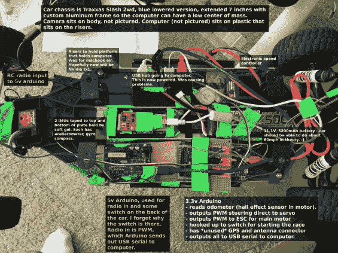
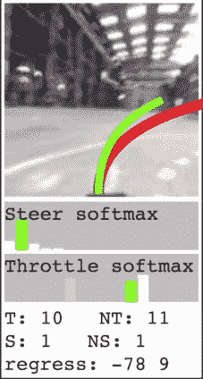

# 采用 TensorFlow 的自动驾驶遥控汽车；板载树莓派或 MacBook

> 原文：<https://hackaday.com/2017/06/06/self-driving-rc-cars-with-tensorflow-raspberry-pi-or-macbook-onboard/>

你可能认为你不具备制造自动驾驶汽车的条件，但你错了。你犯的错误是假设你将控制一台两吨重的死亡机器。相反，你可以在没有危险和相对较低的预算下尝试一下。[奥塔维奥]和[威尔]进入了使用无线电遥控汽车的自动驾驶汽车。

[奥塔维奥]把一台 MacBook Pro 放在一辆遥控汽车上做重物，并把它叫做 car puter。计算机从电机读取霍尔效应传感器数据，以确定行驶距离(这可以用来计算速度)，并通过安装在底盘上的网络摄像头观看水流。使用 TensorFlow 将这两个源输入到神经网络中。您可以通过在整个过程中手动驾驶车辆几次来训练系统，然后让它自动驾驶。

    

在下面的视频采访中，你可以看到这辆车，当我们看到几场比赛的回放时，[奥塔维奥]对系统如何工作进行了评论，包括 Sparkfun 2016 自动驾驶汽车比赛。我为糟糕的音频道歉，他们输掉了摊位抽奖，而且隔壁是一个非常吵的机器人乐队([视频证明](https://youtu.be/za2juqkmVmw))，所以我们基本上是在互相喊叫。但是我想你会同意看一看比赛是值得的。

 [https://www.youtube.com/embed/tOj53RRgtmg?version=3&rel=1&showsearch=0&showinfo=1&iv_load_policy=1&fs=1&hl=en-US&autohide=2&wmode=transparent](https://www.youtube.com/embed/tOj53RRgtmg?version=3&rel=1&showsearch=0&showinfo=1&iv_load_policy=1&fs=1&hl=en-US&autohide=2&wmode=transparent)

carputer 当然是一次性的，而且对初学者来说并不友好。这就是[威尔]的用武之地。他在[驴车](http://www.donkeycar.com/)队。驴车是自动驾驶汽车的标准平台。这是一个大约 200 美元的零件和一些 3D 打印的底盘部件的组合，大约两个小时的组装时间后，你就可以开始运行了。驴的大脑是树莓 Pi 3，我们已经知道[会很好地运行 TensorFlow】。](http://hackaday.com/2017/04/11/introduction-to-tensorflow/)

驴车团队的指南是一个很好的开始。他们不卖工具包——这仍然是黑客的项目，我们喜欢这样。如果你在构建过程中遇到任何困难，团队会在一个空闲的频道里，很乐意帮助你完成构建。唯一的另一个问题是找到一条赛道来测试你的赛车。

你一直在做你自己的自动 RC 版本吗？我们很乐意在举报热线上听到他们的消息[！](http://hackaday.com/submit-a-tip/)