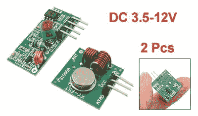
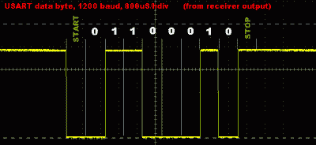

# 使用廉价的射频模块发送数据

> 原文：<https://hackaday.com/2016/06/06/sending-data-using-cheap-rf-modules/>

如今，无线比以往任何时候都更容易，有许多标准可供选择。但是如果你只是想切断脐带，你不需要任何复杂的东西。几年前，[Roman Black]试验了便宜的射频模块,你可以在拍卖网站和剩余电子产品供应商那里只花几美元就能买到，他还写下了自己的发现。它们很值得一看。

这些模块具有电源和天线引脚、发射器的发射输入(TX)引脚和接收器的接收器输出(RX)引脚。TX 所做的只是打开和关闭载波，RX 输出报告载波状态。[Roman]首先使用 50%占空比的方波来表征 RX 对 TX 的跟随程度。低于 1 kHz 时，匹配良好。在更高的频率下，RX 不能保持 50%的载波。他发现从 USART 发送 1200 bps 的数据在良好的条件下也能正常工作——结果是每秒 83 字节。

改为长短脉冲周期协议，1 和 0 分别发送 150 和 100 微秒，他得到了更好的结果。他的最高吞吐量约为每秒 800 字节。

这是一个有趣的实验，它表明介质上使用的协议(在本例中是简单的连续波 RF)对数据传输有很大的影响。[罗马]达到了 20 米的穿墙距离，这是一个很好的距离与廉价的硬件。还有更好的协议吗？