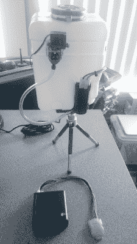

# 哨兵机器人把坏猫变成好猫

> 原文：<https://hackaday.com/2017/01/20/sentry-robot-turns-bad-cat-to-good/>

[詹姆斯·沃茨]家养猫，这些猫认为地毯上的各种斑点很适合用爪子挖。经过一番训练猫的努力后，[詹姆士]找到了[一个带远程无线传感器的机器猫训练员](https://james481.github.io/cat-trainer/)。自动训练器只做一项工作，但它可靠而不知疲倦地完成了那项工作，这正是这种情况下所需要的。像“自动训练猫停止抓地毯”这样的任务实际上是由许多更小的问题组成的，[James]在他的解决方案中实现了许多聪明的想法。

首先，对自动化解决方案的需求与宠物如何形成关联有很大关系，并且需要让负面强化在正确的时间出现在正确的位置才能有效。在这种情况下，一股无害的水被用于纠正，需要立即、持续地使用，并且“不知从哪里冒出来”(而不是来自一个人。)否则，正如(詹姆斯)发现的那样，当猫抓地毯时喷水仅仅意味着当他在附近时，它们停止喷水。

在这个过程中有许多棘手的问题需要解决。一个是如何可靠地检测猫是否真的在抓地毯。另一个问题是如何将无害的水喷到有问题的地方，以及如何在不造成另一个混乱的情况下控制和管理供水。最后，整个事情需要干净整洁；到处都是乱七八糟的电线的黑客工作是不行的。

 为了实现这一切，【James】创造了一个主喷洒器单元，它使用 NRF24L01+串行分组无线电无线连接到远程传感器单元。当一个遥控器感觉到一个麻烦的地方被抓了，主机就会使用遥控伺服系统将一个喷嘴旋转到正确的方向，并给这只冒犯的猫一个水的提醒。

独立的遥感器使用一个加速度计来检测地毯被抓时的轻微抬起。[James]对 MMA8452Q 三轴加速度计进行编程，使其在检测到运动超过某个阈值时触发外部引脚，并通过无线链路发送该事件。

对于主要的喷雾器单元本身，[詹姆斯]巧妙地围绕现成的替换挡风玻璃清洗槽。有了集成的泵、管道和各种喷嘴，就不需要从头开始设计任何这些元件。如果你想给这个项目一个机会，去看看 github 库——可能值得，因为一个晚上就改变了猫的行为，这解释了为什么没有任何动作视频。

宠物项目通常围绕着喂养过程的自动化，但也很高兴看到其他应用程序。关于训练的积极强化方面，看看这个[卡特彼勒健身轮](http://hackaday.com/2015/11/11/the-running-cat/)，它集成了一个零食分配器，以鼓励锻炼养生。