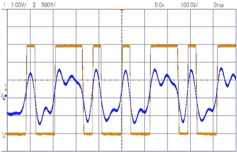

# 音频串行连接:Arduino 可以监听 UART

> 原文：<https://hackaday.com/2018/05/31/serial-connection-over-audio-arduino-can-listen-to-uart/>

我们都有过这样的经历:在评估了一个问题并思考了一个解决方案后，我们会立即去追求脑海中出现的第一个方案，只是后来发现有一个简单得多的替代方案。令人欣慰的是，开发一个晦涩的解决方案，虽然有时会令人沮丧，但确实会成为一个不错的黑客帖子。这次是[David Wehr]和[audio serial:一种通过 Android 手机的音频端口输出原始串行数据的简单方法](https://davidawehr.com/blog/audioserial/)。虽然[David]可以很容易地在这个项目中使用 USB OTG，但许多微控制器没有他的 Arduino 的 USB 到 TTL 功能-所以这不是完全徒劳的。

起初，这似乎是一个简单的任务:任何一部令人尊敬的手机的 DAC 都应该至少有 44.1kHz 的采样率。[David]使用了[Oboe，一个用于 Android 音频应用](https://github.com/google/oboe)的高性能 C++库，来创建所需的波形。他发送的 8 位数据块只能组成 256 个唯一的消息，所以他预先生成了它们。然而，DAC 试图变得更聪明，对信号进行一些插值处理——这对音频很好，但对数字波形不太好。你可以看到蓝色的扭曲信号与橙色的信号相比。为了解决这个问题，使用了一个运算放大器比较器来清理信号，并将其提升到所需的电压。

更喜欢你的 Arduino 无线连接？看看这个[智能手机控制的元素周期表](https://hackaday.com/2018/01/16/smartphone-controlled-periodic-table-of-elements/)，或者这个[无线机器人手](https://hackaday.com/2017/03/13/robot-hand-goes-wireless/)。

 [https://www.youtube.com/embed/BxXZ84qBnZs?version=3&rel=1&showsearch=0&showinfo=1&iv_load_policy=1&fs=1&hl=en-US&autohide=2&wmode=transparent](https://www.youtube.com/embed/BxXZ84qBnZs?version=3&rel=1&showsearch=0&showinfo=1&iv_load_policy=1&fs=1&hl=en-US&autohide=2&wmode=transparent)

