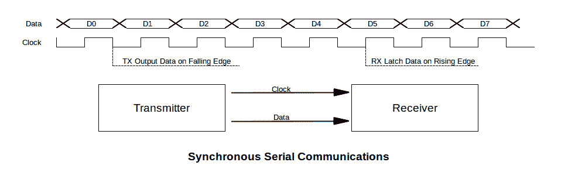
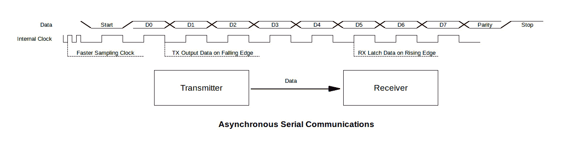

# 串行，你是同步还是异步？

> 原文：<https://hackaday.com/2016/06/28/serially-are-you-syncing-or-asyncing/>

我知道你听说过同步和异步通信。但是你真的知道两者的区别吗？

早在计算机出现之前，串行通信就已经使用了。其前身是使用莫尔斯电码的电报系统，这是最早的数字通信方式之一。另一个前身是 teletype，它设定的标准今天仍在 Arduino 或 Raspberry Pi 中使用。

你所需要的是两条用于串行通信的线，这使得它变得简单且相对稳定。一根线是地线，另一根是信号线。通过预先定义的模式中断电源，信息可以进行短距离和长距离传输。挑战在于正确且足够快速地接收有用的模式。

我有点惊讶地发现 Arduino Uno 的 ATmega328P 微控制器上的串行端口是通用同步异步发送接收器(USART)。我以为它只是一个 UART(同名，只是省略了同步)可能是因为我的第一次串行通信工作是与古老的英特尔 8251“可编程通信接口”，一个 UART，我不期望微控制器更先进。我真傻。后来，我用 Zilog 8530 串行控制器芯片，一个 USART，这个术语我将用于两种设备类型。

所有这些设备都以同样的方式工作。通过将一个字节加载到一个寄存器中来发送它，它在发送(TX)线路上以脉冲的形式一次移出一位。接收器接受接收(RX)输入端的脉冲，并将它们移入寄存器，然后由系统读取。发送器的工作非常简单，它只是以已知的时钟速率将比特移出。接收机的任务更加复杂，因为它需要知道何时对输入信号进行采样。这就是异步和同步通信的区别。

## 同步通信

同步通信通过在地线和信号线上增加第三条时钟线，使接收机的工作变得更容易。这是发送器用来移出比特的时钟。接收器使用时钟来确定何时对接收位的值进行采样。

除了 Arduino 上的 USART 或其他微处理器芯片，还有其他设备使用同步通信。I ² C(内部集成电路)和 SPI(标准外设接口)都是同步的。I ² C 使用串行数据线(SDA)和串行时钟线(SCL)两条线。总线上的每个器件都分配有一个地址，当主机通过 SDA 发送该地址时，器件会做出响应。器件在 SDA 上做出响应，使其成为半双工系统。

SPI 至少需要四条线路:串行时钟(SCK)、主机输出/从机输入(MOSI)、主机输入/从机输出(MISO)和地。该总线还可以为每个器件使用一条从机选择(SS)线。这增加了复杂性，但允许 SCK/MOSI/MISO 连接到多个从设备——每个设备仅在其 SS 线路激活时“监听”。主机激活 SS，发送并等待响应。

在 I ² C 和 SPI 中，主机总是产生时钟。它使从设备与主设备同步。这就是同步通信。

同步系统的一个问题是，如果时钟是活动的，接收器期望接收数据。如果发送系统需要在一条消息中暂停，它需要发送空闲字符，让接收方丢弃这些字符，以保持线路活动。

## 异步通信

异步通信不提供时钟信号。发送器的工作是一样的，以约定的时钟速率将比特转移到线路上，但是它需要做更多的工作。没有时钟，接收器需要知道何时开始对输入位进行采样。发送器通过发送同步位来提供帮助:一个起始位，然后是一个、一个半或两个停止位。还有一个可选的奇偶校验位，允许进行错误检查。关于这方面的更多信息，请查看本周早些时候【埃利奥特·威廉姆斯】写的[系列故障排除技术。](http://hackaday.com/2016/06/22/what-could-go-wrong-asynchronous-serial-edition/)

因为发送和接收时钟速率是独立运行的，所以它们不会同相。因此，接收器可能不会对起始位进行采样，直到它几乎完成，从而放弃对字符中剩余位的采样。为了避免这种情况，接收时钟比发送时钟运行得更快，有时快 16 倍，以便更精确地检测起始位的下降沿。

在理想情况下，USART 的接收器可以确定输入位中间的时间，读取信号电平，这就是接收位。在现实世界中，事情没有这么简单。发射机发出一个很好的方波，但随着信号的传播，它会衰减。漂亮的急剧上升时间变成了一个斜率，下降沿也是如此。信号线上也可能有降低或提高信号电平的噪声。同样，接收时钟可以更快地获取多个读数并求平均值以确定输入位。

## 遗产:中断和信号级别

电报和电传打字系统甚至在今天还影响着串行通信。今天，我们考虑数字信号线的默认或空闲条件，即其上没有电压，意味着其值为 0。电报系统认为空闲线路是高的。当信号线处于高位时，操作员可以检测到线路中的物理中断，因为信号下降到零。为了发送信息，电报员移动按键上的滑块来“断开”线路。当消息完成时，滑块被放回原处。

电传打字(TTY)系统继续这两种做法。TTY 键盘有一个 break 键，可以直接中断线路上的高信号和正在发送的任何信息。电脑键盘上的 break 键是电报系统断线的遗留物。由于 TTYs 与早期的计算机一起使用，break 键被用作中断失控进程的一种手段。USART 可以配置为设置一个错误标志，并在检测到中断时产生一个中断，即一个字符周期内的低电平信号。

高怠速信号水平是另一个遗留问题。空闲串行线保持高电平，而大多数数字信号保持低电平。在传统术语中，高信号线是*标记*信号，低信号线是*间隔*。1 位作为标记发送，0 位作为空白发送。这解释了为什么异步起始位是指示空闲行结束的空格，以及为什么停止位是将行返回到高空闲状态的标记。

最后一个优点是能够指定多个停止位。TTY 机制并不总是足够快来捕获、打印一个字符，并在单个停止位提供的时间内准备下一个字符。多个停止位为这些机械设备的恢复提供了内置的延迟时间。

## 错误和标志

由于噪声、不良连接和墨菲的突发奇想，串行通信过程中总是会出现错误。USART 在适当命名的状态寄存器中报告错误及其操作状态。它还可以配置为针对错误和大多数状态指示器产生中断。

一个错误是*成帧*错误，通常由发送和接收时钟以不同速度运行引起。扰乱起始或停止位的严重噪声也可能导致这种情况，因为它是由未按预期结束的字符触发的。由于时钟在两个不同的系统上，它们不可能以相同的速度运行。如果发送时钟比接收时钟慢得多，停止位将在接收器预期的时间后出现。更快的发送时钟意味着停止位在接收器预期之前就存在，这意味着接收器在准备好之前看到下一个开始位。时钟必须在 3.3%以内，基于 Maxim Integrated 的[确定 UART 通信的时钟精度要求](https://www.maximintegrated.com/en/app-notes/index.mvp/id/2141)。

另一个错误是*超限。*当 USART 在其系统读取前一个字符之前接收到一个新字符时，就会出现这种情况。为了避免这种情况，现代 USART 将提供一个字符缓冲区，为输入寄存器接收下一个字符扫清道路。这种双重缓冲为系统读取缓冲字符提供了时间。发送器也做同样的事情，在发送一个数据时，将另一个数据保存在缓冲器中。一些 USARTs 提供更大的缓冲器。多家供应商提供的 16550 USART 用于许多电脑，为发送和接收提供 16 字节缓冲。

更多的错误和指示器是可能的。当接收到的字符的奇偶校验与 USART 计算出的不匹配时，会出现*奇偶校验*错误。发送器*欠载运行*状态表示缓冲器和输出寄存器为空。此外，当发送器和接收器的缓冲器可以分别接受或提供字符时，发送器和接收器都提供*就绪*状态。

## 包裹

[Elliot 的]文章[什么可能出错:异步串行版](http://hackaday.com/2016/06/22/what-could-go-wrong-asynchronous-serial-edition/)深入探讨了使用异步通信连接两个 Arduino 的细节。谁会是第一个在 Hackaday.io 上使用同步通信连接两个 Arduinos 的项目的人？