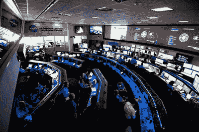
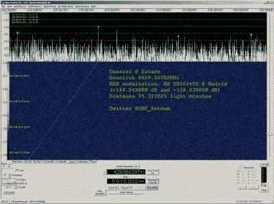
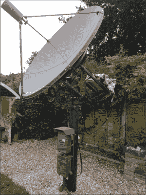

# 严重的 DX:深空网络

> 原文：<https://hackaday.com/2017/07/21/serious-dx-the-deep-space-network/>

迄今为止，人类成为太空物种才刚刚 60 年。在这短暂的时间里，我们已经相当熟练地掌握了将物体送入绕地球轨道的技术，而且如此热衷于此，以至于现在我们周围充满了有用和无用的物体。与地球轨道上的卫星通信几乎是微不足道的；你的手机现在可能正在收听至少六个地球同步 GPS 卫星，任何业余无线电操作员只需要一部 30 美元的对讲机和一个自制天线就可以和国际空间站上的宇航员聊天。

但是一旦我们的宇宙飞船远离地球同步轨道，通讯就变得有点危险了。平方反比定律和大部分星际飞行器可用的有限能量预算，决定了有多少射频能量可以传回地球。然而，这些任务的科学需要一个具有足够带宽的可靠连接，以控制航天器并检索其宝贵的数据。这需要一个强大的无线电网络和一些强大的大耳朵，但正如我们将看到的，美国宇航局不是唯一一个监听深空发生什么的机构。

### 深空三号

美国太空计划很早就认识到需要一种与卫星通话的方式，太空通信网络(后来被称为深空网络(DSN ))的发展与太空技术的发展平行，太空技术的发展迅速推动硬件离地球越来越远。DSN 是专门构建的，因此每个新任务都不需要部署自己的通信解决方案，只需利用当前的网络即可。此后，欧洲航天局和其他国家的太空计划网络也相继建成，所有网络运营商之间的合作非常普遍，尤其是在紧急情况下。

Space Flight Operation Facility, “The Center of the Universe” and home of the DSN control center. Source: [JPL](https://www.jpl.nasa.gov/deepspace/about/functions/)

DSN 地面站在全球范围内选择了三个站点——澳大利亚堪培拉；西班牙马德里；和加州的戈德斯通。这两个地点几乎完全相隔 120°，这意味着它们的天空视图在大约 30，000 公里的高度重叠；任何比这更远的地方都在 DSN 的视野之内，不管地球的旋转。

每个地点都有完全可控的抛物面反射器天线，大小从 26 米到 70 米不等。灵敏的接收器和数字信号处理设备仍然可以接收到旅行者号飞船发出的微弱信号，该飞船目前距离地球 30 多光年。上行链路发射机功率根据频率而变化。S-和 X-波段发射机通常有 20 千瓦的放大器，但也有一个 400 千瓦的放大器，有时会被用于堪培拉 70 米碟形天线上的 S-波段发射机，与航空当局进行特别协调，以便没有飞机飞过波束，并且碟形天线的仰角被限制在地平线以上 17 度，以避免烧焦地面上的任何人。

JPL 有一个非常酷的互动页面，列出了 DSN 中所有天线的当前状态以及每个天线正在做什么。当我写这篇文章时，马德里的 70 米碟形天线正在向旅行者 1 号发送 19 千瓦的信号，并返回-154.27 dBm 的信号。这大约是 370 zeptowatts，但仍足以产生 159 位/秒的数据。

### 监听

有了这些专门的硬件，人们很自然地认为普通黑客无法监听入站 DSN 信号。事实上，JPL 的好心人已经用明确的“不”回答了这个问题。他们似乎没有与一群狂热的无线电爱好者联系，这些人经常将自制的碟形天线转向天空，尽最大努力接收 DX 信号。

 

卡西尼从土星打电话回家。来源:[UHF-Satcom【M0EYT】](https://twitter.com/UHF_Satcom)(点击放大)

业余无线电爱好者保罗·马什(M0EYT)就是这样一个人，他有足够的深空联系人来填充一个活跃的 [Twitter feed](https://twitter.com/UHF_Satcom) 。在他定期从气象卫星捕捉的许多图像中，散布着瀑布显示，显示了由远离地球的航天器发出的多普勒频移信号引起的特征对角线。他最近将卡西尼号探测器收入囊中，目前正在土星轨道上做最后一次飞行，然后在九月坠入这颗气态巨行星。他和他的同伴们也收听了许多其他的深空探测，包括火星勘测轨道飞行器、小行星带中的 OSIRIS-REx 任务、STEREO-A 和 STEREO-B 太阳观测台以及前往木星的 Juno 任务。

M0EYT’s 1.8-meter dish, now fully steerable.

与 DSN 的大型装备相比，Paul 用来完成这一切的装备看似简单。他的碟形天线是一个现成的 1.8 米 prime focus 卫星天线，带有扩展翼，直径可达 2.4 米。直到最近，碟形天线还是手动定位的，但现在使用皇家海军剩余的 altazimuth 支架完全机动化。他的接收设备是你在任何微波爱好者的小屋中所期望的——低噪声放大器、混频器、滤波器——但大多数是定制的，并为深空工作进行了优化。小屋内的电子表格根据相对速度引起的多普勒频移计算出任何给定航天器的监听频率。从那时起，耐心和经验让他捕捉到最微弱的信号。

那么航海家号，这个人类最遥远的前哨站呢？用 18 瓦的信号从星际空间打电话回家，似乎只有 DSN 的大耳朵才能接收到。但是阿奇姆·沃尔哈特博士，DH2VA，实际上在 2007 年使用 20 米的碟形天线在 95 亿英里的距离听到了旅行者 1 号。所以这是可能的，其他深空收听者很可能能够复制这一壮举，但他们最好快点——旅行者 1 号的放射性同位素热发生器只能再工作三年。

作为一个业余爱好者和短波听众，我可以证明通过噪音和干扰与微弱的信号联系的兴奋感，在表盘上上下追逐它，直到星星排成一行，你终于能够从地球的另一边复制一个呼号。能够将一个天线指向正确的位置并计算出正确的频率来调谐，并看到瀑布上的对角线指示来自整个太阳系的信号，这是多么令人兴奋啊！

标题图片:[喷气推进实验室](https://deepspace.jpl.nasa.gov/)